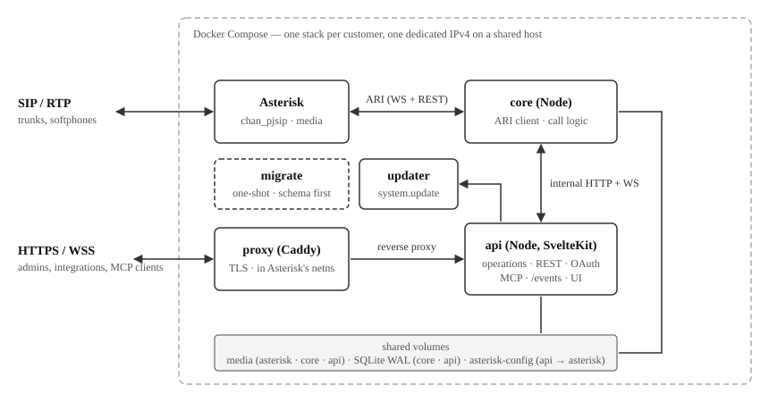

# Zamfono — Technical Specification

Changes made to this specification during implementation, and why, are logged in [spec-changes.md](spec-changes.md), newest first.

## 1. Product Summary

Zamfono is a cloud PBX ("All-in-One Cloud-Telefonanlage") for small businesses (5–20 users). It combines an **Asterisk** media/signaling core with a **Node.js** control plane that drives all call logic via **ARI** (Asterisk REST Interface) and exposes a **configuration REST API** backed by **SQLite3**. The whole system ships as a **Docker Compose** stack.

The name Zamfono is also the Stasis app id (`zamfono`), the image names (`ghcr.io/zamfono/*`), the database filename (`zamfono.sqlite3`) and the webhook signature header (`X-Zamfono-Signature`).

Target customer:

| Profile          | Details                                                    |
| ---------------- | ---------------------------------------------------------- |
| Company size     | Small businesses, 5–20 users                               |
| Decision maker   | Non-technical (office manager, business owner, IT contact) |
| Work environment | Office & home office, no VPN/Citrix                        |
| Primary devices  | Desktop & mobile (native apps)                             |
| Budget           | Cost-conscious                                             |

Guiding principle: *Enterprise telephony without enterprise complexity.*

## 2. Scope

### 2.1 MVP scope

- DIDs & extensions
- Ring groups (simultaneous / sequential / random, configurable timeouts, greeting & waiting music, fallback rule)
- User groups (organizational, nestable; usable as ring-group members)
- Call forwarding (to voicemail, to other users, manual DND → mailbox)
- Anonymous outbound calls (CLIR) per call, per user, per trunk and tenant-wide
- Inbound blocklist (tenant-wide numbers and prefixes) and anonymous-call rejection per user
- Call parking on shared slots
- Ad-hoc three-way calls by feature code
- Click-to-dial through the API (`POST /calls`), the hook for CRM integrations and the MCP assistant
- Find-me: external numbers rung alongside or after a user's devices, staged by delay, with an accept key
- Out-of-Office rules per user, per ring group, per menu, plus a tenant-wide fallback rule (inbound → mailbox / external number / announcement; optional scheduled start and expiry; without an expiry the rule holds until deactivated)
- Opening hours (recurring weekly schedules per user, ring group, menu, and tenant; outside hours → forward target)
- Auto-attendant menus (IVR): a greeting, DTMF strings mapped to forward targets, nesting through targets that are menus, optional dial-by-extension, own out-of-office rules and opening hours
- Voicemail (mailboxes per user and per ring group, configurable greetings & notifications)
- Greetings & audio management (greetings, hold music, voicemail audio)
- Company phone book (Microsoft 365 contact sync is future work, §12)
- Presence status (Available, Busy) + BLF-style live presence with one-click transfer & pickup
- Call history with filtering
- Call recording (stereo, centralized management; search comes later)
- HD voice (modern codecs)
- Role & rights management (owner, admin, end user)
- Desktop & mobile clients: **third-party SIP softphones** (e.g. Ringotel) as primary clients — Zamfono provides the telephony stack and provisioning contract, not its own apps (no web app in initial release)
- QR-code login for the mobile app — fulfilled by Ringotel's native onboarding (activation e-mail / QR, §10.4)
- Search bar (users, extensions, contacts)

### 2.2 Explicit non-goals (MVP)

**No web-phone.** A tenant UI for customer self-administration follows the MVP as the next step. The `api` service is designed as its backend from day one: the tenant UI runs as pages inside it over the operations layer (§10.3), and external tooling consumes REST and `/events`. In the MVP itself, administration happens directly against the REST API or conversationally through the MCP interface (§10.5) with any MCP client. The only browser-served surfaces in the MVP are the authentication pages (§5.2).

**No call-center features**: queues, skill-based routing, whisper, monitor, barge-in, voice bots and speech recognition, dashboards. These are future releases.

**No AI features**: voicemail transcription, call summaries, AI receptionist, intelligent routing. These are a future extension, and the architecture must not block them.

**No high availability or clustering.** The MVP is a single-node deployment; HA belongs to the vision.

**No external contact sources.** The phone book is managed through the REST API. Microsoft 365 sync is future work (§12).

**No fax.** Neither T.38 nor audio fax pass-through is supported or tested; fax over SIP trunks with modern codecs is unreliable by nature, and every trunk provider in this segment offers fax-to-mail on their side. The admin guide points there.

### 2.3 Out of scope of this document

This document specifies the server platform and its external contracts: REST API, MCP, WebSocket events and SIP provisioning. End-user clients are third-party SIP softphones such as Ringotel and are out of scope. They constrain the server only through standard SIP mechanisms (registration, SRTP, BLF via SUBSCRIBE/NOTIFY, MWI) and through the provisioning contract. Mobile push wake-up is the softphone vendor's responsibility.

## 3. Architecture Overview



Three long-running application services run per stack, plus the TLS proxy and a one-shot migration container that runs before them (§6.3).

**`asterisk`** does media and SIP signaling only. It contains almost no call logic: every inbound and outbound call is handed to the core through a Stasis application over ARI, and the dialplan is a thin shim that ends in `Stasis(zamfono)` for everything.

**`core`** (Node.js) is the ARI client, with one AMI connection for the state ARI does not carry, the outcome of outbound trunk registrations (§9.4, "Provisioning and status"). It owns call routing, ring groups, forwarding, voicemail, recording, presence and device state, MWI, and the writing of call history; the voicemail and missed-call mails are rendered and sent by `api` on the core's request (§3.1). It exposes a small internal HTTP and WebSocket API on the Docker network for the `api` service: live-call actions (originate, transfer, pickup, hangup), live state (calls in progress, trunk registration and reachability, presence), config-changed and reload triggers, a mailbox-changed trigger for MWI (§3.1), and a realtime event stream.

**`api`** (Node.js, SvelteKit on `adapter-node`) is the operations layer (§10.3): one `Operation` object per v1 operation, each carrying its description, input schema and role, with one runner applying validation, RBAC and audit around all of them. Around it sit the callers: the configuration REST API, the OAuth authorization server with its pages (§5.2), the MCP server (§10.5), the public `/events` WebSocket and, in the UI phase, the tenant UI's remote functions. `api` reads and writes SQLite, handles audio upload and transcoding, renders the PJSIP configuration, proxies live-call actions to `core`, and relays `core`'s event stream to `/events` subscribers and webhooks (§10.6). The tenant UI runs inside this process because config tables have one primary writer and every config write also renders PJSIP config and triggers the core reload.

### 3.1 Process split

**Write ownership.** Each SQLite table has a primary writer. Both processes read everything; WAL mode and `busy_timeout` make concurrent writers safe, so a cross-write is allowed where a flow naturally lands in the other process.

- `api` owns the configuration tables: users, devices, trunks, trunk_hosts, outbound_routes, outbound_route_users, outbound_route_user_groups, outbound_route_numbers, dids, did_blocks, ring_groups, ring_group_members, user_groups, user_group_users, user_group_groups, extensions, device_blf_keys, forward_targets, user_forward_rules, ring_group_forward_rules, opening_hours, opening_hours_intervals, audio_assets, contacts, contact_phones, settings, ooo_rules, menus, menu_targets, blocked_numbers, mail_templates, tokens, oauth_clients, webhooks, webhook_deliveries, backup_targets, backup_runs, update_state, maintenance_gate, audit_log.
- `core` owns the runtime tables: calls, call_qos, voicemails, recordings, presence_log.
- Known cross-writes: `api` updates and deletes `voicemails` and `recordings` rows through their REST endpoints and, after a voicemail change, calls `core`'s internal `/internal/mwi/{mailbox}` so the MWI counts follow (§9.3). `core` toggles `users.dnd` through the `*90`/`*91` feature codes and stamps `devices.last_registered_at` when a `ContactStatusChange` event reports the device's contact `Reachable`, a timestamp of an event rather than a state: the last time the device became reachable, not its latest REGISTER, since Asterisk raises no event for a registration refresh; a greeting recorded by phone (§10.2) makes `core` insert the `audio_assets` row, write its file to `media/prompts/` and set the mailbox's `mailbox_audio_id`. Live state such as a trunk's registration status never lands in a table (§10.1); `api` reads it from the core when a request needs it.

**Config propagation.** After a config write, `api` regenerates the PJSIP configuration where needed and calls `core`'s internal `/internal/configChanged` endpoint. `core` invalidates its config cache and triggers the Asterisk reload over its ARI connection. A propagation that fails, a render that throws or `core` refusing or not answering, leaves the write committed: its result carries a `warnings` entry naming the failure, and `api` owes the propagation, which `settings.config_propagation_pending` records. While one is owed, every propagation renders and reloads every module; `api` tries again 5 seconds after a failure, doubling up to a minute, and at its start, and the first propagation that succeeds, a later write's included, clears the marker. What must wait for Asterisk to hold a write, its Ringotel push (§10.4), waits for that success, and the write's result says so; these waiting steps are held in memory, so an `api` that starts while a propagation is owed has lost them and, once the first propagation succeeds, after that write's own steps, pushes every `ringotel` device's stored credentials instead (§10.4); the tenant profile push needs nothing of the kind, since `settings.ringotel_profile_pending` keeps it owed across the restart. What waits only for the commit, such as a mail, runs regardless. `/healthz` shows the marker as `configPropagationPending`, and `/metrics` as `zamfono_config_propagation_pending`, with the failed propagations since `api` started in `zamfono_config_propagation_failures_total` (§7).

**Mail.** `api` is the only mail sender: it holds the templates (§10.2 "Mail") and is the one process that can read the relay password, since the encryption key exists in the `api` container alone (§6.3). `core` posts a mail request, the kind, the placeholder values and the attachment path, to `api`'s internal `/internal/mail` endpoint; the retries of §10.2 run in `api`. `api`'s `/internal/*` paths are reachable from the `internal` network only: Caddy answers 404 for the prefix (§6.3), and `api` refuses a request for it that carries `X-Forwarded-For`, which only the proxy hop sets (§5.5).

**Events.** `core` produces all call, presence, OOO and opening-hours events. Its sweep for OOO and opening hours writes nothing; it evaluates and emits. It runs at the next instant any scope's OOO rule starts or expires or its opening hours open or close, at once after a config change, and at least hourly. `api` produces the `backup.*` events of its own jobs, subscribes to `core` over the internal WebSocket, and fans both streams out to authenticated `/events` clients and to webhooks (§10.6).

**Independence.** Either process can restart on its own. An `api` restart never affects live calls.

### 3.2 Design rules

**Asterisk is a dumb media engine.** All business logic lives in Node. Asterisk's own config files are static and templated from the environment at container start. Per-customer runtime configuration lives exclusively in SQLite. The files `api` renders from SQLite onto the `asterisk-config` volume (§9.1: PJSIP endpoints and trunks, hints, MoH classes, the TLS certificate) are derived artifacts and are never edited by hand.

**SQLite is the single source of truth** for configuration and call metadata. Asterisk `.conf` files hold nothing beyond transport and system-level settings.

**One tenant per stack.** Each customer gets their own Compose stack with its own Asterisk, its own Node processes and its own database. This keeps isolation trivial and matches the cost-conscious 5–20-user sizing. Multitenancy in one deployment is future work (§12).

## 4. Technology Choices

**Telephony core:** Asterisk 22 (current LTS) — chan_pjsip only; chan_sip removed upstream in Asterisk 21

**Control protocol:** ARI (WebSocket events + REST); AMI, read-only, for outbound registration state (§9.4) — Stasis app name: `zamfono`; AMI user `zamfono` with the `system` read class

**App runtime:** Node.js 26, TypeScript — two processes: `core` + `api`

**ARI client:** `ari-client` npm package (or thin custom WS+fetch wrapper if it proves stale)

**Application framework:** SvelteKit on `adapter-node` — the `api` process: REST catch-all, OAuth pages, MCP endpoint, later the tenant UI via remote functions; a custom server entry adds the first-boot seed, schedulers and the `/events` WebSocket (§10)

**Input schemas:** zod (Standard Schema, JSON Schema export) — one schema per operation drives remote-function validation, REST validation, OpenAPI and MCP tool definitions (§10.3)

**Database:** SQLite3 via `better-sqlite3`, **Kysely** query builder — type-safe queries; migrations applied by Kysely's `Migrator` in the one-shot `migrate` service (§6.3); WAL mode

**Realtime events:** WebSocket `/events` on the `api` service — for admin UIs & integrations; softphones use SIP-native mechanisms instead

**E-mail:** nodemailer in `api`, the only mail sender (§3.1), via the relay in `settings.smtp_*`, owner-editable, seeded from `SMTP_*` in `.env` at first boot (§6.3; mail rules in §10.2 "Mail") — voicemail notifications (compressed audio attached), user setup & password-reset mails

**Auth:** OAuth 2.1 authorization server in `api` (PKCE, discovery metadata, Client ID Metadata Documents with dynamic client registration as fallback); JWT access + rotating refresh tokens; Argon2id local passwords; SSO via upstream OpenID Connect: presets for Microsoft and Google, or any issuer with discovery — one auth stack for REST, MCP and later UIs (§5)

**AI/agent interface:** MCP server (Streamable HTTP, protocol revision 2026-07-28, legacy 2025-11-25 accepted) — in `api`; tools derived from the operation schemas (§10.5)

**Codecs:** tenant default `settings.codecs_json`, per-trunk override `trunks.codecs_json` (§9.4, §11.4); default Opus, G.722, G.711 A-law — the image ships `opus`, `g722`, `amrwb`, `amr`, `alaw`, `ulaw`; "HD Voice" comes from the default order

**Container base:** Debian 13 (`trixie`) slim images — `asterisk` installs from the Zamfono APT repository (built by the sibling `asterisk-builder` repo for Debian 13); Node images on `node:26-slim`, so `better-sqlite3` and `argon2` use glibc prebuilds

**Container runtime:** Docker Engine with Compose v2, or Podman ≥ 5 with `podman compose` — the stack is one Compose Specification file; CI brings it up on both runtimes (§6.3, §8)

**Image registry:** GitHub Container Registry (`ghcr.io`) — the stack's own images, linked to the `zamfono/pbx` repository, among them `proxy`, Caddy built from its official images with the `caddy-events-exec` plugin (§6.3 "Images")

**Reverse proxy / TLS:** Caddy — HTTPS/WSS termination + automatic Let's Encrypt; SIP-TLS uses the same certificate, handed over by a hook on Caddy's certificate event (§6.4)

## 5. Security

### 5.1 Transport

- HTTPS and WSS only, terminated by the reverse proxy: TLS 1.2 or newer, HSTS.
- SIP over TLS with SRTP for clients: TLS 1.2 or newer.
- Trunks follow the provider's requirements (§9.4).

### 5.2 Authentication

`api` is an OAuth 2.1 authorization server, and it is the only way to obtain a token, for REST and MCP alike. It publishes discovery metadata (RFC 8414 and RFC 9728), implements the authorization-code grant with PKCE, and serves `/oauth/token` and `/oauth/revoke`. Authorization responses carry `iss` (RFC 9207). Authorization codes and their PKCE challenges live in `api`'s memory for 60 seconds, single-use; an `api` restart voids the codes in flight, and the client starts the flow again.

**Client registration.** Two mechanisms, in the priority order MCP clients apply:

1. **Client ID Metadata Documents.** The `client_id` is an HTTPS URL to the client's JSON metadata. The server fetches the document, checks that its `client_id` equals the URL, validates the redirect URI against it, and caches it per its HTTP cache headers. Support is advertised with `client_id_metadata_document_supported: true`.
2. **Dynamic client registration** (RFC 7591) at `/oauth/register`, for clients without a metadata document. `application_type`, the OpenID Connect registration field, is required: `native` for CLIs and desktop apps, `web` otherwise. Registration is stateless: the endpoint validates the request (`client_name` at most 100 characters, at most 5 redirect URIs of at most 512 characters each) and returns a `client_id` that is the metadata itself, encrypted with the stack's secretbox key (§5.4) and base64url-encoded. Nothing is written, so the anonymous endpoint cannot fill the database.
Registered clients are public clients: PKCE, no secret. A redirect URI matches a registered one exactly, except that an `http` URI on a loopback host, `127.0.0.1`, `[::1]` or `localhost`, carries any port when a registered URI names the same host, path and query (RFC 8252 §7.3), whatever the client's `application_type`.

**Client rows.** At `/oauth/authorize` the server decrypts a metadata `client_id` or fetches the document behind a URL `client_id`, and validates the redirect URI from that. On the first successful authorization it upserts the client's `oauth_clients` row (id, name, kind), so a row exists exactly for clients a real user has logged in with, and the foreign key from `tokens` holds for every kind. The daily job deletes a row once no `tokens` row references it and its last token expired more than 30 days ago.

**Integrations.** A script or an external system is an OAuth client like any other: it registers through one of the two mechanisms, a person logs in once and approves it, and it continues headlessly on its refresh token. It acts, and is audited, as the user who logged in, so an integration gets its own dedicated user.

**Login and SSO.** The login page authenticates with a local password (Argon2id) or with SSO through an upstream OpenID Connect provider. One code flow with discovery serves every provider. `settings.sso_provider` selects a preset, `microsoft` or `google`, which fixes the issuer, the button and the claim quirks: Microsoft may deliver the address in `preferred_username` instead of `email`, Google carries the workspace domain in `hd`. The `microsoft` preset discovers against the customer's tenant, `https://login.microsoftonline.com/<sso_tenant_id>/v2.0`, so the issuer carries the tenant id and ordinary issuer validation rejects a token from any other tenant. The value `oidc` covers any other issuer, Nextcloud, Keycloak, Authentik or an IT partner's service; the admin enters `sso_issuer` and `sso_label` for the button. For the presets, one multi-tenant app registration on the operator's side serves every stack. UIs, including the future tenant UI, authenticate through the code flow like any other client and never render their own credential form.

SSO rules:

- The first SSO login matches the verified e-mail against an existing user, then binds the account by OIDC `sub` (`users.sso_subject`). A bound user is matched by `sub` alone: a token whose `sub` is unknown but whose e-mail belongs to a bound user is refused and logged. A change of `settings.sso_provider`, `settings.sso_issuer` or `settings.sso_tenant_id` clears every binding in the same transaction, since a `sub` is meaningful only within the issuer that minted it; the next login re-binds by e-mail.
- An e-mail counts only when the issuer vouches for it: `email_verified` must be true for `google` and `oidc`; for `microsoft` the pinned tenant is the guarantee, since the `email` and `preferred_username` claims are set by that tenant's own administrators, who already control its accounts.
- An e-mail that matches no active user is refused. Accounts are created by admins, never by SSO.
- Each stack's `https://<fqdn>/oauth/callback` must be listed on the shared app registration. Microsoft allows 256 redirect URIs on a work-and-school-accounts registration; Google's console enforces a cap its documentation does not state, around 100 as observed; the registration is part of onboarding a stack.
- With `settings.sso_allowed_domain` set, an SSO login whose e-mail domain differs is refused before the user lookup; NULL accepts any domain the provider vouches for.
- Users may be SSO-only (`password_hash NULL`). Every owner keeps a local password as break-glass against identity-provider outages (`users` CHECK, §11.2); promoting an SSO-only user to owner is refused until they have set one.
- The `sso_*` settings are owner-only (§11.4): whoever controls the issuer decides who logs in as whom, since the first login after a provider change binds by e-mail.

**Authentication pages.** The browser-served surface of the MVP: five SvelteKit pages inside `api`, server-rendered in `settings.language`, in one design that carries `settings.company_name` as its title.

| Page                                   | Purpose                                                                                                                 |
| -------------------------------------- | ----------------------------------------------------------------------------------------------------------------------- |
| Login and consent (`/oauth/authorize`) | E-mail and password form, SSO buttons when a provider is configured, a consent step naming the requesting client        |
| Set password                           | Target of the setup and reset mail links (§10.2 "Mail"); the person types a new password                                |
| Forgot password                        | Form posting the reset request; linked from the login page                                                              |
| SSO callback and error page            | OIDC return handler; a plain error page for a rejected redirect URI, an SSO e-mail matching no user, an expired link    |
| Post-login landing                     | For a sign-in without client redirect: one line confirming the login, with the command to connect an MCP client (§10.5) |

The first-boot owner needs none of them when the password hash is seeded (§6.3). Every later user sets their password through the mail link, or through the link an admin hands over (§10.2).

**Tokens.** JWT access tokens live 15 minutes and are signed HS256 with `JWT_SECRET` from `.env`; the authorization server is the only party that verifies them, so there is no JWKS and no asymmetric key pair. Rotating the secret is changing the value and redeploying: only access tokens younger than 15 minutes are invalidated, every client meets a 401, refreshes and continues, and nobody signs in again, because refresh tokens are not JWTs. Refresh tokens live 30 days, rotate on use, are revocable and are stored hashed; rotation and revocation set `tokens.revoked_at`, and the row stays until it expires. Presenting a revoked refresh token is therefore recognised and revokes every token of that user and client, per OAuth 2.1. Headless access uses a refresh token from one interactive login; the device-code grant (RFC 8628) is a noted extension if that proves cumbersome. Set-password links are single-use tokens of kind `reset`: a setup link from `POST /users` or first boot is valid for 7 days, since a new employee may open the invitation days later; a reset link for 1 hour, since it is requested and used at once.

**SIP credentials.** The response that creates a `manual` device returns the SIP credentials; for a provisioned device they are pushed to the provider. Afterwards an `admin` or `owner` can reveal a device's credentials with `GET /devices/{id}/credentials`, which is audited as `devices.revealCredentials`, so who looked at a password and when is always answerable. `POST /devices/{id}/rotate` generates a new password, re-pushes it for provisioned devices and returns it, for a credential suspected leaked. Trunk passwords, webhook secrets and the `*_enc` settings are write-only: they are re-entered from the provider's side, never read back.

### 5.3 Authorization

Every operation (§10.3) performs its own RBAC check, so REST, MCP, undo and UI calls share one enforcement point. Roles are ordered `owner` > `admin` > `user`. A request acts with the role its user holds in `users` at that moment, not the one its access token was issued with, and a token whose user is soft-deleted or holds none of the three roles is refused, on REST, MCP and `/events` alike.

- A user reads only their own voicemails (including the mailboxes of ring groups they belong to), their own history and their own devices.
- Recordings are readable by `admin` and `owner` only, including recordings of a user's own calls.

### 5.4 Secrets

All stored secrets are encrypted at rest with libsodium secretbox (XChaCha20-Poly1305) under `SECRETBOX_KEY` from `.env`: SIP passwords and every `*_enc` column in `trunks`, `webhooks`, `backup_targets` and `settings`, and the dynamic OAuth client ids (§5.2). Every blob is `version(1 byte) || nonce(24) || ciphertext`; the version byte is a generation counter that names the key the blob was written with.

**Key rotation** is a redeploy, never a command. `.env` holds `SECRETBOX_KEY` (generation N) and, during a rotation, `SECRETBOX_KEY_PREVIOUS` (generation N−1); a read decrypts with the key its version byte names, and a byte matching neither is refused. At boot, before it serves a request, `api` sweeps every `*_enc` column and re-encrypts each blob still on the previous generation under the current key, then logs `key rotation: {n} re-encrypted, {m} remaining`; a non-zero `m` is a secret nobody can read and is reported by `/healthz`. The procedure:

1. generate the new key into `SECRETBOX_KEY` and move the old value to `SECRETBOX_KEY_PREVIOUS`;
2. `docker compose up -d`;
3. confirm the log line reports 0 remaining;
4. remove `SECRETBOX_KEY_PREVIOUS`.

Dynamic client ids are encrypted but not stored, so a client whose id was issued under a retired key registers again; that is the one visible effect. The SSO client secret and the Ringotel API token are write-only through the API and masked in `GET /settings`. ARI and AMI credentials exist only on the internal Docker network; neither port is published.

### 5.5 Rate limiting

An in-memory limiter in the server hooks covers the login, token, password-reset and client-registration endpoints. It keeps two kinds of counter: a volume limit per client address, and a lockout per account after repeated failed logins. The second catches a distributed attack on one account, and keeps one colleague's typos from locking out an office behind a single NAT address.

The limits are constants of the implementation:

| Endpoint                                            | Key            | Limit                               | When exceeded                                       |
| --------------------------------------------------- | -------------- | ----------------------------------- | --------------------------------------------------- |
| Login (`/oauth/authorize` password form)            | account        | 5 failed attempts within 15 minutes | account locked for 15 minutes                       |
| Login                                               | client address | 60 attempts per minute              | 429                                                 |
| Token endpoint                                      | client address | 60 requests per minute              | 429                                                 |
| Forgot-password request (`POST /auth/resetRequest`) | account        | 3 per hour                          | accepted silently, no further mail                  |
| Forgot-password request                             | client address | 30 per hour                         | 429                                                 |
| Client registration (`/oauth/register`)             | client address | 60 per minute                       | 429 (a CPU guard only; the endpoint writes nothing) |

**Account lock.** The lock is a fixed window. Attempts made while locked neither count nor extend it, so nobody can keep an account locked by hammering the form. That protects the owners' break-glass accounts too. A successful login resets the account's counter. The login form answers a locked account exactly as it answers a wrong password, so the lock reveals nothing about the account's existence. Counters and locks live in `api`'s memory, so an `api` restart clears them; the limits are a brake, the passwords' strength is the guarantee.

**Per-address limits** are sized for an office behind one NAT address on the day everyone signs in and sets up their MCP client. A client registers once per installation and stores its `client_id`, so registration traffic is rare after that.

**Forgot password.** The endpoint answers identically whether the address exists or not. Exceeding the per-account limit drops the mail without telling the caller. Redeeming a set-password link (`POST /auth/reset`) and the setup links created by `POST /users` are outside these limits, so a new user setting their first password never touches the request endpoint.

**Token endpoint.** The limit is generous because legitimate clients refresh every 15 minutes and MCP clients may hold several sessions. The 30-day random tokens already make bulk guessing infeasible.

Lockouts and limit hits are logged with the account or address, and an active lock is visible to admins on the user record.

Every request reaches `api` from Caddy's address on the `internal` network. The client address is therefore taken from `X-Forwarded-For`, which Caddy sets on every proxied request. `api` runs with `ADDRESS_HEADER=X-Forwarded-For` and `XFF_DEPTH=1` (§6.3): exactly one proxy hop is trusted, and that hop is the only path to `api` from outside; `core` reaches `api`'s `/internal/*` endpoints directly (§3.1), without the header; `getClientAddress()` throws while the header is absent, so the limiter resolves the address only on the endpoints it covers. The per-address key is the IPv4 address, or the /64 of an IPv6 address, since one subscriber controls a whole /64 and per-address counting would be bypassed by rotating within it.

### 5.6 SIP hardening

- No `anonymous` endpoint is defined, so a request that matches no endpoint is rejected before any dialplan runs.
- Endpoints are bound to auth and identified by auth username (`identify_by=auth_username`).
- Trunks are identified by source address, by the registered contact's `line` tag for registration trunks, or by digest authentication where `inbound_auth` is set (§9.4).
- Plaintext registration is restricted per device by IP allowlist (§9.3). A TLS device's credentials remain technically usable over UDP/TCP. This is accepted: guessing a 24-character random password is infeasible, and a leaked credential works over TLS too.

SIP brute force is made infeasible, not blocked. Asterisk records failed authentications and unidentified requests through `res_security_log` and bans nothing itself. PJSIP's `unidentified_request_count` and `unidentified_request_period` bound the log noise. A banning sidecar is future work (§12).

### 5.7 Audit log

Every operation (§10.3) that changes configuration, destroys data or reveals a secret writes an `audit_log` entry: the actor (id and name captured at write time), the channel the call arrived on (`rest`, `mcp`, `ui`, `undo`, `job`) and, for token-based calls, the OAuth client's id and name, the operation name, the entity, and a field-level diff (`changes_json`: `[{field, from, to}]`).

Outside the audited scope:

- read-flag changes (`voicemails.read`);
- DND (`users.dnd`), presence state that a user toggles many times a day, through `PUT /users/{id}/presence` and through the `*90`/`*91` feature codes alike; its transitions are in `presence_log`;
- live-call actions (originate, transfer, pickup, hangup, park), which are recorded with the acting user in the call's own history entry (`calls.log`, §7);
- the personal voicemail greeting, recorded on `*96` and set or removed through `PUT`/`DELETE /users/{id}/voicemailGreeting` alike.

Five operations record what an effect outside Zamfono answered rather than a change: `ringotel.push`, a device's Ringotel push that ran after its operation committed, `ringotel.profile`, the tenant profile's push (§10.4 "Tenant profile push"), `ringotel.rereg`, the re-registration after an Asterisk restart (§10.4), `system.autoUpdate`, an automatic update's attempt and outcome (§6.3 "Automatic updates"), and `system.maintenanceGate`, the maintenance gate giving up on a moment (§6.4 "Maintenance gate"). Their entries are written outside any transaction, are never undoable, and, like a pure action's, never block an undo of the entity's earlier entries (§5.8). A job's entries carry the actor id `system`, named `Zamfono`.

`GET /audit` exposes the log read-only to `admin`, filterable by entity kind and id, actor, channel, client, operation, time range and state (live, undone, all).

Audit rows are deleted only by the retention job (`settings.audit_retention_days`, NULL = kept forever). The API offers no delete.

### 5.8 Undo

`POST /audit/{id}/undo` reverts exactly one entry. Undo is per entity, which is why the call takes an id: the latest change to a ring group can be reverted after other entities were edited, and with several admins the globally newest entry is usually someone else's.

What an undo does:

- It appends its own entry: operation `audit.undo`, channel `undo`, the same entity, the reverse diff, `reverts_id` pointing at the reverted entry, `undoable=0`.
- It stamps the reverted entry with `undone_at`.
- Field changes are reverted by writing the `from` values back through the normal operations.

History stays one chronological, append-only sequence. An undo is a revert, never a branch.

An entry is undoable while all of the following hold:

- No later live change exists for its entity. Entries that are themselves undone, and undo entries, do not count. Several consecutive changes to one entity are therefore peeled back by repeated calls, and a new change closes the door on everything before it. A refused undo answers with a conflict naming the later live entries.
- For a deletion: its row has not been hard-purged yet (`settings.soft_delete_retention_days`). Field changes have no time limit, since their `from` values live in the diff.
- The reverted state violates no uniqueness rule. A deleted user's extension and e-mail, a deleted DID's number, a deleted group's name are free for reuse at once (§5.9); if a newer live row has taken one of them, the undo is refused with a 409 naming that row, and the admin changes the newer row first. The same applies to reverting a field change that would recreate a duplicate.
- `undoable` is 1. The operation sets `undoable=0` where reversal is impossible:
  - secret-bearing changes: trunk, webhook and backup credentials, SIP and user passwords, the `*_enc` settings. Secret values are masked in `changes_json`, so there is no `from` to restore;
  - pure actions with no prior state: manual backup runs, sent e-mails;
  - hard deletes of runtime rows, voicemails and recordings, whose files are gone;
  - undo entries themselves.

### 5.9 Soft delete

Config tables carry a `deleted_at` column. `DELETE` sets it; reads, config rendering and routing skip soft-deleted rows; undo clears it. The row's id and every row referencing it survive the round-trip.

A soft delete is refused with a conflict while routing still depends on the row:

- forward targets pointing at it or its mailbox from rules owned by other entities: DIDs, other users' forward rules, other groups' fallbacks, menu options and menu fallbacks, OOO rules and opening-hours schedules of other scopes, block fallbacks and the tenant fallback;
- for a trunk: the outbound routes using it, and the rules, numbers and fallbacks whose `sip` forward target dials over it;
- for a DID: the users and outbound routes presenting it as caller-ID and the tenant main number (`settings.main_did_id`, §9.4), since a number the tenant no longer holds must not be presented;
- for a block: live DIDs whose number lies within it, that is, begins with its base (and, for a digits block, has the block's digit count); membership is derived from the number, never stored;
- for a menu: the DIDs and forward targets pointing at it from other menus, rules and schedules;
- for an audio asset: the greetings, MoH classes, announcements and menus using it;
- for an owner: being the last owner.

The response lists those references. The admin retargets them first, each as its own audited and undoable change, or promotes another owner first. Ring-group memberships and route caller lists never block a delete; the member is skipped while soft-deleted (§11.1).

An entity's own rules and their forward targets travel with it. A ring group's rules may point at the group's own mailbox, and a user's rules at their own; these are deleted with the entity and restored by undo, and never count as blocking references.

Soft-deleting a user also soft-deletes their devices, so the rendered configuration drops the endpoints and their registrations end, and revokes their tokens, so no session survives. Undo restores the devices; tokens stay revoked and the person signs in again.

Soft-deleting a user or ring group also deletes its `extensions` row and, through the FK, the BLF keys of other devices watching it, both recorded in the audit diff, so the extension is free for a new owner at once. Endpoint names carry a random per-device slug (§9.3), so a new owner's devices never collide with the old ones. Undo re-inserts the row, or is refused if the extension has been taken (§5.8).

A daily job in `api`, the primary writer of config tables, hard-deletes rows and their audio files once `settings.soft_delete_retention_days` has passed, and deletes `forward_targets` rows that no owner column references any more (§11.2), the backstop for their ownership by construction. It purges in dependency order: an entity's soft-deleted rules and schedules before the entity, and orphaned `forward_targets` before the users, ring groups, menus and audio assets those targets reference, so no `RESTRICT` fires (§11.1); a trunk that a soft-deleted entity's `sip` target still dials over stays until that target is purged.

### 5.10 GDPR

Data export and deletion per user are achievable through the existing endpoints. Recording announcement and consent are the operator's responsibility and are documented in the admin guide. Audit entries keep the actor's name (`audit_log.actor_user_name`) after the user's deletion, retained under legitimate interest as an accountability record.

A full-erasure request is served by `POST /users/{id}/erase`, owners only; it accepts ids whose user row is already hard-purged. It:

- soft-deletes the user if still present;
- anonymizes `actor_user_name` in the user's entries;
- scrubs the user's personal field values from `changes_json` where they are the entity;
- marks the scrubbed entries `undoable=0`.

`actor_user_id` remains as a pseudonymous key. The erase call is itself audited, content-masked, `undoable=0`.

## 6. Deployment (Docker Compose)

### 6.1 Hosting & network model

A stack runs on any Linux host with a container runtime that implements the Compose Specification: Docker Engine with Compose v2, or Podman 5 with `podman compose`. Both are Apache 2.0 and free for commercial use. It asks two things of that host:

- **One public IPv4 address per stack**, reachable on 80 and 443 (TCP), 5060 (UDP and TCP), 5061 (TCP) and the RTP range (UDP). The stack attaches to it in one of two ways, selected by a compose overlay (§6.3):
  - **`compose.macvlan.yaml`**: the `asterisk` container owns the address itself, on a `macvlan` or `ipvlan` network named `public` that the host creates once over an interface carrying routed public addresses. Each stack takes one address as `STACK_IPV4`. No NAT anywhere; the mode for several stacks per host.
  - **`compose.ports.yaml`**: the stack uses the host's own address through published ports, and `EXTERNAL_IPV4` tells Asterisk which address to write into SIP and SDP (§9.1). The mode for a single stack on a machine with one address.
- **Outbound internet access** from the `internal` network: Let's Encrypt, SIP trunks, the mail relay, backup targets and the Ringotel Admin API (§10.4).

Everything else is the operator's choice; the stack contains no host-specific values (§12, "Day-one discipline"). §6.2 walks through one deployment of each mode.

**One IP, two listeners.** The `asterisk` container holds the stack's network namespace. The `proxy` container runs with `network_mode: service:asterisk` and therefore binds ports 80 and 443 in that same namespace. Caddy (80 for the automatic redirect to HTTPS and the ACME HTTP-01 challenge, 443 for everything) and Asterisk (5060/5061 and the RTP range, `RTP_PORT_START`–`RTP_PORT_END`, default 10000–10200) split the one address by port. In the macvlan mode that address is public and nothing translates it; in the ports mode the host maps each port 1:1 onto the container, so port numbers survive and only the address changes, which `EXTERNAL_IPV4` accounts for.

Two consequences follow from the shared namespace:

- The two containers share only the network stack; filesystems and processes stay separate. They must be recreated together, because a recreated `asterisk` container is a new namespace. Always `docker compose up -d` the whole stack rather than recreating `asterisk` alone.
- Caddy reaches `api` over the `internal` network, to which Asterisk's namespace is attached. In the macvlan mode the host itself reaches stack services only via `internal`, since traffic to a macvlan network is not reachable from its parent interface.

### 6.2 Example deployments

Both examples use the files of §6.3 unchanged; they differ only in the attachment overlay and two `.env` values.

#### 6.2.1 Many stacks on a Hetzner dedicated server (vSwitch, macvlan)

One dedicated server hosts up to about thirty stacks, each on its own public address.

1. **Order the addresses.** In Hetzner Robot, order a public IPv4 subnet (sizes /29 to /24; a /27 holds 32 addresses, of which the first usable one is the gateway, so about 30 stacks) and route it to a vSwitch. Note the vSwitch VLAN id (4000–4091).
2. **Bring up the VLAN interface** on the host, with the MTU of 1400 Hetzner recommends for a vSwitch and no address of its own; the host does not need to be a member of the block. With systemd-networkd:

   ```ini
   # /etc/systemd/network/10-vswitch.netdev
   [NetDev]
   Name=vlan4000
   Kind=vlan
   MTUBytes=1400
   [VLAN]
   Id=4000

   # /etc/systemd/network/20-uplink.network — add to the physical interface's unit
   [Network]
   VLAN=vlan4000

   # /etc/systemd/network/30-vswitch.network
   [Match]
   Name=vlan4000
   [Link]
   MTUBytes=1400
   ```

3. **Create the `public` network once**, with the block's first address as gateway. Docker and Podman use the same driver name:

   ```sh
   docker network create -d macvlan --subnet 203.0.113.32/27 --gateway 203.0.113.33 \
     -o parent=vlan4000 public
   # podman: podman network create -d macvlan --subnet 203.0.113.32/27 --gateway 203.0.113.33 \
   #   -o parent=vlan4000 --interface-name vlan4000 public
   ```

4. **Per stack**: a directory with `compose.yaml`, `compose.macvlan.yaml`, `Caddyfile` and an `.env` holding `STACK_IPV4=203.0.113.34`, the `FQDN` whose A record points at that address, and the rest of §6.3. Then:

   ```sh
   ln -s compose.macvlan.yaml compose.override.yaml   # setup.sh makes this link
   docker compose up -d
   ```

The RTP range needs no coordination between stacks, since every stack has its own address. The host cannot reach a stack's public address from its parent interface (a macvlan property), so host-side checks go through the `internal` network or from outside.

#### 6.2.2 One stack on a root VPS with a single public address

Any VPS with root access, one public IPv4 and Docker or Podman installed; the stack takes the host's address.

1. **Firewall**: allow inbound 80/tcp, 443/tcp, 5060/udp, 5060/tcp, 5061/tcp and the RTP range (`RTP_PORT_START`–`RTP_PORT_END`/udp, default 10000–10200) on the provider's firewall and the host's, if any.
2. **Docker only**: disable the userland proxy, so the published RTP ports are plain iptables rules and not one `docker-proxy` process per port:

   ```json
   // /etc/docker/daemon.json
   { "userland-proxy": false }
   ```

   Podman (rootful) publishes ports through netavark and needs no such setting.
3. **`.env`**: `EXTERNAL_IPV4=<the VPS address>`, `STACK_IPV4` unset, the `FQDN` pointing at that address, and the rest of §6.3. Then:

   ```sh
   ln -s compose.ports.yaml compose.override.yaml     # setup.sh makes this link
   docker compose up -d
   ```

Clients and trunks see the VPS address in SIP and SDP; the host forwards each port unchanged into the container, so RTP works without ICE or STUN. A second stack on the same host would need a second address and the macvlan mode.

### 6.3 Compose stack

```yaml
# Values in ${…} come from the deployment's .env, which Compose reads for interpolation only. Each
# service receives exactly the variables it uses, so the encryption key and the JWT secret exist in
# the api container alone. Fixed paths (/data/zamfono.sqlite3, /media, /etc/asterisk/gen) and fixed
# internal ports (api 3000, core 3000, Asterisk ARI 8088 and AMI 5038, HEP 9060/udp) are baked into the images.
# The public address is attached by exactly one overlay, compose.macvlan.yaml or compose.ports.yaml
# (§6.1); this file alone runs the stack with no public reachability.
# api's and core's healthcheck: GET /healthz on the internal port answers 200. The script holds no
# space, since Podman's Docker-compatible API splits a CMD argument at its spaces.
x-healthz: &healthz ["CMD", "node", "-e", "fetch('http://127.0.0.1:3000/healthz').then(r=>process.exit(r.ok?0:1),()=>process.exit(1))"]

networks:
  internal:

services:
  asterisk:
    image: ghcr.io/zamfono/asterisk:${ZAMFONO_VERSION:-latest}   # debian:trixie-slim + asterisk from the Zamfono APT repo + envsubst entrypoint
    networks:
      internal:
    environment:
      STACK_IPV4: ${STACK_IPV4:-}               # macvlan mode: transports bind this address (§9.1)
      EXTERNAL_IPV4: ${EXTERNAL_IPV4:-}         # ports mode: address written into SIP and SDP (§9.1)
      RTP_PORT_START: ${RTP_PORT_START:-10000}
      RTP_PORT_END: ${RTP_PORT_END:-10200}
      ARI_PASSWORD: ${ARI_PASSWORD}             # ARI user is 'zamfono', fixed in ari.conf
      AMI_PASSWORD: ${AMI_PASSWORD}             # AMI user is 'zamfono', read-only, fixed in manager.conf (§9.1)
      HEP_ENABLED: ${HEP_ENABLED:-true}         # hep.conf enabled=…; collector = core's current address (§7)
      SIP_UDP_ENABLED: ${SIP_UDP_ENABLED:-true} # false binds transport-udp to loopback (§9.1)
      SIP_TCP_ENABLED: ${SIP_TCP_ENABLED:-true} # false binds transport-tcp to loopback (§9.1)
      TZ: ${TZ:-UTC}
    volumes:
      - media:/media
      - asterisk-config:/etc/asterisk/gen       # rendered by api: pjsip_users/trunks, hints, MoH, TLS cert
      - astdb:/var/lib/asterisk/astdb           # PJSIP contacts: UDP registrations survive a recreated container (§9.1)
    restart: unless-stopped

  migrate:
    image: ghcr.io/zamfono/migrate:${ZAMFONO_VERSION:-latest}   # node:26-slim + Kysely + db/migrations; applies pending migrations, then exits
    networks:
      - internal
    environment:
      DB_FILE: /data/zamfono.sqlite3
    volumes:
      - db:/data
    restart: "no"                 # a container that exited 0 is the success api and core wait for

  core:
    image: ghcr.io/zamfono/core:${ZAMFONO_VERSION:-latest}   # node:26-slim + ffmpeg (recording mix, §10.2)
    depends_on:
      migrate:
        condition: service_completed_successfully
      asterisk:
        condition: service_started
      api:
        condition: service_healthy   # api's config propagation is up
    networks:
      - internal
    environment:
      ARI_URL: http://asterisk:8088/ari
      ARI_PASSWORD: ${ARI_PASSWORD}
      AMI_HOST: asterisk:5038
      AMI_PASSWORD: ${AMI_PASSWORD}             # outbound registration state (§9.4)
      HEP_ENABLED: ${HEP_ENABLED:-true}         # HEP listener on 9060/udp (§7)
      STACK_IPV4: ${STACK_IPV4:-}               # Asterisk's own addresses, for the SIP message direction (§7)
      EXTERNAL_IPV4: ${EXTERNAL_IPV4:-}
      CALL_LOG_MAX_BYTES: ${CALL_LOG_MAX_BYTES:-1048576}
      ZAMFONO_VERSION: ${ZAMFONO_VERSION:-latest}   # the tag pulled, reported as the version (§7)
      TZ: ${TZ:-UTC}
    volumes:
      - media:/media
      - db:/data                  # /data/zamfono.sqlite3
    healthcheck:                  # internal HTTP server (§3): ARI connected + DB open
      test: *healthz
    restart: unless-stopped

  api:
    image: ghcr.io/zamfono/api:${ZAMFONO_VERSION:-latest}    # node:26-slim + ffmpeg + restic/rclone
    depends_on:
      migrate:
        condition: service_completed_successfully
    networks:
      - internal
    environment:
      FQDN: ${FQDN}                             # public host name; https://<FQDN> is the OAuth issuer, redirect and link base (§5.2)
      ADDRESS_HEADER: X-Forwarded-For           # client address for rate limiting (§5.5)
      XFF_DEPTH: "1"                            # trust exactly one proxy hop (Caddy)
      CORE_URL: http://core:3000                # live-call actions, reload triggers, event stream (§3)
      JWT_SECRET: ${JWT_SECRET}
      SECRETBOX_KEY: ${SECRETBOX_KEY}           # encryption key for every *_enc column (§5.4)
      SECRETBOX_KEY_PREVIOUS: ${SECRETBOX_KEY_PREVIOUS:-}   # set only during a key rotation (§5.4)
      BACKUP_PASSWORD: ${BACKUP_PASSWORD:-}     # restic password of the default local backup target; empty = none (§6.5)
      UPDATER_TOKEN: ${UPDATER_TOKEN:-}         # system.update's token for the updater service; empty = no updates through the API (§6.3)
      HEP_ENABLED: ${HEP_ENABLED:-true}         # false rejects call_log_level 'sip' (§7)
      SIP_UDP_ENABLED: ${SIP_UDP_ENABLED:-true} # false rejects trunks on that transport; both false reject plain devices (§9.3, §9.4)
      SIP_TCP_ENABLED: ${SIP_TCP_ENABLED:-true}
      TLS_RELOAD_HOUR: ${TLS_RELOAD_HOUR:-}     # certificate swap hour when settings.tls_reload_hour is NULL (§6.4)
      METRICS_TOKEN: ${METRICS_TOKEN:-}         # empty = GET /metrics answers 404 (§7)
      STACK_IPV4: ${STACK_IPV4:-}               # the stack's public address, shown by system.info (§10.3)
      EXTERNAL_IPV4: ${EXTERNAL_IPV4:-}
      ZAMFONO_VERSION: ${ZAMFONO_VERSION:-latest}   # the tag pulled, reported as the version (§7)
      TZ: ${TZ:-UTC}
      # first-boot seed, read only while the database holds no user (§6.3 "First boot")
      BOOTSTRAP_OWNER_EMAIL: ${BOOTSTRAP_OWNER_EMAIL}
      BOOTSTRAP_OWNER_NAME: ${BOOTSTRAP_OWNER_NAME}
      BOOTSTRAP_OWNER_PASSWORD_HASH: ${BOOTSTRAP_OWNER_PASSWORD_HASH:-}   # empty = set-password mail; requires SMTP_HOST
      COMPANY_NAME: ${COMPANY_NAME}
      MAIN_DID: ${MAIN_DID}
      MAIL_FROM: ${MAIL_FROM:-}                 # required when SMTP_HOST is set
      SMTP_HOST: ${SMTP_HOST:-}                 # the mail relay, seeded into settings.smtp_* (§10.2 "Mail"); empty = no mail until an owner sets one
      SMTP_PORT: ${SMTP_PORT:-465}
      SMTP_SECURITY: ${SMTP_SECURITY:-tls}      # tls | starttls
      SMTP_USER: ${SMTP_USER:-}
      SMTP_PASSWORD: ${SMTP_PASSWORD:-}
      COUNTRY: ${COUNTRY}                       # ISO 3166-1 alpha-2
      EXT_LENGTH: ${EXT_LENGTH:-3}
    volumes:
      - media:/media
      - db:/data
      - asterisk-config:/etc/asterisk/gen
      - caddy-data:/caddy-data:ro               # certificate sync source (§6.4)
      - backups:/backups                        # the default local backup target's repository (§6.5)
    healthcheck:                                # gates core's start; 200 = database open, no pending migration (§6.3 "Health")
      test: *healthz
    restart: unless-stopped

  proxy:
    image: ghcr.io/zamfono/proxy:${ZAMFONO_VERSION:-latest}   # Caddy, built with caddy-events-exec (images/proxy/Dockerfile), uid 1000
    network_mode: service:asterisk   # binds :80 and :443 on the stack IP; reaches api over internal
    depends_on:
      - asterisk
    environment:
      FQDN: ${FQDN}                             # Caddyfile site address, Let's Encrypt; also read by the cert_obtained hook (§6.4)
      METRICS_TOKEN: ${METRICS_TOKEN:-}         # Caddyfile refuses /metrics while unset (§7)
    volumes:
      - caddy-data:/data
      - ./Caddyfile:/etc/caddy/Caddyfile:ro
    restart: unless-stopped

  updater:
    image: ghcr.io/zamfono/updater:${ZAMFONO_VERSION:-latest}   # node:26-alpine + Docker CLI and Compose; runs update.sh for system.update (§6.3 "Updates")
    networks:
      - internal                                # no published port: only api, which holds the token, reaches it
    environment:
      UPDATER_TOKEN: ${UPDATER_TOKEN:-}         # shared with api alone; empty = every request refused
    volumes:
      - .:/stack                                # this directory: update.sh, the bundle it unpacks, .env
      - ${CONTAINER_SOCKET:-/var/run/docker.sock}:/var/run/docker.sock   # the runtime's API; Podman: /run/podman/podman.sock
    restart: unless-stopped

volumes:
  media:
  db:
  backups:
  caddy-data:
  asterisk-config:
  astdb:
```

**Attachment overlays.** Exactly one of the two is in use: `setup.sh` links it as `compose.override.yaml`, which Compose reads beside `compose.yaml` without any `-f` (§6.1); `update.sh` makes the link for a stack that has none, from the overlay its boot unit names, else from whether `.env` sets `STACK_IPV4`.

```yaml
# compose.macvlan.yaml — the asterisk container owns a public address on the host's `public` network
networks:
  public:
    external: true

services:
  asterisk:
    networks:
      public:
        ipv4_address: ${STACK_IPV4}
```

```yaml
# compose.ports.yaml — the stack uses the host's address; ports are published on asterisk, the owner
# of the shared namespace, so they cover Caddy as well. Every port maps 1:1.
services:
  asterisk:
    ports:
      - "80:80/tcp"
      - "443:443/tcp"
      - "5060:5060/udp"
      - "5060:5060/tcp"
      - "5061:5061/tcp"
      - "${RTP_PORT_START:-10000}-${RTP_PORT_END:-10200}:\
         ${RTP_PORT_START:-10000}-${RTP_PORT_END:-10200}/udp"   # one string; the escaped line break joins it
```

**Caddyfile.** Validated with `caddy validate`; the only two inputs are the two environment variables of the `proxy` service. Its global options wire the certificate hook (§6.4) and import `/etc/caddy/global.d/*.caddy`, which is empty in a deployment and where the integration harness adds `local_certs`, so it can test the certificate sync without reaching Let's Encrypt.

```caddyfile
# Caddyfile — the stack's only public HTTP listener (§6.1). Site address and metrics token come
# from the proxy service's environment. Everything TLS is Caddy's default: Let's Encrypt, TLS 1.2+,
# and :80 answering with a redirect to HTTPS.
#
# The global options block, first and only (Caddy allows exactly one): the `cert_obtained` hook
# that copies a new certificate onto caddy-data and notifies `api` (§6.4, images/proxy/Dockerfile
# for the plugin and the hook script itself). `import`ing a glob that matches nothing is
# harmless, which is what lets the test harness add its own global option — switching automatic
# HTTPS to Caddy's internal CA, so it can prove §6.4 with no internet reachable
# (test/integration/Caddyfile.local-ca) — by mounting a snippet here instead of wrapping this
# file, since a second global block of its own would make Caddy refuse the config.
{
	events {
		on cert_obtained exec /usr/local/bin/zamfono-cert-hook {event.data.certificate_path} {event.data.private_key_path} {event.data.identifier}
	}
	import /etc/caddy/global.d/*.caddy
}

{$FQDN} {
	log                                      # access log to stdout, shipped with the container logs (§7)
	header Strict-Transport-Security "max-age=31536000; includeSubDomains"

	# /metrics and /metrics/*: bearer token from .env; refused outright while the token is unset (§7)
	@metrics path /metrics /metrics/*
	handle @metrics {
		@authorized expression `{env.METRICS_TOKEN} != "" && {header.Authorization} == "Bearer " + {env.METRICS_TOKEN}`
		handle @authorized {
			import /etc/caddy/conf.d/*.caddy     # the DR overlay drops litestream.caddy here (§6.5)
			handle {
				reverse_proxy api:3000
			}
		}
		handle {
			respond 404
		}
	}

	# /internal/*: the process-to-process endpoints of §3.1 are served on the internal network only
	handle /internal/* {
		respond 404
	}

	# everything else, /healthz and the /events WebSocket included; X-Forwarded-For is set by default (§5.5)
	handle {
		reverse_proxy api:3000
	}
}
```

The DR overlay (§6.5) mounts one more file into the proxy, `litestream.caddy` at `/etc/caddy/conf.d/`, which the `import` inside the authorized metrics block picks up:

```caddyfile
# litestream.caddy — mounted into /etc/caddy/conf.d/ by compose.dr.yaml (§6.5)
handle /metrics/litestream {
	reverse_proxy litestream:9090
}
```

**Images.** The stack's own images, `asterisk`, `migrate`, `api`, `core`, `proxy` and `updater`, are published to GitHub Container Registry as `ghcr.io/zamfono/<name>`, linked to the `zamfono/pbx` repository. `proxy` is Caddy built with `xcaddy` from the official `caddy` builder and runtime images and the `caddy-events-exec` plugin, each pinned to one exact version in `images/proxy/Dockerfile`, which alone names them. Its Caddy runs as uid 1000 and the image's `/data` belongs to that uid, so a fresh `caddy-data` volume does too. A newer Caddy is adopted by changing the pins in a pull request that passes CI, which Dependabot opens for the two images; the plugin's pin moves by hand. The one upstream image the stack runs unmodified, the Litestream sidecar of §6.5, is pinned exactly by the operator, in the DR overlay. Every push to `main` that passes CI publishes `edge` and `sha-<short commit>`. A `vX.Y.Z` tag on a commit of `main` adds `X.Y.Z`, `X.Y`, `X` and `latest` to the image `main` already built and tested for that commit, so a release is byte-identical to the edge build it came from, and removes the `sha-` images of the commits that release contains. `latest` only ever names a release. The same tag publishes a GitHub release that attaches the operator files of `deploy/` (`compose.yaml`, both overlays, `Caddyfile`, `litestream.caddy`, `.env.example`, `README.md`, `CHANGELOG.md`, `update.sh` (Updates), the `setup/` helpers it and `setup.sh` share, and `setup.sh`, which writes a new stack's `.env`: it asks for the values only the operator knows, or reads them from the environment, generates every secret, hashes the owner's password with the `api` image, and never overwrites an `.env` that holds values) as `zamfono-deploy.tar.gz` and `zamfono-deploy.zip`, with their `SHA256SUMS` and a build-provenance attestation of both; in the bundle, every `${ZAMFONO_VERSION:-latest}` default of `compose.yaml` names the release, so the files and the images they pull come from one commit, and a `VERSION` file names it as data: `update.sh`, `setup.sh` and the updater read the release a stack directory runs from it, unless `.env` sets `ZAMFONO_VERSION`. The release is created only after the tags are added. A pull request that a maintainer has labelled `publish-image` after reading it has its six CI-built images published for review as `ghcr.io/zamfono/<name>-pr:<N>` and `<N>-<short commit>`, never `latest`, run with `deploy/compose.pr.yaml`; a later push removes the label, and closing the pull request deletes them. Every image carries the full commit it was built from as the label `org.opencontainers.image.revision`, and the `api` and `core` images also as the environment variable `ZAMFONO_REVISION`, which a release keeps, since it adds tags and rebuilds nothing.

**Runtimes.** The file is written to the Compose Specification and is run with `docker compose` or `podman compose`; every command in this document accepts either prefix. CI brings the stack up on both (§8). Four features of the file are the ones that differ between runtimes and are therefore what that test guards: the shared network namespace of `proxy` and `asterisk` (`network_mode: service:`), the health-gated `depends_on`, the `service_completed_successfully` condition on the one-shot `migrate` service, and the static address on the `public` network. Podman needs a systemd host, since it runs healthchecks and restart policies through systemd.

**Environment.** One `.env` per deployment holds the deployment-specific values; Compose interpolates them into the service definitions above, and a service sees only the variables listed for it:

- `FQDN`, plus `STACK_IPV4` (macvlan mode) or `EXTERNAL_IPV4` (ports mode), §6.1;
- `RTP_PORT_START`, `RTP_PORT_END`, `ARI_PASSWORD` and `AMI_PASSWORD` for Asterisk;
- the JWT secret and the encryption key `SECRETBOX_KEY`, plus `SECRETBOX_KEY_PREVIOUS` while a key rotation is under way (§5.4). The encryption key is the only way to read the `*_enc` columns and secret settings, so `.env` is restored before the database in any recovery (§6.5);
- optional `BACKUP_PASSWORD`, the restic password of the default backup target (§6.5 "Default target");
- optional `UPDATER_TOKEN` and `CONTAINER_SOCKET` for the updater service ("Updates");
- the optional mail relay as a first-boot seed: `SMTP_HOST`, `SMTP_PORT`, `SMTP_SECURITY`, `SMTP_USER`, `SMTP_PASSWORD`, copied into `settings.smtp_*` where owners edit them afterwards (§10.2 "Mail");
- the first-boot seed ("First boot");
- optional `TZ`, `TLS_RELOAD_HOUR` (§6.4), `CALL_LOG_MAX_BYTES` and `HEP_ENABLED` (§7, default `true`), `SIP_UDP_ENABLED` and `SIP_TCP_ENABLED` (§9.1, default `true`), `METRICS_TOKEN` (§7; absent = no metrics endpoint), and `ZAMFONO_VERSION`, the tag of the six `zamfono/` images (default `latest`), which Compose also passes to `api` and `core` as the version they report (§7).

**Migrations.** The `migrate` service is the only thing that changes the schema. Its image, built from the repository root by `images/migrate/Dockerfile` with the `db` workspace's production dependencies alone, holds `db/migrate.ts` and `db/migrations/` and applies them with Kysely's `Migrator` to the `db` volume, retrying five times at 5 s intervals for a file that is briefly locked, then exits: 0 when every migration is applied, which is also the idle case on every later start, 1 when a migration fails on its own merits. `api` and `core` start only on that exit 0, so a failed migration stops the deployment before any code runs against an older schema. Migrations are forward-only; a bad release is undone by restoring the snapshot the upgrade began with (Upgrades, §6.5) and setting `ZAMFONO_VERSION` to the previous release. Every container that writes a shared volume runs as uid 1000: the three images that open the database as `node`, the `asterisk` image with its `asterisk` user mapped to that uid, and the `proxy` image, so the migration's database file, the rendered configuration and certificate on `asterisk-config`, the voicemail and prompt files on `media` and the certificate copy on `caddy-data` are readable and writable across containers.

**First boot.** On its first start against a freshly migrated, empty database, `api` seeds it from `.env`:

- the owner, from `BOOTSTRAP_OWNER_EMAIL`, `BOOTSTRAP_OWNER_NAME` and `BOOTSTRAP_OWNER_PASSWORD_HASH`. The hash is an Argon2id PHC string stored verbatim as `users.password_hash`; the `api` image ships a one-line generator for it. The owner's extension is the highest of the tenant's extension length less one — 98, 998, 9998 — since every live user owns exactly one `extensions` row (§11.2). All nines stays free because `999` is the emergency number in several countries (§9.4 "Emergency calls"), and no internal extension may shadow one;
- the main number: a `dids` row for `MAIN_DID` whose target is the owner, referenced by `settings.main_did_id` (§11.4); the owner retargets it to a menu or ring group later like any other DID;
- the `settings` row, from `COMPANY_NAME`, `COUNTRY`, `EXT_LENGTH`, and the mail relay `SMTP_*` with `MAIL_FROM` (§11.4). `MAIL_FROM` is required whenever `SMTP_HOST` is set and is validated at boot; a missing or malformed value stops `api` with an error before it serves a request. `emergency_numbers_json` comes from the per-country table shipped in the `api` image (JSON keyed by ISO 3166-1 alpha-2); a country without an entry gets `["112"]` and a `WARN` log line, and the owner completes the list through `PATCH /settings`;
- nine parking slots as `extensions` rows with `is_parking_slot` set (§10.2), numbered `7` followed by zeros and the digits 1 to 9 at the tenant's extension length: 71 to 79 for two digits, 701 to 709 for three, 7001 to 7009 for four; the length's floor of 2 (§11.4) is what leaves room for them;
- the bundled hold music: the five opsound tracks (§10.2) copied from the image into `media/prompts/` and registered as `audio_assets` rows of kind `moh` with `uploaded_by` NULL, so they are selectable like uploaded music.

Without the hash variable the owner receives the set-password mail instead, so either the hash or a mail relay must be present at first boot. The seed variables are ignored once the database holds a user. Everything else is created by the owner through REST or MCP after the first login: the first trunk, which brings the catch-all outbound route with it (§9.4), the Ringotel organization and branch (§10.4), the users.

**Upgrades** are a backup run (`POST /backups/runs`, §6.5), then unpacking the new release's bundle over the stack's files, which leaves `.env` alone, and `docker compose pull && docker compose up -d`; a deployment pinned through `ZAMFONO_VERSION` edits it to the new release first. On Podman, `down` comes between the two: Podman refuses to remove `asterisk` while `proxy` still shares its network namespace, which Docker allows, so `up -d` cannot replace it; `down` keeps every volume, and the Podman boot unit stops with `down` for the same reason. The `migrate` service applies pending migrations and exits, `api` starts on its success, and `core` starts once `api` reports healthy. Asterisk's static configuration is regenerated from the environment on start.

**Updates.** The bundle's `update.sh` carries out an upgrade: it downloads the named release's bundle, or the latest release's, checks it against the release's `SHA256SUMS`, unpacks it over the stack directory one file at a time, adds the settings a newer `.env.example` introduced that it can generate (`BACKUP_PASSWORD`, `UPDATER_TOKEN`, `CONTAINER_SOCKET`) and lists the others, pulls, and recreates the stack. Podman refuses to replace `asterisk` while `proxy` shares its network namespace, so on Podman it restarts the boot unit where there is one and takes the stack `down` before `up -d` where there is none; the updater's run, on either runtime, removes `proxy` before `up -d` instead, since `down` would stop the updater itself. It then waits up to three minutes for the recreated services to report healthy: `up --wait` waits on their healthchecks where the Compose has it, and without it (`podman-compose`) the script runs `api`'s and `core`'s healthcheck itself until each passes; the update fails otherwise. A rerun finishes an update that stopped before its stack reported healthy. It refuses an older release; a breaking one, a new major from 1.0.0 on and a new minor while 0.x, shows the release notes in between and asks first. The `updater` service runs the same script for `system.update`: an image with the Docker CLI and Compose, on the internal network only, that mounts the stack directory and the runtime's socket (`CONTAINER_SOCKET`, Docker's or rootful Podman's Docker-compatible one) and learns its Compose project and directory from its own container's labels. It answers only requests carrying `UPDATER_TOKEN`, which `.env` shares with `api` alone, and takes the stack only to a published, newer, non-breaking GitHub release, which it learns by asking `update.sh --check <version>`: its exit status is 0 for an update it may install, 10 for a breaking one, 11 for a release not newer than the stack's and 12 for a directory that names no release, so the policy lives in the script alone; it never recreates itself, which the next update from the host does. `system.update` requires a backup run finished `ok` within the last hour and answers once the updater has begun; `system.info` reports the latest release, whether it can be installed this way, and the last update's outcome, which the updater keeps in the stack directory's `.update/`. `update.sh` run on the host writes the same record of its own run, `running` from its start and then `succeeded` or `failed` with both versions and times, and the updater reports it; `--check` and the updater's own run of the script write none. The record names who asked for the run in `trigger`: `manual`, with `by` naming the owner, for `system.update`; `automatic`; `host` for `update.sh` on the host. A run of its own that a starting updater finds still `running` was cut off, since the updater never restarts itself, and is marked failed; a host run, which recreates the updater while it runs, is left `running` until `update.sh` writes its end, unless it started an hour ago or longer. `api` also keeps who asked for the run it started, in `update_state` (§11.2), for an updater that records no `trigger`.

**Automatic updates.** With `settings.auto_update` on (owner-only, off by default), `api` asks the updater hourly for the latest release and installs a newer non-breaking one on its own through the maintenance gate (§6.4): once the gate opens, a backup run of every enabled target, taking turns with the scheduled and manual runs, then the request `system.update` makes, attributed to `automatic`. A failed or missing backup, a refusal, a failed run and a maintenance gate that gave up 3 maintenance moments in a row each count as a failed attempt on that release, which is tried again at a later maintenance moment, no sooner than 20 hours after the last failed attempt, until 3 attempts on it failed; it is then left until a newer release appears or an update succeeds. A refusal because an update is already running, one started by hand or on the host, is no failed attempt: it is audited, and the release is tried again once that run ended. From the first failed attempt until an update succeeds, `/healthz`'s `autoUpdateFailed` is `true`, as is `/metrics`' `zamfono_auto_update_failed` with the attempts in `zamfono_auto_update_failed_attempts` (§7), and `system.info` carries the release, the last reason and the attempts as `autoUpdate.failed`; every owner gets one `updateFailed` mail (§10.2) once the last attempt failed. Every attempt and outcome is an audit entry `system.autoUpdate` on channel `job` (§5.7), `outcome` `started`, `noBackupTarget`, `backupFailed`, `busy`, `refused`, `succeeded` or `failed` with both versions and, on a failure, `reason`, the concrete cause, which `system.info` and the mail name too: `no enabled backup target`, the target and error of a failed backup, the updater's refusal, the run's error, or what kept the system busy at the last of those moments; a run's own outcome is entered once the updater reports it ended, after the update restarted `api`. Whatever the setting, a newer breaking release, which only `update.sh` on the host installs, makes `/metrics`' `zamfono_breaking_update_available` 1, and every owner gets one `breakingUpdate` mail per such release; `update_state` remembers the release announced, so a restart sends none again. `/healthz`, the public uptime check, says nothing of releases; `system.info` names them, signed in. Without an updater (`UPDATER_TOKEN` unset) there are no automatic updates and no report of a breaking release: `autoUpdateFailed` is `false`, the three gauges are 0 and `autoUpdate.failed` is `null`, while `update_state` keeps its record for an updater that comes back.

**Health.** `GET /healthz` is the liveness endpoint. Its HTTP status reflects only the process's own liveness, for `api` the open database with no migration pending, for `core` its database and ARI connection; every other check is a field in the body; a field `api`'s migrated database fails to answer fails the request with 500 rather than reading as all clear. Compose health checks run on `core` and `api`, and the `api` check gates `core`'s start, which is why `api`'s status never depends on `core`. Every long-running service has `restart: unless-stopped`; `migrate` has `restart: "no"`.

### 6.4 TLS certificates

The stack FQDN serves both HTTPS and SIP-TLS on one shared IP (§6.1). Caddy's automatically obtained and renewed Let's Encrypt certificate is therefore the stack's only certificate.

Asterisk cannot do ACME; it reads static PEM files. Whenever Caddy obtains or renews the certificate, its `cert_obtained` event runs a hook in the `proxy` image: the hook copies chain and key from the paths the event names to `zamfono/` on `caddy-data`, a location of the stack's own, then notifies `api` with `POST /internal/certificate` over the internal network. The `proxy` image's entrypoint also runs the hook once for the certificate Caddy holds when it starts, since Caddy emits no event for a stored certificate and can emit one before the hook is subscribed. `api` mounts `caddy-data` read-only and compares that copy with the one on the `asterisk-config` volume on each notification, hourly as a fallback for a missed one, and at start. On a change it copies chain and key over and triggers the PJSIP reload through `core` (§9.1), which the TLS transport picks up because it has `allow_reload=yes` and the file path in its configuration never changes. The same sync runs at `api` start.

A transport reload can briefly drop TLS registrations. Clients re-register within seconds and the RTP of running calls is unaffected, but the job still reloads only on an actual change.

**Fresh stack.** The Asterisk entrypoint generates a self-signed placeholder certificate when the volume holds none, so `transport-tls` loads before Caddy has obtained anything. The first real certificate replaces the placeholder immediately. The reload-timing rule governs only replacements of a working certificate.

**Reload timing.** A detected change is applied at the next maintenance moment once the system is idle (Maintenance gate), the moment resolved in this priority:

1. the midpoint of the current or next scheduled tenant-wide OOO period (an `ooo_rules` row with all scope columns NULL and both `starts_at` and `expires_at` set, starting within 7 days), if that midpoint lies in the future;
2. the midpoint of the longest closed period of the tenant-wide opening hours (§10.2) within the coming 7 days, if such a schedule exists and has a closed period; a schedule without open intervals is closed throughout, and the change is applied at once. The longest period, typically the weekend or the night, keeps a lunch break from being chosen;
3. the next occurrence of the hour in `settings.tls_reload_hour`, the quiet hour of a tenant whose schedule never closes or who has none;
4. the next occurrence of the hour in the `TLS_RELOAD_HOUR` environment variable;
5. the next 03:00.

All hours resolve in the tenant's time zone: `settings.timezone` (an IANA name), else the stack's `TZ`, else UTC. Safety valve: if the certificate currently on the `asterisk-config` volume expires before the gate would next open or look again, the change is applied immediately.

**Maintenance gate.** `api` touches the running system on its own, a scheduled certificate swap or an automatic update (§6.3), only through one gate: it opens at the next maintenance moment once the system is idle, which `core`'s live state tells: no call, no channel open in Asterisk (a parked call, a voicemail deposit and a menu each hold one), and no recording being made or still being mixed; a `core` or ARI that does not answer is not idle. While the system is busy the gate looks again every 5 minutes, and two hours past the moment it gives up until the next moment, resolved from then on. Giving up, it logs a warning and writes an audit entry `system.maintenanceGate` on channel `job` (§5.7) naming the work that waited, `certSync` or `autoUpdate`, the moment, and what its last look found busy: the live calls, Asterisk channels and recordings in progress that `core` counted (`liveCalls`, `asteriskChannels`, `recordingsInProgress`), or that `core` did not answer, in words as `reason`. `maintenance_gate` (§11.2) keeps the last give-up per work, which `system.info` shows as `maintenanceGate`, and counts the moments given up in a row until the work goes through or is no longer pending. The fresh-stack placeholder's replacement and the safety valve do not wait for it.

`api` reads only the hook's copy, never Caddy's own certificate store, whose layout is internal to Caddy. It alerts through `/healthz` and metrics when the copy is missing.

### 6.5 Backups & disaster recovery

**Backups.** A scheduled job in the `api` container (cron expression in `settings.backup_cron`, default nightly) takes a consistent `VACUUM INTO` snapshot of SQLite and backs it up together with `media/` via restic — encrypted, deduplicated, snapshotted — to every enabled `backup_targets` row.

- Target kinds: `local` (host path or volume), `ftp` and `ftps`, `sftp`, `s3`, `webdav`. Local, sftp and s3 use restic's native backends; ftp(s) and webdav go through restic's rclone backend.
- Retention is a per-target restic forget policy in `params_json`, default 7 daily, 4 weekly, 6 monthly.
- Default target: when `.env` sets `BACKUP_PASSWORD` and the stack has never had a target, live or deleted, `api` creates a `local` target at start, its repository `/backups/restic` on the `backups` volume and `BACKUP_PASSWORD` its restic password, so a restore needs only `.env` to open it. It shares the host with the stack: it covers a damaged database or a bad upgrade, not the loss of the host.
- A run creates its target's repository when there is none at the location yet.
- The restic repository password lives in the target's `secret_enc` next to the backend credentials. That column is readable only with the `.env` encryption key, so every restore starts from the preserved `.env` (§6.3).
- Every run is a `backup_runs` row (§11.2), the store behind `GET /backups/runs`, and emits `backup.started`, `backup.finished` (snapshot id, bytes added and total, duration) and `backup.failed` events over `/events` and webhooks (§10.6). A run records two sizes from restic's summary: `bytes_added` (`data_added`), what it uploaded after deduplication, and `bytes_total` (`total_bytes_processed`), the snapshot's full size.
- A row still `running` when `api` starts belongs to a run its previous process did not finish; the start marks it `failed` with error `interrupted`.

The restore procedure is part of the admin guide.

**Continuous replication (optional).** An operator who wants a recovery point of seconds for the database adds a Litestream sidecar through a compose overlay (`compose.dr.yaml` in the stack directory, a fixed name: when it exists, the boot unit, `update.sh` and the updater run Compose on `compose.yaml`, `compose.override.yaml` and then `compose.dr.yaml`, so a boot or an update keeps it; without it, on the first two alone). The published files run unmodified; the overlay carries its own image pin and bucket credentials, and mounts `litestream.caddy` into the proxy (§6.3).

The sidecar mounts the `db` volume and streams the SQLite WAL continuously to an S3-compatible bucket. Nothing in the applications integrates with it, since Litestream works at file level. Restic remains the backup of record, for point-in-time history, retention policy and `media/`.

Litestream is the sole WAL checkpointer: it holds a long-lived read lock, and the applications' auto-checkpoints skip harmlessly. Exactly one instance runs per stack.

**Moving a stack** to another host is a restore: the preserved `.env` (same encryption key, JWT secret and ARI password), the database from `litestream restore` or the latest restic snapshot, `media/` from the latest restic snapshot, then `docker compose up -d`. With replication, configuration, users and history are current to within seconds and media newer than the last restic run is lost; without it, everything is as old as that snapshot.

**Conditions of the overlay.**

1. The Litestream image version is pinned exactly. A change of its first non-zero version component (the minor while it is 0.x, as from 0.3 to 0.5, which replaced the replica format; the major from 1.0 on) can change the replica format, so it is executed as a deliberate migration with a fresh snapshot afterwards, never as a casual pull. Releases that change only later components are ordinary updates.
2. The bucket uses server-side encryption. The WAL stream is not client-side encrypted; the restic repository is.
3. Replication age is exported through Litestream's Prometheus endpoint, published as `/metrics/litestream` through Caddy (§7).

### 6.6 Sizing envelope

*(informative)* The stack is designed for 5–20 users and is comfortable to roughly **200**, where the first two constraints bind at a similar scale:

1. **RTP range**: 201 ports ≈ 100 RTP sessions (one RTP + one RTCP port per leg; `rtcp_mux` reduces a leg to one port where the peer negotiates it) = 100 legs ≈ **50 concurrent bridged calls** at two legs each. Via Erlang B at 1 % blocking, 50 call slots carry ~38 Erlangs ≈ 220 office users at the traditional planning load of 6 CCS (≈ 0.17 Erlang, 10 busy-hour minutes) per station. Parallel-ringing legs consume ports while ringing, so simultaneous-ring groups eat into this transiently; the range is a `.env` change to raise (in the ports mode the overlay publishes the same variables, §6.3).
2. **Reload-based provisioning** (§9.1): the artifacts that grow with tenant size are `pjsip_users.conf` (one endpoint + auth + aor section per device) and the generated hints file (one line per user/ring-group extension). Every config change re-renders these files, and the global reload re-creates all PJSIP objects and re-parses all hints, so the cost is linear in the total endpoint count, not in the size of the change. The reload is invisible to devices — registrations are state in AstDB and survive it, as do calls and subscriptions; only a TLS-transport reload on certificate change is disruptive (§6.4). Sub-second into the hundreds of endpoints; beyond that the remedy is incremental provisioning (e.g. ARI push configuration), not a faster reload.
3. **On-demand statistics** (§10.3): fine to ~5–10 M `calls` rows, then rollup tables.
4. **SQLite writes**: ~10 write transactions per call at ≤ 60 busy-hour calls per extension ≈ 0.17 writes/s per extension, against ≥ 1,000 sustained write tx/s (WAL, `synchronous=NORMAL`, local NVMe) — comfortable into the thousands of extensions, an order of magnitude past every other constraint.

The database is therefore never the reason to re-architect; the single-tenant stack itself is outgrown first (§12 multitenancy/HA, which revisits the embedded-DB choice).

## 7. Observability

**Logs.** Both Node processes write structured JSON logs (pino) to stdout, where `docker logs` and the host log shipper pick them up. Every call-related line carries the per-call correlation id, which is `calls.id` (§11). Asterisk logs are captured the same way, with its `full` log at `notice` level by default. Shipping the logs off the host is the operator's concern; the stack's only requirement on a shipper is that it reads container stdout.

**Version.** `api` and `core` report the stack's version as `<ZAMFONO_VERSION> (<short ZAMFONO_REVISION>)`, the tag the deployment pulled and the commit its images were built from: `1.2.3 (a1b2c3d)` for a release, `edge (a1b2c3d)` for main's latest build. A stack on `latest` knows its commit but not the release number, which the release that names the commit supplies. Both processes log it in their first line at start; `api` also exports it in `/metrics` as `zamfono_build_info{version, revision} 1` and as the MCP `serverInfo.version` (§10.5), and `GET /system/info` returns `api`'s and `core`'s each, with when each process and the Asterisk `core` is connected to started (§10.3), for any signed-in user: the handshake's `serverInfo` reaches no tool, and the two can differ while one container still runs an older image. `/healthz` never shows it (§10.3), and neither do SIP headers.

**Per-call diagnostics level.** Four levels, `none`, `events`, `qos` and `sip`, each adding to the previous. A call's level is resolved at call setup as the maximum of the tenant default (`settings.call_log_level`, default `events`) and the overrides of the user, the trunk and the ring group that routed the call (`users.log_level`, `trunks.log_level`, `ring_groups.log_level`). An override can only raise the level, so its values are `events`, `qos` and `sip`, and NULL means no override; `none` exists only as the tenant default. Overrides expire automatically (`log_level_expires_at`); a request that sets a level without an expiry gets one 7 days out, so diagnostics never stay on by oversight. Level changes are audited like any other mutation (§5.7).

- `events`: a structured routing trace — DID match, or the number that matched none before a 404 release, OOO and opening-hours evaluation (also when no schedule applies), members rung (a device or trunk leg Asterisk would not place marked `cause: placementFailed`), answers (with the answering channel and its device, or its trunk) and declines, the codecs each side of the bridge negotiated, fallback taken and why (the user step's decision with its reason and registered-device count, the reason a call reached a mailbox), trunk and host selection with the caller ID each attempt presented, who ended the call (caller, callee, or the system itself) with the cause, and every REST live-call action (transfer, pickup, hangup) with the acting user; an API pickup's ring on the picker's own phones is relayed into the picked-up call's trace as `pickupRing` lines, `step` naming the original event. Appended to `calls.log` as JSON lines, written once at call end.
- `qos`: a per-leg RTCP summary, as Asterisk sets it on the leg's channel when the leg is hung up (the `RTPAUDIOQOS` variable, which ARI's events carry through `ari.conf`'s `channelvars`), taken from the channel's `ChannelDestroyed` whichever side hung up; stored in `call_qos` (§11) and queryable alongside the call history. The RTCP reports Asterisk mirrors to `core` over HEP (`res_hep_rtcp`, next to the SIP messages of level `sip`, at any level while `HEP_ENABLED` is on) fill in a figure the summary left unmeasured, the summary keeping every figure it measured, and give the row of a leg whose `ChannelDestroyed` never arrived: loss as the packets one side reported missed against those the other side's latest sender report counted, the round trip from the peer's report on Asterisk's last sender report. Jitter is the summary's alone, since a report gives it in the codec's clock units. Each row also counts the packets the leg's RTP instance received from the peer and sent to it (`RTPAUDIOQOS`'s `rxcount` and `txcount`); a row from the reports alone takes the sent count from Asterisk's latest sender report and has no received count, since the peer's sender report counts what the peer sent, not what arrived. A bridged leg no RTP packet reached has a row with nothing measured but a received count of 0, which tells a device whose audio never reached the stack (NAT, a blocked RTP port) from one that sends no RTCP.
- `sip`: the call's SIP messages, stored in `calls.log`. Asterisk mirrors every SIP message it sends or receives to `core` over HEP, the Homer Encapsulation Protocol (`res_hep` and `res_hep_pjsip`; collector address in `hep.conf`, resolved again each time `core`'s ARI connection opens, §9.1). `core`'s UDP listener correlates by Call-ID and keeps messages only for calls at this level. The RTCP reports Asterisk mirrors to the same listener go to `qos` and never into the log: only a datagram of HEP protocol type SIP is logged, or one without a type whose payload opens with a SIP start line. A message is outbound when its source address is one of Asterisk's own: `STACK_IPV4` or `EXTERNAL_IPV4` from the environment plus the `asterisk` service's address on `internal`, since the transports bind the stack address in macvlan mode and the container address in ports mode (§9.1); every other message is inbound. A call at this level holds its join to the SIP dialog before routing starts, joins each leg it places before the leg's INVITE leaves (the channel created, then dialled), and closes a few seconds after it ends, so a call refused at once, or a leg a trunk refuses at once, still records its INVITE, its final response and the ACK.

`HEP_ENABLED=false` in `.env` (§6.3) switches the mirror off in both containers and makes `sip` an invalid level, so the ladder ends at `qos`.

`calls.log` is capped per call at `CALL_LOG_MAX_BYTES` (default 1 MB). The log buffers in `core`'s memory until call end, and a misbehaving peer (a retransmission storm, a re-INVITE loop) can generate messages without limit. On hitting the cap the earliest messages are kept and the log is marked truncated.

**Metrics.** `GET /metrics` exposes Prometheus metrics: active calls, registered devices, trunk registration state, channels in use per trunk against `max_channels` (§9.4), ARI connection state, API latency, database size, the age of the last successful backup per target, whether an automatic update failed (`zamfono_auto_update_failed`, 0 or 1) with the failed attempts on its release (`zamfono_auto_update_failed_attempts`) and whether a breaking release waits for `update.sh` (`zamfono_breaking_update_available`, 0 or 1), all 0 without an updater (§6.3 "Automatic updates"), whether a config propagation is owed (`zamfono_config_propagation_pending`, 0 or 1) with the failed propagations since `api` started (`zamfono_config_propagation_failures_total`, §3.1 "Config propagation"), and the build (`zamfono_build_info`, Version above). It is served through Caddy on the stack FQDN behind the bearer token `METRICS_TOKEN` from `.env`. With the variable absent, Caddy answers every `/metrics` request with 404 and `api` does the same, so an unconfigured stack exposes nothing. The DR overlay (§6.5) adds the Caddy snippet `litestream.caddy` (§6.3), which routes `/metrics/litestream` to the sidecar's own endpoint under the same token. A scraper thus reads the stack over HTTPS with one static token and no Docker-network plumbing. Availability monitoring additionally needs an external uptime check on `/healthz`.

**Dashboards** are outside the stack. The stack guarantees the data sources: structured stdout logs, `/metrics`, `/healthz`.

## 8. Testing Strategy

- **Unit**: routing pipeline (OOO/forwarding/ring-group decision logic) as pure functions against fixture configs — the highest-value tests, no Asterisk needed.
- **Integration**: a Compose test profile with Asterisk + app + [`sipp`](https://github.com/SIPp/sipp) scenarios (inbound → ring group → answer; → no answer → voicemail; OOO; forwarding chains; blind and attended transfer; pickup). Runs in CI on Docker Compose and on Podman (§6.3, "Runtimes"), each as two parallel runs that split the scenarios: one on a fresh install, and one on a stack started as the latest release and upgraded to the build under test as §6.3 "Upgrades" describes, where everything that release's first boot seeded must read the same afterwards.
- **Operations**: the operations layer (§10.3) called directly against an in-memory SQLite — RBAC, audit diffs, undo. The REST catch-all and the MCP adapter each get one smoke test; they are glue over the same functions.
- Manual checklist for device/NAT matrices (office, home office, mobile network).

## 9. Asterisk Layer

### 9.1 Static configuration

Asterisk's own configuration ships in the image, is mounted read-only, and is templated from environment variables at container start by an `envsubst` entrypoint.

- `pjsip.conf` holds transports only; the public side is IPv4 in the MVP (§6.1 for the IP model, §12 for the IPv6 switch-on):
  - `transport-tls`: SIP over TLS on 5061, for clients, accepting TLS 1.2 or newer and refusing older versions. It has `allow_reload=yes` and reads the stack certificate from the `asterisk-config` volume, where `api` keeps it synced from Caddy (§6.4). It has no switch, since every client depends on it. It also carries the TLS trunks that check their provider's certificate (§9.4 "Signaling"): `verify_server=yes` against the system CA bundle (`ca_list_path=/etc/ssl/certs`, wildcard certificates allowed), which Asterisk applies to outgoing connections alone, so a connecting client is not asked for anything.
  - `transport-tls-noverify`: the same TLS server on 5062 with `verify_server=no`, for the TLS trunks that do not check their provider's certificate; PJSIP checks certificates per transport, not per endpoint. The ports mode does not publish 5062, so there its Contact and Via name port 5061 (`external_signaling_port`), where a provider opening its own connection reaches `transport-tls`; in the macvlan mode 5062 is reachable at the stack address.
  - `transport-udp` and `transport-tcp`: port 5060, for trunks per provider requirement and for allowlisted desk-phone registration (§9.3). `SIP_UDP_ENABLED` and `SIP_TCP_ENABLED` (`.env`, default `true`) switch them individually; a disabled transport is still defined but bound to `127.0.0.1`, so the rendered configuration stays valid under every flag combination while nothing outside the container reaches the port. A macvlan stack (§6.2.1) has no host firewall in front of it, so these flags are how such a stack becomes TLS-only.
  - Binding: `STACK_IPV4` when set, else `0.0.0.0`. When `EXTERNAL_IPV4` is set, every transport carries it as `external_media_address` and `external_signaling_address`, so SIP and SDP name the host's public address in the ports mode (§6.1).
  - The RTP port range.
- `ari.conf` and `http.conf` enable ARI with credentials from the environment, `ari.conf` naming `RTPAUDIOQOS` in `channelvars` (§7 level `qos`), and `manager.conf` enables AMI for one user, `zamfono`, with `AMI_PASSWORD` from the environment, the `system` read class for the `Registry` events and the `reporting` write class for the `PJSIPShowRegistrationsOutbound` action the core uses (§9.4), since Asterisk authorises AMI actions against the write classes. The container owns the public IP, so `bindaddr` is never `0.0.0.0`: the entrypoint resolves the container's address on the `internal` network at start and binds ARI and AMI to it alone.
- `hep.conf` names `core`'s UDP listener on the internal network as HEP collector, with `enabled=no` when `HEP_ENABLED=false` (§7). `res_hep` takes a numeric address only, and `core` starts after Asterisk and gets a new address whenever it is recreated, so the file names none itself: its `#exec` (`execincludes` in `asterisk.conf`) has Asterisk run a script that prints the address `core` resolves to each time it loads the file, or the loopback, with a warning in the log, while `core` does not resolve. `core` reloads `res_hep` over ARI each time its ARI connection opens, which covers a first boot, where Asterisk starts before `core`, and a `core` recreated at another address; nothing polls for the address.
- `asterisk.conf` puts the astdb, where the PJSIP contacts live (`sorcery.conf`), in a directory of its own on the `astdb` volume, so registrations over UDP survive a recreated container. Those over TLS or TCP do not, in any Asterisk: `rewrite_contact` makes such a contact the connection's source address, which dies with the connection, so `res_pjsip_registrar` marks it `prune_on_boot` and Asterisk removes it at start. Those devices register again, and the Ringotel apps, which register over TLS, are told to at once (§10.4 "After a restart").
- `indications.conf` holds one tone zone, ITU-T E.180's, whose special information tone the core plays for a failed call (§9.4 "Cross-trunk failover").
- `extensions.conf` is the minimal dialplan; every context ends in `Stasis(zamfono,<context-tag>)`.
- `rtp.conf` sets the RTP range from `RTP_PORT_START` and `RTP_PORT_END` (default 10000–10200/udp) and the ICE and STUN settings for far-end NAT where needed.
- Sound prompts for the six tenant languages ship in the image from Debian's packages: `asterisk-core-sounds-<lang>-wav` and `-g722` for `en`, `es`, `fr`, `it` and `ru`, and `asterisk-prompt-de` for German, which Asterisk does not publish itself. The set of tenant languages is exactly the set of languages the image has prompts for. The core sets every channel's language from `settings.language`, so Asterisk plays the tenant's set; a prompt missing from a community set falls back to the English file of the same name, except the failed-call announcement, which such a set replaces with a tone (§9.4 "Cross-trunk failover").
- The codec and format modules cover `opus`, `g722`, `amrwb` and `amr` (AMR-WB is ITU G.722.2; both transcode through `codec_amr` from the build's `asterisk-modules-amr` package, the reason the image builds from Debian's source package), `alaw` and `ulaw`. This set is what `codecs_json` values are validated against, since a codec without its module breaks the PJSIP reload. Every endpoint's `allow=` line is rendered from the tenant default or the trunk's own list (§9.4).

Dynamic SIP objects use generated configuration plus reload. `api` renders `pjsip_users.conf`, `pjsip_trunks.conf`, the hints include file and `musiconhold.conf` (one class per `moh` asset) onto the shared `asterisk-config` volume, then asks `core` over the internal API to trigger the matching reloads over ARI: PJSIP, dialplan, `res_musiconhold`. This is boring and debuggable, and a reload is cheap at the tenant sizes of §6.6.

### 9.2 Dialplan (thin shim)

```
[from-trunk]      ; inbound from provider
exten => _[+0-9a-zA-Z*#].,1,Stasis(zamfono,inbound,${EXTEN})   ; any user part: E.164, national digits, or an account name
 same => n,Congestion()                                          ; reached only when the core is down: Stasis() returns at once

[from-users]      ; anything a registered client dials
exten => _[0-9*#+]!,1,Stasis(zamfono,outbound,${EXTEN})
 same => n,Congestion()
```

While the core is down, `Stasis()` returns immediately and the next priority releases the call with congestion, so a caller hears a busy tone. All routing decisions (DID → ring group → user → voicemail, OOO, forwarding, permissions) are made in the Node core.

### 9.3 SIP endpoints

Clients are third-party classic SIP softphones such as Ringotel; desk phones are possible too. Zamfono provisions standard SIP accounts. Anything a client needs beyond SIP, such as push wake-up or its own call history, is the softphone vendor's concern.

**One endpoint per device.** A user may have several devices, and each is its own PJSIP endpoint. An inbound call to the user rings all registered devices of that user; the core dials them in parallel.

**Naming.** Endpoints are named `e<ext>-d<slug>`, for example `e101-d3kx7`; the slug is a short random identifier generated once per device. A user has exactly one extension (§11.2), so all their devices share the `e<ext>` part and differ only by slug. SIP passwords are 24 random characters generated by the application. Changing a user's extension renames their endpoints: the configuration is regenerated and reloaded, the provisioning provider re-pushes the new names (§10.4), and `manual` devices must be updated by hand. The `PATCH /users/{id}` response and the audit entry list the affected devices.

**Transport policy.** The policy is declared per device in `devices.transport`:

- `tls`: SIP over TLS with SRTP, from anywhere, no IP restriction.
- `plain`: UDP or TCP, only from the device's admin-configured IP allowlist, rendered as `permit=<devices.allowed_ips_json>`; typically office addresses for desk phones. Creating a `plain` device is refused while both plain transports are disabled (`SIP_UDP_ENABLED`, `SIP_TCP_ENABLED`, §9.1).

PJSIP transports carry no ACL and an endpoint ACL applies to every transport alike, so a `tls` device's credentials are technically accepted over UDP and TCP as well, and any device's over `transport-tls-noverify` where its port is reachable (§9.1). This is an accepted residual risk (§5.6): the passwords are 24 random characters, and a leaked credential is equally usable over TLS. Hardware desk phones are supported registration-only in the MVP, without auto-provisioning (no vendor templates, no DHCP option 66, no TFTP).

**NAT.** Clients work from the office and from home without a VPN. Endpoints carry `rewrite_contact=yes`, `rtp_symmetric=yes`, `force_rport=yes` and `direct_media=no`. Media always flows through Asterisk, which recording, presence and internal routing depend on.

**BLF and presence.** Softphones learn extension state through standard SIP `SUBSCRIBE` and `NOTIFY`. The core maintains per-extension state as ARI-controlled device state (`PUT /deviceStates/Stasis:presence-<ext>`; ARI can only drive the `Stasis:` provider), and generated `extensions.conf` hints (`exten => <ext>,hint,Stasis:presence-<ext>`) expose that state to subscribers. Hint states:

- a user: `RINGING` while any of their devices rings, `INUSE` in a call, `BUSY` on DND, `UNAVAILABLE` with no registered device, else `NOT_INUSE`;
- a ring group: `RINGING` while the group rings, else `NOT_INUSE`;
- a parking slot: `INUSE` while a call is parked there, so a BLF key per slot shows where the waiting callers are.

Any registered device may subscribe to any hint; which lamps a device shows is the device's own configuration: on a manual device it is set on the phone, on a `ringotel` device it is the user's own list of extensions and parking slots (`device_blf_keys`, §10.4), or every extension of the tenant when that list is empty. One-click transfer and pickup in third-party clients use their native SIP transfer; pickup is also available through the `*8<ext>` feature code, handled in Stasis.

**MWI.** The core sets message counts per mailbox through the ARI mailboxes API (`res_mwi_external`), and PJSIP notifies the subscribed devices.

**Feature codes** are handled in Stasis, since the clients are third-party. The codes are the values of `settings.feature_codes_json`, a JSON object with one fixed camelCase key per action: `pickup`, `dndOn`, `dndOff`, `mailbox`, `ownVoicemail`, `deposit`, `addParty`, `clirOn`, `clirOff`, `park`. Each value is the dialled prefix; `pickup`, `mailbox`, `deposit`, `addParty`, `clirOn` and `clirOff` are followed by an extension or number, the others are dialled alone. The defaults below are the column's default value; an admin remaps a code through `PATCH /settings`.

| Code                | Function                                                                                                                                                       |
| ------------------- | -------------------------------------------------------------------------------------------------------------------------------------------------------------- |
| `*8<ext>`           | directed pickup; any user may pick up any ringing call in the tenant, and the picker is recorded as the answerer in the history                                |
| `*90` / `*91`       | DND on / off                                                                                                                                                   |
| `*95<ext>`          | mailbox access for the user or ring group owning `<ext>`; permission-checked: own mailbox, or member of the group                                              |
| `*96`               | own voicemail access: listen, delete, and record the personal greeting (§10.2)                                                                                 |
| `*97<ext>`          | deposit the caller in the mailbox of the user or ring group owning `<ext>`, without ringing; the usual transfer target for "put them through to her voicemail" |
| `*5<ext or number>` | during a call: add a third party; the answered leg joins the current bridge (§10.2)                                                                            |
| `#31#<number>`      | this call anonymous (CLIR, §9.4)                                                                                                                               |
| `*31#<number>`      | this call with number, overriding a user, trunk or tenant default                                                                                              |
| `*70`               | park the current call on the lowest free slot; the slot number is announced to the parker (§10.2)                                                              |
| `<slot>`            | dialling a parking slot, an extension whose owner is a slot, retrieves the call parked there                                                                   |

Remapped codes must start with `*` or `#`, which keeps them disjoint from extensions and emergency numbers, both digits only, and no code may be a prefix of another, since Stasis resolves a dialled string by its longest matching code; the operation refuses both. Parking slots are `extensions` rows of their own kind, so the primary key keeps them apart from users' and groups' extensions.

### 9.4 Trunks (PSTN connectivity)

SIP trunks are first-class, admin-configurable objects managed through the REST API and stored in the `trunks` table. Any standards-compliant SIP trunk provider must work.

**Auth mode.** Both modes are in the MVP. In `registration` mode Asterisk sends `REGISTER` with the trunk's username and password at `register_expiry_s`, retries every `register_retry_s`, and answers digest challenges on outbound INVITEs. In `ip` mode the provider whitelists the stack IP and Asterisk registers nothing; credentials pass only where `inbound_auth` is set.

**Inbound identification.** Asterisk classifies an incoming call by trunk in one of three ways, depending on how the provider sends its INVITEs:

- `ip` trunks are identified by source address: an `identify` section matches every host of the trunk whose `direction` is `inbound` or `both`. A host may be a single IP, a CIDR range or an FQDN (resolved, `srv_lookups=yes`).
- `registration` trunks are identified primarily by the `line` parameter. The outbound registration carries `line=yes`, Asterisk registers a contact tagged `;line=<id>`, and INVITEs sent to that contact carry the tag back. Calls are thus recognized even when the provider's media gateways send from addresses outside the host list. The source-address match is the fallback.
- Trunks with `inbound_auth` set are identified by digest authentication: the provider answers Asterisk's 401 challenge with the trunk's username and password, and the retried INVITE is matched by its `Authorization` username (`identify_by=auth_username`, §5.6). The trunk endpoint therefore carries an `auth=` section with the same credentials the trunk uses outbound. Such a trunk needs no `inbound` hosts, since the credential identifies the call wherever it comes from; a host list is still honoured where present. Available in both auth modes.

**Hosts.** Every trunk has an ordered list of hosts in `trunk_hosts`, each with a `direction`: `both` (default), `outbound` (a target for our INVITEs and registration only) or `inbound` (a source address the provider sends from, never dialed; typically a media-gateway IP or CIDR).

- Resolution: a host without a port is resolved per RFC 3263, NAPTR for the transport, SRV for the server list with priorities and weights, then A records; a host with an explicit port is resolved by A record alone. Registration and outbound hosts should therefore be entered without a port unless the provider requires one; the API warns on write in that case.
- Inbound: `identify` matches the `inbound` and `both` hosts as described above.
- Outbound, `ip` trunks: the core attempts the `outbound` and `both` hosts in priority order and fails over to the next host on a 5xx or when no provisional response arrives within the 8-second budget of Route fallthrough. Host failover is core logic, since the core originates all legs.
- Outbound, `registration` trunks: every INVITE targets the registrar, the first host, and PJSIP walks that host's SRV targets. The core does not iterate hosts, because for TCP and TLS the registration owns the connection the call should use (Flows). Failover is re-registration: PJSIP walks the SRV targets across registration retries. For providers that publish several explicit registrar hostnames without SRV, failover is manual: the admin reorders the hosts.

**Flows.** A `registration` trunk over TCP or TLS opens one connection to the registrar, and PJSIP keeps it open for the life of the registration, with keepalives.

- Inbound: the registration advertises RFC 5626 SIP Outbound (`support_outbound=yes`), so a provider that supports it sends inbound requests down that connection. A provider that does not opens its own connection to the registered Contact, which the stack's public address accepts without NAT.
- Outbound: INVITEs reuse the open connection whenever they resolve to the server it is connected to, which holds for a single SRV target or one with the highest priority. Behind several equal-weight SRV targets an INVITE may open a second connection to another server; a provider that requires the registered connection for every request is entered with one explicit registrar host, so registration and INVITEs resolve identically.
- State: which server a trunk is registered at, and over which connection, is PJSIP's (`pjsip show registrations`, transport states). The application keeps no copy, since the core originates legs as `PJSIP/<number>@<trunk>` and the endpoint resolves them.

**Signaling.** UDP, TCP or TLS; an outbound proxy is optional. A trunk transport that `SIP_UDP_ENABLED` or `SIP_TCP_ENABLED` switches off (§9.1) is refused on write; a trunk configured before the switch turns `unreachable`. A TLS trunk checks its provider's certificate while `trunks.tls_verify` is set, the default for a new trunk: the certificate must chain to a public CA and name the host dialled, else the connection is closed and the trunk turns `unreachable`. With it cleared, for a provider with a self-signed certificate, nothing is checked; the two use `transport-tls` and `transport-tls-noverify` respectively (§9.1). `trunks.srtp` encrypts the trunk's media with SDES-SRTP (`media_encryption=sdes`) like a `tls` device's (§9.3); SDES carries the keys in the SDP, so it is refused on a trunk whose transport is not `tls`.

**Codecs.** `trunks.codecs_json` is the trunk's ordered offer; NULL means the tenant default `settings.codecs_json` (§11.4). Client and trunk lists need not overlap: Asterisk transcodes between the legs of a bridged call, so a G.711-only provider never blocks an Opus client, at the cost of CPU on that call.

**Channels.** `trunks.max_channels` is the number of concurrent calls the provider sells on the trunk; NULL means unlimited. The core counts the active legs per trunk. An outbound call that would exceed the cap skips the route without an INVITE and falls through to the next matching route (Route fallthrough); when no route remains, the call fails with 486 busy and a line in the routing trace. Inbound, the provider enforces its own limit, so the counter is informational there. Channels in use per trunk are exported in `/metrics` (§7).

**Inbound numbers.** An inbound call is matched by called number alone, DID or block, most precise match first (§11.3), whatever trunk delivered it, so a provider's redundant trunk pair delivers every number over whichever account is up. The trunk that identified the call is recorded in the call's routing trace (§7). Numbers are not bound to a trunk: which provider account delivers a number is the provider's business, and a trunk is deleted or replaced without touching the numbers.

**Inbound number normalization.** A called or calling party that consists of digits with an optional leading `+` is normalized to the international form at the trunk boundary per `trunks.inbound_number_format`: `e164` (a leading `+`, or `00` which becomes `+`) or `national` (a leading `0` becomes `+` plus the calling code of `settings.country`; `00` is the international prefix). The called party is the Request-URI's user part, unless that is no number and the `To` header's user part is: a registration trunk's provider addresses the INVITE to the contact the stack registered, whose user part is the account name, and many carry the dialled number in `To` alone, which is then normalized the same way and recorded in the routing trace (`calledFrom: to`). Anything else passes the boundary verbatim and is matched verbatim against `dids.number`: a registration trunk whose provider addresses the INVITE to the account name, `acct-4711`, and names it in `To` too, is served by a `dids` row with that string as its `number`. Everything behind the boundary — pipeline, contact lookup, `calls`, `voicemails.caller` — sees the normalized or the verbatim form, never a raw national one. Both formats assume the provider delivers a complete number; a provider that sends only the DDI digits behind a block base is not supported.

**Withheld caller.** A call whose caller number is absent or withheld (a `From` without a usable user part, or an identity suppressed under RFC 3323 privacy) carries the literal `anonymous` as its caller behind the boundary. That single value is what `reject_anonymous` acts on (§10.1, Entry), what the contact lookup skips, and what `calls.from_uri` and `voicemails.caller` store, so no consumer has to recognise the several ways SIP expresses "no number".

**Outbound routing** selects the trunk. `outbound_routes` are evaluated per call in priority order; the call is attempted over the first matching route and, when that attempt fails for a reason listed under Route fallthrough, over the next matching route, down the list. A route matches when both of its lists pass:

- callers: users and user groups, nested groups flattened (`outbound_route_users`, `outbound_route_user_groups`);
- numbers: E.164 entries, each matching exactly or as a prefix (`outbound_route_numbers`).

An empty list passes everything. A soft-deleted caller matches nobody, so a deleted department never opens its route to the rest of the company. Caller lists are about people: a leg the system dials on behalf of a DID, a menu, a ring group or a tenant rule carries no user and matches only routes without callers, while a user's own forwards and find-me legs count as that user's calls.

Creating the first trunk inserts the catch-all route, a row with no callers and no numbers over that trunk, which the admin edits or reorders like any other; kept at the bottom of the list, it is the default every other route falls through to. A call that matches no route is refused with 503 and logged at level `events`; a call whose every matching route failed ends with the last attempt's outcome: 486 when that route was skipped for its channel cap (Channels), 403 when it was skipped for CLIR (Anonymous calls), 503 otherwise. Routes reference their trunk with `RESTRICT`, so a trunk in use cannot be deleted (§5.9). A department's own trunk is a user group in a route's caller list; least-cost routing is a prefix per route.

**Route fallthrough.** An attempt over a route falls through to the next matching route when the trunk could not carry the call:

- the trunk is `unreachable` (Provisioning and status) or its channel cap is reached (Channels); the attempt is skipped without an INVITE;
- the trunk cannot present the call as resolved, a `from` trunk for a withheld number (Anonymous calls);
- every host of an `ip` trunk failed (Hosts);
- no provisional response arrived within 8 seconds of the INVITE; a working provider answers `100 Trying` at once, so this budget catches only a dead trunk without holding the caller for the 32-second SIP transaction timeout;
- a final response arrived before any alerting, other than the four named below; among them 401, 403 and 407 (credentials or the presented number refused by this provider), 404, 410, 484 and 488 (this provider cannot route the number or the offer), 408, and every 5xx and 6xx.

An attempt is final, and the call ends with that outcome, once the far end alerted (a 180 or 183) or answered, whatever follows, since the callee's phone already rang; and on the responses that state the callee's own condition: 480, 486, 600 and 603. Caller-ID and CLIR are resolved per attempt, since each route may carry its own override. Every attempt writes one line to the routing trace at level `events` naming route, trunk and cause; `calls.status` reflects the last attempt.

**SIP targets.** A forward target of kind `sip` (§10.1 step 7, §11.2 `forward_targets`) names a trunk and the user part of a request URI, such as an AI agent's `proj_…` at `sip.api.openai.com`, which has no number a route could match. It bypasses `outbound_routes`: the core dials `PJSIP/<user>@trunk-<id>/sip:<host>[:<port>]` for each `outbound` or `both` host of an `ip` trunk in priority order, failing over as Hosts describes, and `PJSIP/<user>@trunk-<id>` to a `registration` trunk's registrar, so the INVITE's request URI is `sip:<user>@<host>[:<port>]` and its `To` `<sip:<user>@<host>>`, Asterisk adding no `transport` parameter to either. Everything else is a trunk leg's: the `unreachable`, channel-cap and CLIR pre-checks, whose failure ends the call as the last route's does (Outbound routing), Caller-ID and CLIR as for an external forward with no route override, the attempt's trace line with a `null` route, the channel count, the call history and QoS. A trunk that is soft-deleted, or has no outbound host, releases the call with 503 and a `sipTarget` line at level `events` naming the cause, `trunkMissing` or `noOutboundHost`, as an external forward that matches no route is refused. The user part is 1 to 64 characters of `A-Z a-z 0-9 . _ ~ + -`, a subset of RFC 3261's `user` that needs no escaping and cannot reach into the dial string. The target also names the custom headers its leg sends (Forwarded calls). Only an `admin` or `owner` sets or keeps one (§10.3 Forward targets), since it sends calls to whatever host a trunk names.

**Caller-ID** is decided separately from the trunk. The presented number is the first of:

1. the matching route's `callerid_did_id`, when the route sets one;
2. the caller's own `users.callerid_did_id`, the primary number; the API sets it when a user receives their first DID and has none, and the admin may change it afterwards;
3. the company main number (`settings.main_did_id`).

A leg the system dials without a user (Outbound routing) presents the main number unless a route overrides it. Only a numeric DID can be presented: the operation refuses a DID whose `number` is a provider's verbatim string as `callerid_did_id`. Number format (E.164 or national) and the header layout are per-trunk settings, since providers differ. `trunks.callerid_header` has three values: `from`, the presented number in `From` and no `P-Asserted-Identity`; `pai`, `From` carrying the trunk's account identity and the presented number in `P-Asserted-Identity`, which some providers require (the account identity is the trunk's `username`, so the API refuses `pai` on a trunk without one); `both`, the presented number in `From` and in `P-Asserted-Identity`.

**Anonymous calls (CLIR).** Whether the presented number is shown or withheld is resolved per call from four levels; the first that is set wins:

1. the per-call prefix: `#31#` withholds, `*31#` shows (§9.3);
2. `users.clir`;
3. `trunks.clir` of the selected trunk;
4. `settings.clir`, the tenant default.

The user and trunk levels are tri-state, NULL meaning inherit. A withheld call is sent per RFC 3325: the real number travels in `P-Asserted-Identity` and `Privacy: id` asks the provider to strip it before the callee, while `From` is `"Anonymous" <sip:anonymous@anonymous.invalid>` on a `both` trunk and stays the account identity on a `pai` trunk. That needs a trunk that carries PAI, `callerid_header` `pai` or `both`, since a `from`-only trunk has nowhere to carry the identity. The API refuses `clir = 1` on a `from` trunk, and the core skips a route whose trunk is `from`-only for a call that resolves to "withhold" (Route fallthrough), refusing the call with 403 and a line at level `events` only when no matching route remains. Emergency numbers are never anonymous, whatever any level says.

**Forwarded calls.** A trunk leg the core dials for a forward target, of kind `external` or `sip`, a ring-group member's followed forward included, carries the call's forwarding context; a user's own dial, a find-me leg, a transfer and a click-to-dial carry none.

- `Diversion` (RFC 5806), as the trunk's `trunks.diversion` says: `off`, the default, sends none; `last` one entry, the newest hop; `all` one entry per hop, newest first, the order of RFC 5806 §4. Each forward hop of the call (§10.1 step 7) records the diverting party, a user, a ring group or a menu, with the party's name and a reason, as Asterisk's `REDIRECTING` reason and the `Diversion` `reason` sent for it: an OOO rule `away` (`away`), a closed schedule `time_of_day` (`time-of-day`), a user's `unconditional` rule and a member's followed forward `cfu` (`unconditional`), `busy` `cfb` (`user-busy`), `noAnswer` and a group's `unanswered` `cfnr` (`no-answer`), `offline` and a group's `unavailable` `unavailable` (`unavailable`), `dnd` `dnd` (`do-not-disturb`). The leg's `REDIRECTING` data holds the first hop as the original party (`orig-*`), the last as the redirecting party (`from-*`, `reason`) and the number of hops (`count`), set without an indication (`,i`) before the INVITE, with a user's primary number or else their extension, a ring group's extension, a menu's called number; it feeds the header placeholders below and the call log, and nothing is sent from it: every trunk endpoint section, a trunk's username endpoint included, carries `send_diversion = no`, and `send_history_info` stays at its default `no`, since Asterisk builds `History-Info` from the same party. The core writes the header itself, as the originate variable `PJSIP_HEADER(add,Diversion)` beside the custom headers: one header field, its entries comma-separated, RFC 5806 §4's `1#` list, which RFC 3261 §7.3.1 makes equivalent to one field per entry and the one form a single originate variable can carry. An entry is `"<name>" <sip:<number>@<host>>;reason=<reason>`, without a `counter`, which counts 1 when absent (RFC 5806 §9.2.4), one per hop. The number is the diverting party's own, never an extension: a user's primary number, a ring group's DID (of the DIDs in the international form whose target is the group, the one created first), a menu's called number of an inbound call in the international form; else the tenant's main number (`settings.main_did_id`); formatted as the trunk formats a caller ID (`callerid_format`). A hop with neither, a main DID since deleted, is left out before `last` or `all` picks. The name has its control characters stripped, `"` and `\` escaped and is cut to 64 bytes; a party without one has no display name. The host is the one chan_pjsip's own `Diversion` took, the host of the leg's `From`, where the core can know it: a `pai` trunk's `from_domain`, its first outbound host; else the address the stack writes into SIP (`EXTERNAL_IPV4`, else `STACK_IPV4`, §6.1), which in the macvlan mode is the `From`'s own and in the ports mode replaces the container's internal one there; else the trunk's first outbound host.
- For a `sip` target alone, the target's own headers (§10.3 Forward targets, §11.2 `forward_targets`), each a name and a value template. An `external` forward carries `Diversion` alone, under the trunk's policy, since a carrier has no use for the rest; some carriers present the original caller's number on a forwarded call only with a `Diversion` naming one of the tenant's numbers.

No other header is added.

**Header templates.** A header's value is literal text with `{{placeholder}}` substitutions, the mail templates' `{{name}}` syntax without their blocks, helpers or escaping (§10.2 Mail), from the table below. The core renders each header for the leg it dials: every control character (CR, LF, tab and the rest of C0, DEL and C1) is stripped from each substituted value, which is cut to its placeholder's maximum; the value is trimmed and cut to 256 bytes; and a header whose value renders empty is omitted, which is how a withheld caller's `{{callerNumber}}` leaves its header out. Lengths are bytes of UTF-8, and a cut never splits a character. The rendered value reaches Asterisk as the originate variable `PJSIP_HEADER(add,<name>)`, which is set literally, so a `${…}` in it is sent as written and never expanded. A `sip` target written without headers gets `X-Zamfono-Caller: {{callerNumber}}` and `X-Zamfono-Did: {{did}}`. The hops are the call's forward hops above, first to last.

| Placeholder            | Max bytes | Value                                                                                                                        |
| ---------------------- | --------- | ---------------------------------------------------------------------------------------------------------------------------- |
| `callerNumber`         | 32        | the original caller, an inbound caller's in the international form and an internal caller's extension; empty for `anonymous` |
| `callerName`           | 64        | the phone book's name for the caller (§10.2 Phone book), else an internal caller's user name, else empty                     |
| `did`                  | 16        | the called number of an inbound call in the international form; empty for an internal call and a verbatim one                |
| `calledExtension`      | 16        | the extension of the user or ring group the call was for: the diverting party of the first hop from a user or group          |
| `calledName`           | 64        | that user's or ring group's name                                                                                             |
| `forwardedByExtension` | 16        | the extension of the last hop's diverting user or ring group; empty for a menu                                               |
| `forwardedByName`      | 64        | the name of the last hop's diverting party                                                                                   |
| `forwardReason`        | 13        | the last hop's reason: `outOfOffice`, `closed`, `unconditional`, `busy`, `noAnswer`, `unavailable` or `dnd`                  |
| `hopCount`             | 2         | the number of hops, the `REDIRECTING` count                                                                                  |
| `callId`               | 36        | the call's id (`calls.id`)                                                                                                   |
| `direction`            | 8         | `inbound` or `internal`                                                                                                      |
| `language`             | 2         | the tenant's language (`settings.language`)                                                                                  |
| `startedAt`            | 24        | when the call started, ISO 8601 in UTC                                                                                       |

A placeholder that names a hop is empty without one, and `hopCount` is `0`. The reasons are the hop's `REDIRECTING` reasons in the wire's camelCase: `away` is `outOfOffice`, `time_of_day` `closed`, `cfu` `unconditional`, `cfb` `busy`, `cfnr` `noAnswer`, and `unavailable` and `dnd` keep their names.

**Provisioning and status.** Trunk changes regenerate `pjsip_trunks.conf` through the same mechanism as the endpoint generation (§9.1, §9.3) and trigger a PJSIP reload. Trunk status, `registered`, `unreachable`, `unmonitored` or `unknown`, is live state the core holds in memory and resyncs at boot. For `ip` trunks it is the `qualify` reachability of the first host, carried by the ARI `ContactStatusChange` events: Asterisk OPTIONS-probes that host's contact every 60 seconds while `trunks.qualify` is set, the default. An endpoint that answers no OPTIONS would stay `unreachable` although it takes calls, so the admin clears `qualify` for it: its AOR gets `qualify_frequency = 0`, Asterisk probes nothing and reports the contact `NonQualified`, and the core reports the trunk `unmonitored` whatever the contact says, from boot and from the config change that clears it; one whose `qualify` is set again is `unknown` until its first probe answers. No pre-check skips an `unmonitored` trunk, as none skips an `unknown` one, so it fails over on real call failures alone (Hosts, Route fallthrough, Emergency trunks). `qualify` is accepted and ignored on a `registration` trunk, like `tls_verify` on a trunk that is not `tls`. For `registration` trunks it is the registration outcome, which ARI does not carry: the core reads it at boot with the AMI action `PJSIPShowRegistrationsOutbound` and follows it through AMI `Registry` events, whose `Username` and `Domain` are the registration's client URI, `sip:<username>@<registrar host>`, and server URI, `sip:<registrar host>[:<port>]`, as `pjsip_trunks.conf` carries them; `Registered` maps to `registered`, and `Rejected`, `Failed` and `Unregistered` to `unreachable`. `api` merges `status` and `statusChangedAt` into `GET /trunks` responses at read time from the core's internal API, answering `unknown` while the core is unreachable, and relays the core's `trunk.status` event on `/events`; the `/metrics` gauge comes from the same source, 1 for `registered` and 0 otherwise, with no line for an `unmonitored` trunk, of which nothing is measured. Nothing about it is stored (§10.1). Per-host reachability is post-MVP.

**Trunk order.** `trunks.priority` (1 = first) is the tenant's trunk order: the order of `GET /trunks`, rewritten as a whole by `PUT /trunks/order`. A new trunk appends. Emergency calls (§10.1) try the emergency trunks in this order; nothing else consumes it in the MVP.

**Emergency trunks.** `trunks.emergency` states that the provider carries emergency calls to the emergency service of the company's registered address, which a provider in another country does not. It is required on `POST /trunks`, so every trunk carries the admin's explicit choice. While no trunk has it set, emergency calls fail (§10.1): a write that leaves the tenant in that state returns the warning `no emergency trunk; emergency calls will fail` and `/healthz` reports it in its body.

**Cross-trunk failover** is route fallthrough for ordinary calls, so a second trunk carries them exactly when a matching route names it, and the trunk order (§10.1) for emergency calls. A call whose last route failed hears the announcement for a failed call, `please-try-call-later`, in the tenant's language. Where the tenant's prompt set lacks it (the German, Spanish and Russian sets), the caller hears the special information tone of ITU-T E.180 instead, three short rising tones of 950, 1400 and 1800 Hz for 330 ms each, repeated three times, and the call is then released.

## 10. Node.js Application

Two long-running processes plus the one-shot migration container — a monorepo with two application packages, a shared library and the `db` package, npm workspaces of the root that one install and one lockfile cover:

```
packages/
├── core/                # container 1: ARI call handling
│   └── src/
│       ├── main.ts      # boot: env, openDb, ARI and AMI connect, internal server
│       ├── ari/         # thin ARI client (WebSocket events + REST) and its in-process fake for tests
│       ├── ami/         # AMI client for outbound registration state (§9.4) and its fake
│       ├── routing/     # pure decision functions: schedules, entry, user step, ring groups, menus, dialed strings, trunks; no ARI, no database
│       ├── calls/       # the Call aggregate and the ARI-driven flows: pipeline, inbound, outbound, ring groups, menus, voicemail, features, recording, actions, transfers, resync
│       ├── presence.ts  # registrations + call state → device state (BLF), presence_log, events
│       ├── cdr.ts       # call history writer
│       ├── hep.ts       # HEP listener for the SIP messages and RTCP reports Asterisk mirrors (§7); off when HEP_ENABLED=false
│       ├── callLog.ts   # capped per-call log buffer (§7)
│       ├── sweep.ts     # sweep emitting OOO and opening-hours transitions as they happen (§10.2)
│       └── internal/    # internal HTTP+WS server for `api` (actions, state, events, reload)
├── api/                 # container 2: SvelteKit (adapter-node) — operations, REST, OAuth, MCP, /events
│   ├── static/              # the logo and favicons, served as they are (§10.3 "Icons")
│   └── src/
│       ├── server.ts            # entry: http server, SvelteKit handler, /events WS; stops on SIGTERM
│       ├── hooks.server.ts      # init: first-boot seed and every background job (lib/server/jobs/background.ts); token → actor resolution, rate limits (§5)
│       ├── lib/server/          # `#lib/server`: everything the browser must never receive, which SvelteKit refuses to bundle for it
│       │   ├── ops/             # operations layer (§10.3): registry and runner, then one directory per area
│       │   │   ├── users/       #   one module per operation (list.ts, create.ts, update.ts, …); index.ts registers the area
│       │   │   └── …/
│       │   ├── rest.ts          # REST route table (method + path pattern → operation), OpenAPI generation
│       │   ├── mcp.ts           # MCP server (§10.5) — tools derived from operation schemas
│       │   ├── events.ts        # /events fan-out (subscribed to core's internal WS)
│       │   ├── auth/            # OAuth server, tokens, SSO (§5.2)
│       │   ├── pjsip/           # pjsip_users.conf + pjsip_trunks.conf + hints + musiconhold renderer
│       │   ├── audio/           # upload, transcode (ffmpeg), prompt management
│       │   ├── mail/            # templates, relay, sending (§10.2 "Mail")
│       │   ├── provisioning/    # manual and Ringotel providers (§10.4)
│       │   └── jobs/            # purge, retention, backups, certificate sync, key rotation, Ringotel re-registration (§5.9, §6.4, §6.5, §10.4)
│       ├── lib/i18n/            # the authentication pages' dictionaries (§5.2), which their browser code shares
│       └── routes/
│           ├── api/v1/[...path]/+server.ts   # REST catch-all → lib/server/rest.ts
│           ├── oauth/, .well-known/          # authorization server + login/consent page (§5)
│           ├── mcp/+server.ts                # Streamable HTTP endpoint (§10.5)
│           └── internal/mail, healthz, metrics
└── shared/              # db access (Kysely + better-sqlite3), generated row types, wire contracts, time and opening-hours math, the background jobs' repeat schedule, MWI mailbox keys, the Asterisk object names `api` renders and `core` addresses
db/                      # container 3, one-shot: the migrate entry point and migrations (§6.3 "Migrations"); its image is images/migrate/Dockerfile
├── migrate.ts           # applies migrations/ to the file DB_FILE names
├── config.ts            # kysely-ctl's, for creating a migration
└── migrations/
```

Two processes run for the life of the stack; `migrate` is a third container that runs to completion before them.

### 10.1 Core (ARI) — call handling model

**Boot and restart.** On boot the core connects to the ARI WebSocket, registers the Stasis application `zamfono` and resyncs its state. After a crash or restart, live calls keep their media flowing in their Asterisk bridges. The restarted core adopts the orphaned channels only for cleanup: it marks their `calls` rows `interrupted`, hangs up the bridges when a party leaves, hangs up parked calls whose parker it no longer knows, and deletes voicemail files without a `voicemails` row. Live state is not reconstructed, so transfer and recording control for those calls is lost. That is accepted for the MVP.

**Call aggregate.** Every call is a Call aggregate in memory: caller channel, callee channels, bridge, timers, routing cursor. SQLite holds only durable outcomes — history, voicemail, recordings, presence transitions — never live state.

**Routing pipeline.** Every call that targets a user or a ring group runs the same pipeline, whether it arrives inbound from a trunk, internally from a colleague, or re-enters through a forward.

1. **Entry.** Resolve the target and screen the caller:
   - a caller on the tenant blocklist (`blocked_numbers`, a number or every number under a prefix, §11.2) is released with 603 and recorded as `blocked` in the history;
   - for an inbound call, the DID resolves to its forward target (`dids.target_id`), or a number without a `dids` row to the block or tenant fallback (§11.3), which Forward targets applies: a user or ring group enters the pipeline without counting a hop, a menu plays, a mailbox or announcement ends the pipeline, an external number or a SIP target dials out;
   - for an internal call, the dialed extension is the target;
   - a withheld caller number is then checked against the target user's `reject_anonymous` (NULL = `settings.reject_anonymous`), or against the tenant default for a ring group or menu target; a rejected caller goes to the target's mailbox when it has one enabled, else 603;
   - a forward to a user or ring group re-enters here with the hop counter increased (Forward targets).
2. **Out of office.** Take the in-effect `ooo_rules` row for the target (user, ring-group or menu scope), else the tenant-wide one. If one exists, apply its forward target (§11, `forward_targets`), a forward hop of reason `away` (§9.4 Forwarded calls), and end. This step runs for internal calls too: an OOO rule states that the person or group is absent, and a colleague reaches their mailbox like any other caller. Each scope's OOO rule and opening hours are evaluated at most once per call, so a rule whose target leads back into its own scope is not applied twice.
3. **Opening hours.** Inbound and forwarded calls only; internal calls skip this step, since hours describe when the company is reachable from outside. Take the target's `opening_hours` schedule, else the tenant-wide one. If the tenant clock (`settings.timezone`) falls outside every open interval, apply the schedule's closed target, a forward hop of reason `time_of_day`, and end.
4. **Target user.** Conditions in this order:
   - an `unconditional` rule: apply its target, end;
   - DND: apply the `dnd` rule;
   - no registered device and no find-me entry: apply the `offline` rule;
   - otherwise ring all registered devices in parallel; a user already in a call is still rung on their other devices, as call waiting;
   - find-me legs (`users.find_me_json`) ring alongside: each entry is an outbound leg to an external number through the normal outbound resolution, started `delayS` seconds after ringing begins, so delay 0 rings with the devices and later delays stage the search. The external party who answers hears a short prompt and presses `1` to accept; a leg not accepted within 5 s is dropped, which keeps a mobile carrier's mailbox from taking the call. Find-me applies to direct calls only; a ring group rings a member's devices;
   - the first accepted answer wins and every other leg is hung up. If every device answers 486 or 600, apply the `busy` rule. If nobody answers within `users.ring_timeout_s`, counted from the start, or every leg has ended without an answer before that, apply the `noAnswer` rule.

   Every rule applied is a forward hop of its condition (§9.4 Forwarded calls). An absent rule resolves to an implicit default: the user's own mailbox when `mailbox_enabled`, otherwise a rejection — 486 busy for `dnd` and `busy`, 480 temporarily unavailable for `noAnswer` and `offline`. An absent `offline` rule falls to the `noAnswer` rule before the default.
5. **Target ring group.** Expand the members: users and user groups, nested user groups flattened and deduplicated. Then decide who is ringable:
   - members who are DND, offline or under an in-effect OOO rule are skipped;
   - members already in a call are skipped while the group's `skip_busy` is set (the default); with it cleared they are rung on their other devices as call waiting;
   - a member's `unconditional` forward to a user, an external number or a SIP target is followed, and that target is rung as the member's leg, a SIP target over its trunk as step 7 dials it, with the member's forward as its last hop (§9.4 Forwarded calls); a forward to a mailbox, an announcement or a ring group skips the member, so a group never drops its caller into one member's voicemail.

   If no member is ringable, the `unavailable` rule fires immediately without ringing (absent that rule, the `unanswered` rule). Otherwise the group greeting plays to the caller, if configured, and the strategy runs:
   - `simultaneous` rings everyone for `ring_timeout_s`;
   - `sequential` and `random` (sequential over a shuffled order) ring one member at a time for `ring_timeout_s` each, capped by `ring_total_s`;
   - with `allow_reject` (the default), a member's SIP decline stops ringing all their devices; sequential moves on, and if everyone declined the fallback fires early. With it cleared, a decline is ignored and the member keeps ringing until the timeout, for groups where nobody may opt out of a call;
   - `calls.decline` (§10.3) declines a user's own ringing legs as their phones' SIP 603 would, here and in step 4 alike;
   - the fallback is the group's `unanswered` forward rule, of any target kind, a forward hop like a user's rule. Absent that rule, the implicit default mirrors the user's: the group's own mailbox when `mailbox_enabled`, otherwise 480 temporarily unavailable.
6. **Target menu.** Play the menu's greeting and collect DTMF:
   - keys are collected while the string typed so far is a prefix of a longer mapped string; the string resolves as soon as it matches a mapping that no longer string extends, or when 2 s pass without a further key, so a single-digit menu never waits;
   - a matched string applies its forward target (Forward targets, without counting a hop); an unmatched string that is a live user or ring-group extension routes to it when the menu's `allow_extension_dialing` is set, parking slots excluded;
   - silence for `menus.timeout_s` or an unmatched string replays the greeting after the language default prompt; after `menus.max_attempts` the menu's `fallback_target_id` applies;
   - menus reached without a key in between, through fallbacks or OOO and closed targets that are menus, count toward the same attempts limit, so two menus falling back to each other end in a hangup with a trace line.

   Nothing about a menu is recorded; the routing trace lists the path pressed.
7. **Forward targets.** A target of kind user, ring group or menu re-enters at Entry; a user or group target increases the hop counter, a menu does not, and neither does a DID's own target, since that is the call's first hop. An external number is dialed through `outbound_routes` (§9.4), as the forwarding user's call, or without a caller when a DID, menu, ring group or tenant rule forwards. A SIP target is dialed over its own trunk, bypassing `outbound_routes` (§9.4 SIP targets), under the same caller rule, and like an external number neither counts a hop nor re-enters. An OOO rule, a closed schedule, a user's rule and a group's rule are forward hops, recorded for the forwarded leg's `Diversion` (§9.4 Forwarded calls); a DID's, block's or tenant fallback's own target and a menu's option or fallback are not. Mailbox and announcement targets end the pipeline. After the third hop the call goes to the last target's mailbox, or is released with 480 if it has none.

**Outbound.** The dialed string is resolved in this order:

1. a feature code (§9.3); the CLIR prefixes are stripped and remembered, and resolution continues with the remaining digits; `*97<ext>` ends the pipeline in that extension's mailbox, like a DID whose target is a mailbox;
2. an emergency number (Emergency calls), always external and never a valid extension; the list lives in `settings.emergency_numbers_json`, seeded per country at first boot (DE: 112, 110; `112` alone for a country without a shipped list, §6.3) and owner-editable. The two are kept disjoint from both sides: assigning an extension that the list holds is refused with 422, and so is adopting an emergency number that a live extension holds;
3. an internal extension: one owned by a user or ring group enters the pipeline at Entry; a parking slot retrieves the call parked there, or plays a short error tone when the slot is empty; a digit string of extension length or shorter that no row owns is refused with 404;
4. anything longer than an extension is normalized to E.164 with the rules of `inbound_number_format = 'national'` (§9.4): a leading `+` or `00` is international, a leading `0` is national under `settings.country`'s calling code, and digits without either are refused with 484 address incomplete. The following steps, route patterns and the call history see only the E.164 form;
5. a `dids` row: the company's own numbers are routed to their target internally and never leave through a trunk;
6. otherwise an external number. Every authenticated user may dial any external number. The core selects trunk and caller-ID through `outbound_routes` (§9.4), originates the second leg (with host failover for `ip` trunks, over the registrar's flow for `registration` trunks), falls through to the next matching route when the trunk could not carry the call (§9.4, Route fallthrough), and bridges.

**Emergency calls** bypass outbound routing: no route, caller list, CLIR level or channel cap applies. They try the tenant's emergency trunks, those with `trunks.emergency` set, in `trunks.priority` order (§9.4, "Trunk order"), skipping `unreachable` ones and failing over to the next on timeout or error, and fail with 503 and an `ERROR` log line only while no live emergency trunk exists. A trunk without the flag never carries one, since a provider outside the company's country cannot route its emergency numbers to the company's local emergency centre: a US trunk has no use for `112`, and a German number has no E911 record. They present the caller's own number, never anonymous, and their routing trace is kept at level `events` whatever the tenant default. They reach the emergency service responsible for the address the provider has registered for the presented number, which is the company's address: a softphone in a home office dialling 112 is answered by the office's local emergency centre. The admin guide carries this warning for remote workers. The one exception is the Ringotel mobile app: it receives the tenant's emergency numbers in its branch profile (§10.4) and dials them through the phone's own cellular dialer, which reaches the emergency service where the person is, with the phone's own location (AML), without data or the PBX; such a call bypasses Zamfono entirely, so it has no history entry, uses no emergency trunk and leaves no trace. A change to the emergency numbers is stored and in force on the PBX once `PATCH /settings` commits, whether or not Ringotel is reachable; it reaches the apps' profile afterwards, and a push Ringotel refuses is kept pending and sent again (§10.4 "Tenant profile push"), so an outage never loses it. Ringotel's desktop apps and every other device dial emergency numbers through the PBX as above.

Timers, the hop counter and busy handling live entirely in the core.

**Transfers and pickup.** The softphone sends SIP `REFER`; Asterisk executes it and the core follows the ARI events.

- Blind transfer: `BridgeBlindTransfer` closes the transferrer's participation. Asterisk swaps a Local channel pair in for the transferrer (the event's `replace_channel`) and sends the pair's other half into `from-users`, where it enters Stasis as a new StasisStart, which the core routes through the pipeline as a new `calls` row with `parent_call_id` set to the original call. The Local pair links the two and stands in for the transferee's line: either end hanging up ends the other. A transfer to an external number is routed as the transferrer's call (§9.4).
- Attended transfer: `BridgeAttendedTransfer` merges the two bridges. The core closes the transferrer's participations in both calls; the consultation call continues as the conversation and receives `parent_call_id` set to the original call.
- Over the API (§10.3 "Live calls"), `calls.transfer` with a target is the blind transfer. `calls.consult` puts the other party on hold in the core (§10.2 "Hold music") and dials the target from the actor as a three-way call's added leg (§10.2 "Three-way calls"), in the bridge the actor is in; `calls.transfer` with `toCallId` then joins the held party to the consultation in the actor's place, with the same rows, `parent_call_id`, trace and recording rule as the attended transfer above. The consulted party leaving, or the consultation being hung up, leaves the actor with the party still held, to resume; the actor's own channel leaving ends both.
- Each row keeps its own `answered_by_user_id`. Recordings follow the participation rule (§10.2) per row. History renders the chain through `parent_call_id`.
- Pickup: `*8<ext>` (§9.3) finds the ringing call for that extension, answers the picker's channel into its bridge and stops the original ring. The `calls` row records the picker as `answered_by_user_id`.
- Voicemail: `POST /calls/{id}/transfer` with `voicemail: true` transfers the other party to `*97<target>`, the mailbox of the user or ring group owning that extension, without ringing (§9.3); an extension nobody owns is refused with 422.

### 10.2 Feature implementation notes

**Auto-attendant menus.** A menu (`menus`, §11.2) is a greeting plus a map of DTMF strings to forward targets (`menu_targets`). Because the targets are the shared vocabulary, a menu option can ring a user, run a group, open another menu, deposit in a mailbox, play an announcement or dial out, and a menu is usable wherever a target is: as a DID's target, as a closed-hours or OOO target, as a group fallback or a user's forward. A menu carries its own OOO rules and opening hours like a user or group, so a support line offers "press 5 for technical assistance" while open and, through its closed target, another menu offering "press 15 to leave a message for the tech team" after hours. Menu playback and collection are the Target-menu step of §10.1.

**Ring groups.** The core places each member device as it places every leg, the channel created and then dialled once it is in the app, at every diagnostics level (§7 Levels): all at once for `simultaneous`, one by one with a per-member timeout for `sequential`, the same over a shuffled order for `random`. The first answer wins and the other legs are hung up. The group greeting plays to the caller before ringing; the group's hold music replaces ringback while members ring.

**Out of office.** `ooo_rules` holds any number of rules per scope (user, ring group, menu, tenant), so future absences can be scheduled in advance. Active periods must not overlap within a scope, which is validated on write. The target's in-effect rule wins over the tenant's. Each rule has an optional scheduled start, an expiry (after the start; NULL means until deactivated) and a forward target (§11, `forward_targets`): mailbox, external number, announcement, menu, or routing to a user or another group. Start and expiry are evaluated on each call; a sweep in `core` emits the transition events at the start and expiry themselves and writes nothing (§3.1).

**Opening hours.** `opening_hours` and `opening_hours_intervals` (§11) hold recurring weekly open intervals, one schedule per user, ring group, menu or tenant scope. Outside every interval, inbound calls route to the schedule's closed target. Times are in the tenant time zone (`settings.timezone`). Precedence: an in-effect OOO rule, then the target's own schedule, then the tenant schedule. The OOO sweep also emits open and close transitions on `/events`, at the interval edges themselves. One-off closures are OOO rules; public-holiday calendars are future work.

**Voicemail.** Over ARI: answer, play the mailbox greeting or the language default prompt (`settings.language`) when none is set, then `POST /channels/{id}/record` capped at `settings.voicemail_max_s`, with a 5 s silence stop and `#` to end. The silence threshold is a constant: it has to outlast a caller's pause for thought, 2 to 3 seconds, and stay short enough that a dropped line does not record long stretches of dead air, which leaves no room for a per-tenant choice. The file lands on the media volume and a row in `voicemails`. MWI is updated through the ARI mailboxes API, the e-mail notification with the audio attached follows the rules in "Mail", and a `voicemail.new` event is emitted.

**Mailbox access** (`*96`, `*95<ext>`) is a small DTMF menu in the core: play new and old messages, delete, and record a greeting. The identity is the device's owner, and there is no PIN, so a shared desk phone belongs to one user. A recorded greeting is stored as an `audio_assets` row of kind `vmGreeting` uploaded by that user and set as the mailbox's `mailbox_audio_id`, replacing the previous one, so the REST API and the phone share one greeting; `PUT /users/{id}/voicemailGreeting` stores an upload the same way, transcoded as `POST /audio` transcodes one, and `DELETE` returns the mailbox to the language default prompt.

**Greetings and audio.** Uploaded via REST as WAV or MP3, transcoded with ffmpeg to 16-bit signed linear WAV for Asterisk playback, and referenced by `sound:` URIs from the media volume.

**Hold music.** One MoH class per `moh` asset, plus Asterisk's built-in `default` class. `musiconhold.conf` is rendered by `api` and reloaded like the PJSIP files (§9.1); the files live on the media volume. A party put on hold by a softphone (re-INVITE with `sendonly`) hears `settings.hold_moh_audio_id`, else the static default class, and so does one held through `calls.hold` or `calls.consult` (§10.3), which the core takes out of the bridge while the phone shows nothing of it, a hold or resume from the phone staying independent of it; ring groups choose their ringing music separately (`ring_groups.moh_audio_id`). The bundled music is the opsound set that Asterisk itself ships:

- installed in the image from Debian's `asterisk-moh-opsound-wav` and `asterisk-moh-opsound-g722` packages, 8 kHz and 16 kHz, so wideband calls get wideband music;
- seeded at first boot (§6.3) as five `audio_assets` rows, so a ring group or the hold default can name one track like any upload; the built-in `default` class plays all five in a shuffle and is what a NULL `hold_moh_audio_id` falls back to;
- CC BY-SA 3.0, attributed in the admin guide. The artists are not registered with a collecting society, which is what makes the bundled music free of GEMA and AKM fees; music a tenant uploads is the tenant's own licensing matter, and the admin guide says so next to the upload.

**Call forwarding.** Per-user rules, one per condition, in `user_forward_rules`, set by the user themselves or an admin (§10.3 Users): `unconditional`, `busy`, `noAnswer`, `dnd`, `offline` — the classic CFU, CFB and CFNR plus presence-aware conditions. All draw on the shared target vocabulary `forward_targets`: user, ring group, external number, SIP target (§9.4 SIP targets), mailbox, announcement, menu. Ring-group fallbacks and OOO actions use the same targets (§11).

**Presence and BLF.** Device registration events (ARI `ContactStatusChange`) and the core's call state combine into per-user presence: available, busy, offline, dnd. It is published two ways: SIP-native for softphones (`Stasis:` device state and hints, §9.3) and on `/events` for admins and integrations. Transfer and pickup for softphones use native SIP transfer and the `*8` feature code, and are also available as REST actions (`POST /calls/{id}/transfer`, `/pickup`) proxied to the core. Every presence transition is appended to `presence_log` with the call counterpart and group context while busy, so past status can be reconstructed per timestamp.

**Call recording.** Off by default; enabled per user (`users.record_calls`) and per ring group (`ring_groups.record_calls`), both admin-set. A call yields one recording per recorded participation; the full semantics are in "Recording semantics". Technique: two snoop channels on the recorded user's leg, mixed after the call into one stereo file with ffmpeg (left the recorded user, right what they heard), stored on the media volume with a row in `recordings`. Download is RBAC-guarded; files are purged per the retention policy (§11.6).

**Call history.** The core writes one `calls` row per call, plus one per transfer leg linked by `parent_call_id`; there is no Asterisk CDR engine. Rows carry caller and callee user, ring group and answering user where applicable, so consumers can render "group, answered by X" versus a direct call. The REST filter covers direction, date, user, ring group and answered or missed.

**Phone book.** The `contacts` table is the company-wide phone book, managed via REST, with one `contact_phones` row per number and label. Numbers are stored in the international form of §9.4, which the contacts operation produces on write, so the core's caller-name lookup is one indexed equality on `contact_phones.number` against the normalized caller; the contact's display name is set as caller-ID name on the legs pushed to the softphones.

**Search.** `GET /search?q=` is the type-ahead behind the search bar: one query, one call, matches across kinds. It matches a user's name, e-mail and extension, a ring group's name and extension, and a contact's display name, company and phone numbers, the last so that a pasted number finds the customer. Each hit is `{ kind, id, label, matched }`, with `kind` one of `user`, `ringGroup`, `contact`, `label` the display text ("Anna Huber · 101", "Huber GmbH · +43 1 …") and `matched` the field that hit, so a client renders one mixed list and links each item to its resource. A `user` receives names, extensions and contacts, since colleagues' extensions are what everyone dials; e-mail addresses appear only for `admin`. Case-insensitive `LIKE` over the live rows suffices at this scale; SQLite FTS5 is the upgrade path.

**Call parking.** `*70` during a call moves the other party into a holding bridge with the default hold music, assigns the lowest free slot and reads the slot number to the parker, who then hangs up. Slots are the `extensions` rows with `is_parking_slot` set (§11.2): nine seeded at first boot in the `7` block of the tenant's extension length (§6.3), replaced as a set through `PUT /parking/slots`. Dialling the slot from any device takes the call out of the bridge. A call parked for longer than `settings.parking_timeout_s` (default 300) rings the parker back as an internal call to the parker's extension, so the parker's own rules apply; if that call ends without an answer, the parked party goes to the tenant fallback target (§11.3), as a blind transfer's transferee does (§10.1 "Transfers and pickup"): the parked call ends as answered, and the party's call to the target is a new `calls` row with `parent_call_id` set to it. Slots are tenant-wide (§9.3 for the hint per slot); a call carries its parker in the routing trace. Also through `POST /calls/{id}/park`, which returns the slot instead of reading it out and hangs up the parker's leg in the call as `*70` does; the call of a party added to another (Three-way calls) is not parked, `*70` from it is released and the API answers 409 `notBridged`, as it does for a transfer, consultation or hold of that call; `GET /parking/calls` lists every parked call to every user, as every phone's BLF shows every slot: slot, call, the parked party's number (none when withheld), since when and by whom. A click-to-dial to the slot retrieves (Click-to-dial). A parked call has no connected user (§10.3 "Live calls"), so only an admin ends it over the API, until the parker answers the ring-back and is connected in it again.

**Three-way calls.** `*5<target>` dialled from a device that is in a call originates a leg to the target, an extension or an external number, through the normal outbound resolution. On answer the leg joins the caller's current bridge, which mixes all three parties. The added leg is its own `calls` row with `parent_call_id` set to the running call, the same shape as a transfer leg: history renders "Anna and customer, Ben joined at 14:02", and the recording rule ("Recording semantics") evaluates Ben's participation on its own flags. Hanging up the added leg leaves the original two-party call intact; the initiator hanging up ends the bridge for everyone. The same leg is also added through `calls.addParty` (§10.3), from the actor's side of the call; with no line of anyone's dialling it, it only rings its target, without the target's forward or mailbox rules.

**Click-to-dial.** `POST /calls` with a target, an extension or an external number, originates a call on behalf of a user. The core rings the user's devices first; when one answers, it dials the target exactly as if that device had dialled it, so CLIR, routes, caller-ID and the channel cap all apply. A parking slot as target retrieves the call parked there, as dialling it does, and the optional `clir` is the call's own CLIR, as `#31#`/`*31#` give it (§9.4), which an emergency call ignores. A `user` may originate for themselves, an `admin` for any user. The call is a normal `calls` row with the originating actor in its routing trace (§7). A user with no registered device is refused with a 409 problem whose `detail` names the cause, `noRegisteredDevice`, and the attempt appears in the history with a trace line. This is the operation behind a CRM's call button and the MCP assistant's "call John".

**Device provisioning.** See §10.4: `manual` and `ringotel` providers in the MVP. QR-code login is provided by Ringotel's own onboarding flow.

#### Mail

Mail is optional. The relay is `settings.smtp_host`, `smtp_port`, `smtp_security`, `smtp_user` and `smtp_password_enc`, owner-editable and seeded from `.env` at first boot (§6.3), and `api` sends every mail through it once `smtp_host` is set; the mails the core triggers arrive as requests over the internal API (§3.1). Zamfono runs no mail server and handles neither inbound mail nor bounces. The mails:

- on the core's request: the voicemail notification with the audio attached;
- on the core's request: the missed-call mail, one per missed inbound call to a user with `notify_missed_calls` set, carrying caller number, the phone-book name where known, time and the targeted DID; a call that reaches the mailbox sends the voicemail mail only;
- from `api` itself: the setup mail with the set-password link, sent when an admin creates an account and, when no password hash is seeded, to the first owner at first boot (§5.2, §6.3); and the admin-triggered and self-service reset mails;
- from `api` itself, to every owner: the failed automatic update and the breaking release that needs a manual update (§6.3 "Automatic updates").

**Without a relay**, `POST /users` and `POST /users/{id}/resetPassword` return the one-time set-password link in their response, and the admin passes it on. The login page offers no forgot-password form, voicemail notifications are skipped (MWI and the `voicemail.new` event remain), and `/healthz` reports mail as not configured. The link is returned to the admin in both modes, since a mailed link can land in a spam folder.

**Sender.** `settings.mail_from`, seeded at first boot from `MAIL_FROM` in `.env` (§6.3) and editable by owners afterwards like the relay itself, with `settings.company_name` as display name. It is NULL while no relay is configured. The operator seeds an address the relay is authorized to send for, such as `no-reply@<operator-domain>`, since a small company's own domain rarely authorizes the relay under SPF, DKIM and DMARC. An owner who changes it to the company's domain must have that authorization in place.

**Attachments.** Voicemail audio is attached as a compressed transcode, MP3 or Opus, never as WAV; at the default 180 s cap that is roughly 1.5 MB. A link is no alternative, since `GET /voicemails/{id}/audio` requires a bearer token and would not open from a mail client.

**Failure.** A relay outage never affects a call. The notification is a courtesy next to MWI and the `voicemail.new` event, so a send is retried a few times over some minutes in process, then logged as a warning and dropped. There is no persistent mail queue.

**Transport.** `settings.smtp_security` is `tls` (implicit TLS on connect) or `starttls` (required upgrade); there is no plaintext mode, and a relay that offers neither is refused, also on the `internal` network. `POST /mailTemplates/{kind}/test` ("Templates") is how an owner checks a changed relay.

**Templates.** Every mail is rendered from a template with a subject, a plain-text body and an optional HTML body. The `api` package ships one template per kind and language (`de`, `en`, `es`, `fr`, `it`, `ru`); a tenant overrides any of them through `PUT /mailTemplates/{kind}/{language}`, and `DELETE` removes the override. Resolution per mail: the tenant's template for the kind in `settings.language`, else the shipped template for that language.

Templates are Handlebars: `{{placeholder}}` substitution, the built-in `if`, `unless`, `each` and `with` blocks, and one registered helper, `{{date value}}`, which formats a timestamp in the tenant's time zone and language. No other helpers and no partials are available, so a template can only read the values its kind offers and can never run code; values are HTML-escaped in the HTML body.

The API parses a template on write and rejects one that names a placeholder its kind does not offer, calls anything but the allowed helpers, or omits a required placeholder. `POST /mailTemplates/{kind}/test` sends the effective template to the caller with sample values. Every kind offers `companyName`, `recipientName` and `fqdn`; the rest per kind:

Per kind, the placeholders a template may use and the ones it must use:

**`voicemail`** — placeholders: `callerNumber`, `callerName` (phone book, else empty, so `{{#if callerName}}` chooses the wording), `mailboxName`, `receivedAt`, `durationS`; the audio is attached.

**`missedCall`** — placeholders: `callerNumber`, `callerName`, `receivedAt`, `didLabel`.

**`setup`** — placeholders: `link`, `linkExpiresAt`, `invitedBy` (the admin who created the account; empty for the first owner at first boot, so the shipped template branches on it and carries the MCP connect hint in that branch); required: `link`.

**`reset`** — placeholders: `link`, `linkExpiresAt`; required: `link`.

**`updateFailed`** — placeholders: `fromVersion` (empty when unknown), `toVersion`, `reason`, `failedAt`.

**`breakingUpdate`** — placeholders: `currentVersion`, `version`, `releaseUrl`, `publishedAt` (each empty when GitHub names none).

#### Recording semantics

A recording captures one user's participation in a call. Flags are evaluated per participation, and a call yields zero or more `recordings` rows, one per recorded participation.

**Effective flag.** A participation is recorded when the participant's `users.record_calls` is set, or when `ring_groups.record_calls` is set on the group that routed this participation. This OR-resolution has the same shape as the §7 log level. A participation created outside a group, such as a direct call or a transfer target, is governed by the user flag alone. DIDs carry no recording flag: users and groups are also reachable internally without a DID, through a group extension or a transfer, which a DID-level flag cannot cover. Per-number granularity can be added later if a concrete need appears.

**Channels and stereo mapping.** The snoop pair attaches to the recorded user's answering channel. Left is the recorded user's voice, right is everything they heard: counterpart, hold music, announcements. The mapping is constant across inbound and outbound calls.

**Sample rate.** A recording is 16 kHz when at least one leg of the bridge it records runs a wideband codec (Opus, G.722, AMR-WB), and 8 kHz otherwise, so a wideband call is not recorded at narrowband quality.

**Start and end.** Recording starts when the user's leg enters the bridge, that is at answer; ringing, early media and group greetings are not captured. It ends when the user leaves the bridge, by hangup or transfer-away. The next participation after a transfer is evaluated on its own flags and, if recorded, gets its own row and file.

**Internal calls** with both parties flagged produce two recordings with identical content and swapped channels. This is accepted: deduplication would trade a rare redundancy for perspective and RBAC special-casing.

**Never recorded**: unanswered calls, voicemail deposits (the voicemail file is the record), and feature-code service calls (`*95`, `*96` and `*97` would duplicate voicemail audio into recordings).

**Best effort.** A snoop or mixing failure never affects the call. A failed mix leaves the raw per-leg files on the media volume for manual salvage, logs an error and is visible in `/metrics`. A `recordings` row asserts that a playable file exists.

Pause and resume and on-demand recording are call-center features (§12). A recording announcement or beep remains the operator's responsibility (§11.6).

### 10.3 Operations layer & configuration REST API

#### Operations layer

Every v1 operation is one module, `packages/api/src/lib/server/ops/<area>/<operation>.ts` (`users/update.ts` for `users.update`), exporting one `Operation` object, a plain record built with a `defineOperation` helper that infers `In` from the schema and `Out` from the body:

```ts
type Operation<In, Out> = {
  name: string                         // e.g. 'users.update' — stored as audit_log.operation; the MCP tool name
  description: string                  // one line; the MCP tool description and the OpenAPI summary
  input: ZodType<In>                   // validation, OpenAPI, MCP tool schema
  minRole: 'owner' | 'admin' | 'user'
  readOnly?: boolean                   // true for reads; the MCP readOnlyHint, so clients need not confirm them
  confirm?: (input: In) => string      // present on destructive operations: the question a human must answer first
  run(ctx: Context, input: In): Promise<Out>
}

type Context = {
  actor: User                          // the authenticated user; RBAC and audit use it
  db: Transaction                      // the runner's Kysely transaction: body and audit entry commit together
  now: string                          // one ISO 8601 instant per operation, for every timestamp it writes
  channel: 'rest' | 'mcp' | 'ui' | 'undo' | 'job'   // how the call arrived; recorded in audit_log.channel
  clientId?: string                    // the OAuth client behind the token, when there is one
  requestId: string                    // correlation id for the operation's log lines
}
```

A registry, filled by each area's `index.ts`, maps every name to its object; the REST route table, the MCP tool list and the OpenAPI document are all generated from that one map, which is what keeps the three surfaces from drifting. One runner wraps every `run` and does the four things they share: it validates the input against `input`, enforces `minRole` and the own-scope rules of §5.3 (a `user` reading only their own voicemails), writes the `audit_log` entry with the field-level diff, and performs config propagation (§3.1) where the write touched PJSIP-rendered state. It also builds the `Context`: it opens the transaction that `run` and the audit entry share, fixes `now`, and records how the call arrived, so the trail can tell a person's own change from their assistant's. `run` holds only what differs between operations.

**Confirmation.** An operation with `confirm` runs only after a human has answered its question, built from the input, for example "Delete Anna Huber (extension 101)? The deletion can be undone for 30 days." The runner enforces it per channel:

- MCP: elicitation where the client supports it, else a `confirm: true` tool input (§10.5);
- REST: the request body carries `confirm: true`; without it the answer is 409 with the question text, so a client can show it and retry;
- the tenant UI: the question is its dialog;
- undo and jobs never ask.

Every `DELETE` carries `confirm`, as do `users.erase` and `devices.rotate`; the deletion of a voicemail or a recording and those two actions cannot be undone. The guard is not a substitute for undo, which is what makes a wrong deletion cheap; it is there so that neither a human nor an assistant deletes by momentum.

**Callers.** The callers add transport and nothing else:

- the REST catch-all (`routes/api/v1/[...path]/+server.ts`) via a route table `(method, path pattern) → operation`;
- the MCP server (§10.5), one tool per operation;
- undo (§5.8), which replays `from` values through the owning operation;
- the tenant UI's remote functions (§12), in the same process.

#### REST surface

Base: `https://<host>/api/v1`. JSON only. JWT bearer auth (tokens issued by the OAuth server, §5). RBAC roles: `owner`, `admin`, `user` — any number of owners, at least one; only owners change roles, and the last owner cannot be demoted or soft-deleted.

The endpoints by area, as a sketch, each with the minimum role it needs:

**Auth** — `POST /auth/resetRequest` (sends the reset-link e-mail; 404 while no relay is configured), `POST /auth/reset`; token issuance exclusively via OAuth 2.1 (§5): `/oauth/authorize` (login/consent, PKCE), `/oauth/token`, `/oauth/revoke`, `/oauth/register` (dynamic client registration, fallback for clients without a Client ID Metadata Document), discovery under `/.well-known/*`

**Audit** (min. role: admin) — `GET /audit` (filters: entity kind/id, actor, channel, client, operation, time range, `state` = live | undone | all), `POST /audit/{id}/undo` (one entry per call, §5)

**Confirmation** — every `DELETE`, `POST /users/{id}/erase` and `POST /devices/{id}/rotate` require `confirm: true` in the body and answer 409 with the question text without it (§10.3, "Confirmation")

**Users** (min. role: admin (self-service subset for `user`)) — `GET/POST /users` (`POST` returns the one-time set-password link, mailed too with a relay), `GET/PATCH/DELETE /users/{id}` (`DELETE` answers 409 with the blocking references, §5.9), `POST /users/{id}/resetPassword` (same link semantics), `POST /users/{id}/erase` (owners only, §5.10), `GET /users/{id}/forwarding` (the rules, in the shape the `PUT` takes, `sip` targets with their `headers`), `PUT /users/{id}/forwarding` (the rules replaced as a whole), `PUT /users/{id}/presence` (dnd; outside the audit log, §5.7), `PUT/DELETE /users/{id}/voicemailGreeting` (the personal greeting, a WAV or MP3 upload; outside the audit log, §5.7). Self-service, on the user's own id alone (403 for another's): `GET /users/{id}`, `GET /users/{id}/forwarding`, `PUT /users/{id}/forwarding` (a new or changed `sip` target excepted, Forward targets), `PUT /users/{id}/presence`, `PUT/DELETE /users/{id}/voicemailGreeting` and the `PATCH` fields `clir`, `rejectAnonymous`, `ringTimeoutS`, `notifyMissedCalls`, `findMe`; `calleridDidId` is admin-set (§9.4)

**Devices** (min. role: user (own, `tls` only) / admin; `plain` devices, reveal and rotate admin) — `GET /users/{id}/devices`, `POST` (transport class + allowlist for `plain`, refused while both plain transports are disabled, §9.3; returns the SIP credentials), `PATCH /devices/{id}` (label, `allowedIps`), `DELETE /devices/{id}`, `GET /devices/{id}/credentials` (reveal, audited), `POST /devices/{id}/rotate` (new password, re-pushed and returned), `GET/PUT /devices/{id}/blf` (the `ringotel` device's BLF panel, an ordered list of extensions and parking slots replaced as a whole, §10.4)

**Provisioning** (min. role: owner) — `POST /provisioning/ringotel/setup` (input: Ringotel `domain`, `region`, `packageid`) — runs `createOrganization` + `createBranch` (§10.4) and stores the ids in `settings`; a `region` or `packageid` the account does not offer is refused before anything is created, naming the ones it does, and a domain the account already has with 409, naming its organization and the adoption call that takes it over. `GET /provisioning/ringotel/options` lists those choices live (`getRegions`, `getPackages`, each package with the registrations per user it allows), since Ringotel adds regions and the packages are the account's own. Setup and adoption set `ringotel_max_regs` to the package's while it is still at its default (§11.4). `POST /provisioning/ringotel/adopt` (input: `orgId`, `domain`, optional `branchId`; confirmed) takes over an organization that already exists instead (§10.4)

**Trunks** (min. role: admin) — `GET/POST /trunks`, `GET/PATCH/DELETE /trunks/{id}` (auth mode, inbound auth, transport — refused for a disabled transport, §9.4 —, qualify — `true` unless given, §9.4 "Provisioning and status" —, diversion — `off`, `last` or `all`, `off` unless given, §9.4 "Forwarded calls" —, emergency — required on create, §9.4 "Emergency trunks" —, codecs, clir, max channels, hosts, status; `DELETE` answers 409 with the outbound routes and the owners of the live `sip` forward targets using the trunk, §5.9), `PUT /trunks/order` (the ordered trunk ids, §9.4 "Trunk order"), `GET/PUT /outboundRoutes` (the ordered routes, each with its users, user groups and numbers, replaced as a whole)

**Extensions & DIDs** (min. role: admin) — `GET/POST /dids`, `PATCH/DELETE /dids/{id}` (`target`, a forward target of any kind, §11.2), `GET/POST /didBlocks`, `PATCH/DELETE /didBlocks/{id}` (`PATCH` edits label, digits and fallback target; `base` is immutable, since the DIDs inside are matched by it); a number is the normalized international form or a provider's verbatim called-party string (§11.3)

**Forward targets** — not a resource of their own: every `target`, `fallbackTarget` and `closedTarget` a DID, block, forwarding rule, OOO rule, schedule, menu or the tenant fallback carries is one of `{ kind: 'user', userId }`, `{ kind: 'ringGroup', ringGroupId }`, `{ kind: 'external', external }` (E.164), `{ kind: 'sip', trunkId, user, headers }` (§9.4 SIP targets), `{ kind: 'mailboxUser', userId }`, `{ kind: 'mailboxRingGroup', ringGroupId }`, `{ kind: 'announcement', audioId }` or `{ kind: 'menu', menuId }`, each naming a live row (404 otherwise). A `sip` target is admin-only wherever it is set: a `user` writing their own forwarding, OOO rule or opening hours is refused with 403 for one in the input, and for an OOO rule update that keeps one, except that a forwarding rule sent back with the very `sip` target its condition already holds (same trunk, user part and headers) is kept as it is, while one under another condition, or differing in any field, is a new one and refused; a forwarding rule the `PUT` leaves out is removed like any other; the check is the shared target writer's (`ops/forwardTargets.ts`), which every operation a `user` may call writes its targets through.

A `sip` target's `headers` is a list of `{ name, value }` (§9.4 Header templates), for example `[{ "name": "X-Called", "value": "{{calledExtension}}" }]`, and every read returns it; a write that leaves it out gets `X-Zamfono-Caller: {{callerNumber}}` and `X-Zamfono-Did: {{did}}`, and `[]` sends none. The write is refused with 422 for a name other than `X-`, in any case, followed by 1 to 64 of `A-Z a-z 0-9 -`; a name given twice, compared without case; a value with a control character, a `{{` that does not open a `{{placeholder}}`, or a placeholder the table does not name; and headers whose size exceeds 2048 bytes. No count limit applies. The size is the sum over the headers of the name's length, 2 for `: `, and the value's maximum rendered length, its literal text plus each placeholder's maximum, at most 256. On a trunk whose `transport` is `udp`, where an INVITE past about 1300 bytes risks IP fragmentation, headers larger than 150 bytes by that measure, the room beside a baseline INVITE of 1150 bytes (the harness's forwarded INVITE over UDP, 1126 bytes without custom headers, rounded up), are written with the warning `sip target headers may push an INVITE over UDP trunk '<name>' past 1300 bytes`. The warning is evaluated when a target is written alone; a trunk switched to UDP later warns for none of its targets.

**Ring groups** (min. role: admin) — `GET/POST /ringGroups`, `GET/PATCH/DELETE /ringGroups/{id}` (members, replaced as a whole when present, strategy, timeouts, greeting/MoH, skip-busy and reject flags, recording flag, mailbox), `PUT /ringGroups/{id}/forwarding` (the `unanswered` and `unavailable` rules, §11.2)

**User groups** (min. role: admin) — `GET/POST /userGroups`, `GET/PATCH/DELETE /userGroups/{id}` (nested members; cycle-checked)

**Audio** (min. role: admin) — `GET/POST /audio` (kinds `greeting`, `moh`, `vmGreeting`, `announcement`), `PATCH /audio/{id}` (label), `DELETE /audio/{id}`

**Voicemail** (min. role: user) — `GET /voicemails` (own: the personal mailbox plus the mailboxes of ring groups the user belongs to; all for admin), `GET /voicemails/{id}/audio`, `DELETE`, `PATCH` (mark read)

**Recordings** (min. role: admin) — `GET /recordings`, `GET /recordings/{id}/audio`, `DELETE`

**Call history** (min. role: user (own: caller, callee or answerer) / admin (all)) — `GET /calls?direction=&from=&to=&userId=&ringGroupId=&status=`, `GET /calls/{id}` (one ended call with its `log` and its `qos` rows, §7: each leg's `channelId`, `role`, `jitterMs`, `lossPct`, `rttMs`, `rxPackets` and `txPackets`, §11.2 `call_qos`)

**Presence log** (min. role: admin) — `GET /presence/log?at=&userId=` (status snapshot at a past timestamp)

The time filters of these reads, `from` and `to` of `GET /audit` and `GET /calls` and `at` of `GET /presence/log`, take an ISO 8601 date-time with an offset or `Z` as the instant it names, and one without an offset, or a date alone (its midnight), as a local time in the tenant's time zone (§11.4 `timezone`), a local time that a DST change skips or repeats as the earlier of its two possible instants.

**Statistics** (min. role: admin) — `GET /stats?metric=&from=&to=&bucket=&ringGroupId=` — metrics: `answerRate`, `ringToAnswer`, `avgCallLength`, `callVolume`; bucket: `minute`|`hour`|`day`|`week`; computed on demand from `calls` (no rollup tables at this scale)

**Phone book** (min. role: user read, admin write) — `GET/POST /contacts`, `GET/PATCH/DELETE /contacts/{id}`; a contact carries `phones: [{ label, number }]`, and a `PATCH` that includes `phones` replaces the set

**Blocklist** (min. role: admin) — `GET/POST /blockedNumbers`, `DELETE /blockedNumbers/{id}` (`number` in E.164, `isPrefix`, `label`); `rejectAnonymous` is a `PATCH /users/{id}` field, self-service

**Parking** (min. role: admin; `GET /parking/calls` user) — `GET/PUT /parking/slots` (the set of parking-slot extensions, replaced as a whole; a slot that collides with a user's or group's extension is refused by the primary key), `GET /parking/calls` (the calls parked right now, §10.2 "Call parking")

**Menus** (min. role: admin) — `GET/POST /menus`, `GET/PATCH/DELETE /menus/{id}` (name, greeting, timeout, attempts, fallback, dial-by-extension), `GET/PUT /menus/{id}/targets` (the DTMF map, replaced as a whole)

**Out of Office** (min. role: user (own) / admin) — `GET/POST /users/{id}/ooo`, `GET/POST /ringGroups/{id}/ooo`, `GET/POST /menus/{id}/ooo`, `GET/POST /tenant/ooo`, `PATCH/DELETE /ooo/{id}`

**Opening hours** (min. role: user (own) / admin) — `GET/PUT /users/{id}/hours`, `GET/PUT /ringGroups/{id}/hours`, `GET/PUT /menus/{id}/hours`, `GET/PUT /tenant/hours`, `DELETE` on each

**Webhooks** (min. role: admin) — `GET/POST /webhooks`, `PATCH/DELETE /webhooks/{id}` (URL, secret, event-type filter, active; delivery status: `lastStatus`, `lastDeliveryAt`, `failingSince`, `failedDeliveries`, `lastError`, `lastErrorAt`, §10.6)

**Mail templates** (min. role: admin) — `GET /mailTemplates` (effective templates, each marked `builtin` or `tenant`), `GET/PUT/DELETE /mailTemplates/{kind}/{language}`, `POST /mailTemplates/{kind}/test` (sends to the caller with sample values) — §10.2 "Mail"

**Backups** (min. role: admin) — `GET/POST /backups/targets`, `PATCH/DELETE /backups/targets/{id}`; `GET /backups/runs` (history and status), `POST /backups/runs` (start a run), `GET /backups/runs/{id}`; a run carries `bytesAdded` and `bytesTotal` (§6.5)

**Settings** (min. role: admin; owners for the columns marked 👑 in §11.4) — `GET/PATCH /settings` — the columns of the singleton row (§11.4) under their wire names; unknown fields rejected, secret values masked; a change to the tenant's Ringotel profile reaches Ringotel after the write committed, and a refusal is a `warnings` entry of the result, never a failed write (§10.4 "Tenant profile push")

**Live calls** (min. role: user (own scope) / admin) — `GET /calls?live=true` (the calls in progress, each with `callId`, `direction`, `from`, `to`, `state`, `startedAt`, its ring-group context `ringGroupId`, and `userIds`, the users the call concerns now: its caller, callee and answerer and every user with a leg ringing or up in it), `POST /calls` (click-to-dial: target, optional `userId` for admins and `clir`, §10.2), `POST /calls/{id}/transfer` (a `target`, with `voicemail` for the target's mailbox, or `toCallId`, the consultation, §10.1 "Transfers and pickup"), `POST /calls/{id}/pickup`, `POST /calls/{id}/hangup`, `POST /calls/{id}/park` (optional `userId` for admins, the user in the call who parks it; 409 `noFreeSlot` with every slot taken, `notBridged` for an added party's call, §10.2 "Call parking"), `POST /calls/{id}/consult`, `POST /calls/{id}/parties` (a third party, §10.2 "Three-way calls"), `POST /calls/{id}/hold` and `/resume` (in the core, so the phone does not show it, §10.2 "Hold music"; hangup, transfer and park work as usual while held), `POST /calls/{id}/decline` (the actor's own ringing legs, §10.1 steps 4 and 5; 409 when none rings); a `user`'s own scope: the live calls list a call they placed, were called on or answered, or that a leg of theirs rings or is up in right now, and they transfer, park, hang up, consult on, add to, hold or resume only a call they placed, while their own channel is in it, or have a leg up in

**Search** (min. role: user) — `GET /search?q=` (users, ring groups, contacts; §10.2 "Search")

**Health** (min. role: none (public, unauthenticated — served through the proxy so the §7 external uptime check can reach it)) — `GET /healthz` (HTTP status = `api`'s own liveness, the open and migrated database; body fields for core and its ARI connection, mail configured, key rotation remaining (§5.4), certificate sync (§6.4), emergency trunk present (§9.4 "Emergency trunks"), Ringotel profile pending (§10.4 "Tenant profile push"), whether a config propagation is owed (`configPropagationPending`, a boolean, §3.1 "Config propagation"), whether an automatic update failed (`autoUpdateFailed`, a boolean, §6.3 "Automatic updates"); no version, neither the stack's nor a release's, nothing else of releases, and no configuration values)

**Icons** (min. role: none (public, unauthenticated)) — `GET /favicon.ico`, `GET /favicon.svg` (black, white under a dark color scheme), `GET /logo.svg` and `GET /logo.png` (192 px) for a light background, `GET /logoDark.svg` and `GET /logoDark.png` for a dark one: static files of `packages/api/static/`, named in the MCP `serverInfo` (§10.5) and linked from the authentication pages (§5.2), and at the paths a client that shows a domain's favicon asks for

**System** (min. role: user) — `GET /system/info` — the version and commit `api` runs and the ones `core` reports (§7 "Version"), each with its process's `startedAt`, and `core`'s `asteriskStartedAt` (§10.4 "After a restart"), `core` as `null` while it does not answer within three seconds, with the updater's latest release, whether `system.update` takes it and the last update's outcome with who asked for it (§6.3 "Updates"), `autoUpdate`: `enabled`, `settings.auto_update`, and `failed`, the release, reason and time of the last automatic update's failure and the failed `attempts` on that release, until an update succeeds, else `null` (§6.3 "Automatic updates"), `maintenanceGate`: for `certSync` and `autoUpdate` each, the time (`at`) and `reason` the maintenance gate last gave up on it, else `null` (§6.4 "Maintenance gate"), `ringotel.profilePending`, whether a tenant profile change has not reached Ringotel yet (§10.4 "Tenant profile push"), and `stack`: `domain`, the `FQDN`, and `ipv4`, the address SIP and media use (§6.1), `EXTERNAL_IPV4` in the ports mode and `STACK_IPV4` in the macvlan mode, each `null` while unset; owner, with confirmation: `POST /system/update` (`version` optional) — hands the update to the updater once a backup run finished `ok` within the hour, refused otherwise; not undoable

**Metrics** (min. role: bearer `METRICS_TOKEN` from `.env`; 404 while unset) — `GET /metrics` (Prometheus, §7); `GET /metrics/litestream` with the DR overlay

Versioning: URL prefix `v1`; additive changes only within v1.

Conventions: one casing on the wire, camelCase, for every name a client sees: path segments (`/ringGroups`, `/mailTemplates/missedCall/de`), query parameters (`?ringGroupId=`), JSON fields, enum values (`noAnswer`), event scopes, operation names and mail placeholders. Exceptions are the paths standards fix (`/oauth/token`, `/.well-known/…`, `/healthz`, `/metrics`) and the `X-Zamfono-Signature` header.

- Columns are snake_case in the database (§11.1). The operations' zod schemas name the wire fields, and Kysely's `CamelCasePlugin` maps column names, configured with `maintainNestedObjectKeys: true`, since the plugin otherwise recurses into any value that is already an object and rewrites the keys inside JSON columns; JSON columns are therefore parsed in the operations layer, after the row is mapped.
- Enum values are stored camelCase (§11.1), so they need no mapping.
- Storage suffixes do not cross the boundary: `codecs_json` is `codecs` and carries a JSON value, `sso_client_secret_enc` is the write-only `ssoClientSecret`. A unit suffix such as `ringTimeoutS` is meaning, and crosses.
- List endpoints paginate with `?limit=` and an opaque `?cursor=` and return `{ items, nextCursor }`; errors are RFC 9457 `application/problem+json`.

An **OpenAPI 3.1 document** is generated from the REST route table and the operations' zod schemas (JSON Schema export) and served at `/api/v1/openapi.json` — the same schemas drive request validation, remote-function validation and the MCP tool definitions (§10.5).

### 10.4 Device provisioning (modular)

Provisioning is a pluggable interface with two MVP implementations:

```ts
interface ProvisioningProvider {
  onDeviceCreated(device, sipCredentials): Promise<{ remoteId } | null>   // the provider's user id, for the audit entry
  onDeviceDeleted(device): Promise<void>
  onCredentialsRotated(device, sipCredentials): Promise<{ remoteId } | null>   // POST /devices/{id}/rotate (§5.2)
  onDeviceBlfChanged?(device, keys): Promise<void>              // PUT /devices/{id}/blf; Ringotel: updateUser options.blfs
  onRosterChanged?(users): Promise<void>                        // any user/extension change; e.g. Ringotel re-renders the branch and per-user blfs lists
  onTenantProfileChanged?(settings): Promise<void>              // codecs, ringotel_max_regs, feature codes, emergency numbers, country: Ringotel updateBranch; language: Ringotel updateOrganization (`params.lang`)
  onPbxRestarted?(): Promise<void>                              // Asterisk restarted; Ringotel: updateBranch with `rereg: true`
}
```

**`manual`** is always available. `POST /users/{id}/devices` returns the SIP credentials once in the response, and the admin enters them into any SIP softphone or desk phone by hand. The admin guide documents tested bring-your-own clients with their settings: Groundwire (Acrobits' retail app; one-time purchase, vendor-run push, BLF; the recommended no-subscription mobile option) and MicroSIP (Windows desktop, which needs no push).

**`ringotel`** drives the Ringotel Admin API: RPC-style `POST https://shell.ringotel.co/api` with a Bearer API key and `{"method": …, "params": …}` bodies. Object mapping:

**Account** (Ringotel Shell) — the operator holds the API key; one account across all customer stacks (key scope below)

**Organization** — one per customer stack, created by `POST /provisioning/ringotel/setup` (§10.3) via `createOrganization`, or adopted by `POST /provisioning/ringotel/adopt` when it already exists (created in the Ringotel Shell, or left behind by a setup whose cleanup failed). The account's API key reaches every customer's organization, so adoption finds the organization only by its id and its domain together, and only while it has no users; it points the named connection, or a new one it creates, at this stack as setup's would be, and writes the organization's `params` as setup does. Required by Ringotel: `name`, a globally unique `domain`, and the `region` (immutable after creation; `3` = Europe/Frankfurt); `packageid` selects the Ringotel plan. Always `hidePassInEmail: true` in the organization's nested `params` object, so onboarding mails carry no plaintext SIP password, and `lang` = `settings.language` there

**Branch** ("connection", the provisioning template) — the stack's Asterisk; one per stack, created by the same setup operation via `createBranch`, with `address` = stack FQDN and SIP-TLS port plus the provision profile below

**User** — at most one Zamfono device of kind `ringotel` per user (`devices_one_ringotel_per_user`), since the Ringotel user already covers every app the person runs and Ringotel keeps extensions unique per organization; `onDeviceCreated` calls `createUser` (parameters under "`createUser` parameters"), an extension change or a password rotation (§5.2) pushes the new values via `updateUser` (§9.3)

**`createUser` parameters.** `extension` = the user's extension; `username` and `authname` = the SIP username `e<ext>-d<slug>`; `password` = the generated SIP password; display name and e-mail; `status: 1`, since Ringotel sends the onboarding mail only for activated users.

**When a device reaches Ringotel.** An activated user registers against the stack with its SIP credentials before Ringotel accepts it, and Asterisk holds a device only once its write has committed and propagated (§3.1). So `onDeviceCreated` and `onCredentialsRotated` run after that propagation, outside the operation's transaction, never inside it. The device's write stands whatever Ringotel answers: a refusal becomes a `warnings` entry of the operation's result naming Ringotel's reason, and `POST /devices/{id}/rotate` pushes the device again. A stack without a Ringotel setup pushes nothing and says so in a `warnings` entry too; setup and adoption provision such a device when they run, where a refusal is a `warnings` entry of theirs too and never fails them. An undo that restores a `ringotel` device, or its user, pushes it the same way, after the undo propagated. Each of these pushes appends an `audit_log` entry of its own (§5.7), operation `ringotel.push` on the device, attributed to the caller of the operation it follows, with `outcome` (`pushed`, `refused`, `skipped`), `trigger` (the operation: `devices.create`, `devices.rotate`, `audit.undo`, `provisioning.ringotelSetup` or `provisioning.ringotelAdopt`, or `api.start` for the push of every device after a restart that dropped the pushes waiting for an owed propagation, §3.1, attributed to the job) and either `ringotelUserId` or `reason` as its changes, so what Ringotel answered outlives the result and the logs. Ringotel reports some refusals inside an HTTP 200 `result` (`{"error": …, "status": -1}`); those count as refusals as much as a top-level `error`, and an operation's caller receives any refusal as a 502 carrying Ringotel's message.

**Key scope.** Ringotel scopes API keys to the account, so the key in each stack can manage every customer's organization: a compromised stack (`.env` plus database, or an owner token) reaches every customer's Ringotel organization. Accepted for the MVP; the mitigation is an operator-side provisioning service that holds the key and that the stacks call with a per-stack credential.

**Branch provision profile.** Zamfono owns the keys it sends in the branch's `provision` object: the provider sends all of them at setup and on every `updateBranch` push, so a value of one of them edited in the Ringotel Shell is overwritten at the next push. `updateBranch` merges the keys of `provision` into the stored object, so a key Zamfono does not send keeps whatever the Shell or an earlier push stored. These settings make Ringotel behave as a thin SIP client of the Zamfono core:

- `protocol: sips`, `nosrtp: false`; `codecs`: the tenant's `settings.codecs_json` in order, filtered to what Ringotel supports (`Opus`, `G.711 Alaw`, `G.711 Ulaw`; G.722 is dropped), each with `frame: 20`, re-pushed via `updateBranch` when the setting changes; `dtmfmode: rfc2833`;
- `features: "pbx"`, with the feature objects set so that DND, voicemail and forwarding execute in the core:
  - `dnd.on` / `dnd.off` and `vmail.ext` carry the Zamfono feature codes (§9.3);
  - `vmail.unsolicited: false`, so the app subscribes for MWI as §9.3 describes;
  - the `forwarding` codes stay empty, since forwarding is configured through `PUT /users/{id}/forwarding` (§10.3) and a Ringotel-side forward would bypass the core;
  - `callpark.park` is the park code and `callpark.slots` lists the parking-slot extensions, so the app shows the slots with their state.
- the call-routing and registration keys, as `docs/ringotel.yaml` documents them after reading them back from a live branch, one Shell control at a time:
  - `internalRouting: 1` ("Route internal calls through PBX only"; Ringotel's default 2 routes them through the PBX only "if possible"), `extst: true` (users' calls to their own extension number) and `extvc: true` (video calls), so every call passes through the PBX, since history, recording and presence depend on the core seeing every call; the legacy `internal` key has no effect beside it and is not sent;
  - `keepCallerName: true` ("Prioritize Caller Name from the PBX"), so the caller-ID name set by the core's contact lookup (§10.2) wins over app-local contacts; `displayname: ""`, the name the app itself sends to the PBX, stays empty, since the core sets the caller-ID;
  - `keepreg: true`, so an app that is closed stays registered for its push; `regexpires: 120`, the registration TTL in seconds (Ringotel's default 3600), so a registration Asterisk lost returns within two minutes even without "After a restart" below; `inboundFormat: ""`, no rewriting of incoming numbers, which the core normalizes already (§9.4).
- `emergency`: one `{title, number}` per number of `settings.emergency_numbers_json` (§11.4), the number as its own title, re-pushed via `updateBranch` when the setting changes, after the change committed (Tenant profile push below); the mobile apps dial these through the phone's cellular dialer (§10.1 "Emergency calls").

An existing branch takes these values at its next push (setup, adoption, a roster or profile change, a re-registration after a restart); a key an earlier release sent and this one leaves out, such as `internal`, keeps its stored value.

**Tenant profile push.** A `PATCH /settings` that changes a column the profile carries (codecs, `ringotel_max_regs`, feature codes, emergency numbers, country, language) stores it and propagates it to Asterisk and `core` first; `onTenantProfileChanged` runs after that, outside the transaction, as a device's push does, so a Ringotel outage never fails the write nor keeps the PBX from the new values. This holds for every profile column alike rather than for the emergency numbers alone, since one `updateBranch` carries the whole profile. While Ringotel is set up, the write also sets `settings.ringotel_profile_pending` in its own transaction, so an `api` that stops before the push still owes it; the push clears it once Ringotel took both its `updateBranch` and its `updateOrganization`. A refusal of either keeps it set, is a `warnings` entry of the result naming Ringotel's reason, and, like every outcome, is appended to `audit_log` as `ringotel.profile` on the settings (§5.7) with `outcome` (`pushed`, `refused`, `skipped`), `trigger` and, unless pushed, `reason`, attributed to the caller (`trigger` `settings.update`, an undo replaying it included). Setup and adoption, which write the connection's profile and the organization's `params` alike, clear the marker as well; a roster change or the re-registration after a restart, whose `updateBranch` carries the branch's profile, the country included, but not the organization's language, leaves it set. Beyond that, `api` tries once more at its start and at each `asterisk.started` announcement (After a restart), before that start's re-registration, as `ringotel.profile` with channel `job` and `trigger` `api.start` or `asterisk.started`; a stack no longer set up with Ringotel drops the marker as `skipped`. A refusal waits for the next such moment: no timer retries, so nothing loops. `GET /system/info` shows the marker as `ringotel.profilePending`, and `/healthz` as `ringotelProfilePending`.

A Ringotel user registers up to `maxregs` times (desktop and mobile). That number is `settings.ringotel_max_regs` (§11.4, default 3, the value the Admin API's examples use): the provider writes it into the branch profile, and the endpoint renderer writes the same value as every `ringotel` device's `max_contacts`, so changing the setting moves both sides in one operation. Endpoints carry `remove_existing=yes`, so a reinstalled or roaming app replaces its own stale contact instead of being refused until that contact expires. A `manual` device is one phone and gets `max_contacts=1` with the same `remove_existing=yes`; PJSIP's own default of 0 would accept no registration at all.

**Colleague presence (BLF).** The provider maintains the branch's `blfs` provision list (`[{number, title}]`), one indicator per extension in the tenant, pushed via `updateBranch` on every user or extension change; that is what a device shows by default. A user narrows their own device's panel through `PUT /devices/{id}/blf`, an ordered list of extensions and parking slots stored in `device_blf_keys` and pushed as the Ringotel user's `options.blfs` via `updateUser`, with each title taken from the extension's owner or reading "Parking 701"; an empty list means the branch default. Whether Ringotel treats the per-user list as a replacement of the branch list or as an addition is not stated in the Admin API description and is settled on a live branch. The apps subscribe to the §9.3 hints and display PBX-truth presence, desk-phone calls and DND included. Ringotel's own in-app presence reflects only calls its cloud handles.

**After a restart.** A new Asterisk holds none of the registrations over TLS or TCP the one before held, the Ringotel apps' among them, whether Asterisk alone restarted, the stack or an update recreated it: it removes them at start, and the `astdb` volume keeps only those over UDP (§9.1). `core` reports when the Asterisk it is connected to started (`asteriskStartedAt` of its internal `GET /internal/version`, read from ARI's `startup_time`, `null` while ARI is down), and announces it on the internal event stream each time its ARI connection opens, as an `asterisk.started` frame for `api` alone that is never relayed to `/events` or webhooks; `api` also reads `/internal/version` each time that stream connects or reconnects, since a start announced while it was down went unheard, and nothing polls. For an Asterisk start it has not handled, while Ringotel is set up, `api` calls `onPbxRestarted` once: the provider sends `updateBranch` with the branch's fields and `rereg: true`, the Shell's "Reset registrations", and Ringotel re-registers every user of the connection. The attempt is appended to `audit_log` as `ringotel.rereg` (channel `job`, entity `settings`, `outcome` `reregistered` or `refused` with `reason`, and `asteriskStartedAt`), and a refusal is logged; it is never retried for the same start, so nothing loops. The audit log is also what remembers across an `api` restart: a start older than the latest `ringotel.rereg`, `provisioning.ringotelSetup` or `provisioning.ringotelAdopt` entry needs nothing, since the apps registered against that Asterisk afterwards. A normal push never sends `rereg`.

The Admin API description carries no provision object for caller-ID restriction; the app dials the `#31#` and `*31#` prefixes (§9.3) like any digits.

**Configuration and lifecycle.** The provider is configured in `settings`: `ringotel_api_token_enc`, `ringotel_org_id`, `ringotel_branch_id` (§11.4). End-user onboarding, QR login and mobile push are handled entirely by the Ringotel platform through its activation e-mail and QR code. `onDeviceDeleted` runs `deleteUser`, which frees the extension at Ringotel the moment Zamfono frees it (§5.9); Ringotel keeps an extension unique per organization, so a retained user would block the next holder of that extension. Undo of a `ringotel` device deletion calls `recoverDeletedUser`, which Ringotel accepts for 24 hours after the deletion and which keeps the person's app logins; after that window undo re-runs `createUser`, and the person onboards again through a new activation e-mail.

**Further providers** can be added behind the same interface post-MVP, in this order of preference:

1. Acrobits Cloud Softphone: the same category as Ringotel, with a provisioning API, vendor-run SIPIS push and deep SIP and BLF support. Implementing it second also proves the interface generalizes beyond Ringotel's object model.
2. SessionCloud/SessionTalk: transparent low pricing, explicit Asterisk support, QR credential provisioning, multi-tenant branding; a match for the cost-conscious 5–20-seat segment.
3. Bria: only on concrete customer demand; quote-based enterprise sales and the least API-shaped provisioning.

Linphone and Zoiper are not candidates for mobile, since their push reliability would fall to Zamfono, which §2.3 rules out. Desk-phone auto-provisioning (vendor templates, redirect servers) is a separate future provider family.

### 10.5 MCP interface

The `api` service exposes the v1 operations as a Model Context Protocol server over Streamable HTTP at `/mcp`. Any MCP client — Claude Code, Codex, ops tooling, later the tenant UI's assistant (§12) — can administer the stack conversationally. In the MVP, which has no UI, this is the human-friendly admin surface.

**Protocol revision** 2026-07-28. The server is stateless: there is no `Mcp-Session-Id`, and version, client info and capabilities travel in each request's `_meta`. It implements `server/discover`, every result carries `resultType`, list results carry `ttlMs` and `cacheScope`, and `tools/list` returns tools in a deterministic order so clients can cache and hit prompt caches. The server is dual-era: an `initialize` request selects legacy 2025-11-25 semantics for clients that have not moved yet. Its `serverInfo` is `{ name: "zamfono", title: "Zamfono", version, websiteUrl, icons }`: the version of §7, the repository `https://github.com/zamfono/pbx` as the website, and the logo the stack serves itself (§10.3 "Icons") under `https://<FQDN>`, an SVG and a 192 px PNG each for a light and for a dark background.

**Context budget.** What a client loads at session start is the server `instructions` and the tool list, so both stay small. `instructions`, returned by `server/discover` and by the legacy `initialize`, is under 512 characters and self-contained: what Zamfono is, that every write is audited and undoable, and to call `zamfono.help` before configuring anything. Tool descriptions are one line each.

Everything longer sits behind the read-only tool `zamfono.help(topic)`, which returns the requested section of the admin guide (`docs/guide/*.md` in the repository): the mental model with entities and the forward-target vocabulary, the routing order, recipes (onboard an employee, vacation rule, diagnose a bad call, undo), a glossary, and guardrails. A tool carries this because every client supports tools, whereas MCP resources are not documented for Codex. The same guide files ship as the reference files of the Claude Code skill (§12).

**Prompts.** The recipes are also published as MCP prompts through `prompts/list`, one per recipe with its parameters, for clients that surface prompts in their UI.

**Tools** derive from the operation registry (§10.3): the operation's `name` is the tool name, its `description` the tool description, its `input` schema exported as JSON Schema the tool input schema, `readOnly` the tool's `readOnlyHint`, and the presence of `confirm` its `destructiveHint`. Tool handlers invoke the operation itself, so validation, RBAC and auditing behave exactly as for REST. Coverage: read tools for active calls, call history, trunk and registration status, voicemails and config inspection, and mutating tools for the full configuration surface.

**Confirmation over MCP.** A tool with `confirm` pauses before running and asks the person through elicitation: the call returns an `input_required` result whose `inputRequests` carry one boolean field with the question, the client answers with `inputResponses`, and the tool runs only on an affirmative answer; on a legacy 2025-11-25 session the same payload travels as a server-initiated `elicitation/create` request. Claude Code, Cursor and VS Code offer the capability; Codex advertises it but declines every request at the time of writing. With a client that lacks it, among them Claude Desktop and claude.ai connectors at the time of writing, and whenever a client declines the elicitation, the tool mirrors the REST contract: the first call returns the question and `confirmationRequired`, the second must carry `confirm: true` in its input. On such clients the human gate is the client's own permission prompt for tools marked destructive, which is why the hint is set even though it is advisory; the guard there is as strong as a REST call with `confirm: true`, and no stronger.

**Auth** follows the MCP authorization spec on OAuth 2.1. The endpoint publishes protected-resource metadata pointing at the stack's own authorization server (§5.2), so MCP clients connect via Client ID Metadata Documents or dynamic registration plus PKCE, without manual token handling. An MCP session acts as the authenticated user with that user's role, and mutating tool calls appear in `audit_log` under that actor with channel `mcp` and the MCP client's OAuth client id and name, so "was that you or your assistant" has an answer.

### 10.6 Realtime events (WebSocket `/events` + webhooks)

Consumers are the future admin frontends, the operator's tooling and integrations. End-user softphones are not consumers; they use SIP-native BLF and MWI. The WebSocket is served by the `api` process on its HTTP port, with `ws` attached to the server in `server.ts` (§10).

**Authentication** happens in the first message: the client sends `{ "type": "auth", "token": "<jwt>" }` as its first frame, and the server closes a connection that sends anything else first, or nothing within 5 s. The token never travels in the URL, since Caddy logs every request line and a log shipper forwards it off the host (§7).

Visibility follows roles: `admin` and `owner` receive every event; a `user` receives events about themselves (own presence, own calls, and voicemails for the mailboxes they may read, §5.3) plus the tenant-scope `ooo` and `hours` events. A call is a user's own while the live calls list it for them (§10.3 "Live calls"): a user whose leg starts ringing it receives its current state, one it stops being the call of while it goes on, their leg having stopped ringing or left, receives `ended`, and nothing of it after; neither event goes to an admin or a webhook.

Server-to-client messages:

```jsonc
{ "type": "presence",  "userId": "0198a4f2-…", "status": "busy", "peer": "+49…", "ringGroupId": "0198b7c1-…" }
{ "type": "call.state", "callId": "0198c2d4-…", "state": "ringing|up|ended", "peer": "…", "ringGroupId": "0198b7c1-…", "userId": "0198a4f2-…" }
{ "type": "voicemail.new", "voicemailId": "0198d0aa-…", "mailbox": "ringGroup:0198b7c1-…" }
{ "type": "ooo", "scope": "tenant", "active": true, "startsAt": null, "expiresAt": "2026-08-01T00:00:00Z" }
{ "type": "hours", "scope": "ringGroup:0198b7c1-…", "open": false }          // scope: tenant | user:<id> | ringGroup:<id> | menu:<id>
{ "type": "trunk.status", "trunkId": "0198f0b3-…", "status": "unreachable" }
{ "type": "history.appended", "callId": "0198c2d4-…" }
{ "type": "backup.finished", "targetId": "0198e511-…", "snapshotId": "…", "bytesAdded": 580000, "bytesTotal": 27000000, "durationS": 42 }
```

Subscribers render presence, live call state and OOO status from this stream, without polling.

**Webhooks.** The same events are delivered as HTTP POSTs to admin-configured endpoints from the `webhooks` table: URL, per-hook secret, optional event-type filter, and an `active` flag that is off on creation and switched on with `PATCH` once the receiver is ready. `api` delivers at least once from the `webhook_deliveries` outbox: three attempts with exponential backoff and a 5 s timeout per request. A delivery's row holds the body, its attempt count and when the next attempt is due, and is deleted once the delivery succeeds or its third attempt fails, or when its hook is deleted; a delivery still pending when `api` restarts resumes from its row, after what remains of its backoff. Each POST carries the JSON event, an event id for consumer-side deduplication, and an `X-Zamfono-Signature` header holding the HMAC-SHA256 of the body with the hook's secret. One delivery whose three attempts all fail marks the hook `failing` in `GET /webhooks`, and the next delivery that succeeds marks it `ok`; a hook is never auto-disabled. A delivery whose hook secret cannot be decrypted (§5.4) fails at once, without a retry, for the reason `secret unreadable — set a new secret`. A failed delivery's reason is its last attempt's: the HTTP status (`HTTP 404`) or the class of error (`timeout`, `DNS lookup failed`, `TLS error <code>`, `connection refused`, …), kept as the hook's `lastError` and `lastErrorAt`; while it is failing, `failingSince` and `failedDeliveries` say since when and how many deliveries failed, `null` and 0 again once one succeeds. `api` logs a warning with the URL, without credentials or query, the reason and the event type when a hook turns `failing`, whenever the reason changes while it stays failing, and once a day while it keeps failing for the same reason, and logs its recovery; `webhooks.last_logged_at` keeps the time across restarts.

## 11. Data Model (SQLite)

WAL mode, `foreign_keys=ON`, write ownership split per §3.1 (`api` = config tables, `core` = runtime tables; primary-writer rule). Kysely migrations applied by the one-shot `migrate` service (§6.3); schema types generated for both processes from the shared package.

### 11.1 Schema conventions

**Ids.** Every entity table has a `TEXT PRIMARY KEY` holding an app-generated UUIDv7 (RFC 9562), produced by a maintained library such as `uuid`, never by a hand-written implementation. UUIDv7 ids are non-enumerable, globally unique (snapshots, stack migrations and a future multi-tenant consolidation, §12, never collide) and time-ordered, so index inserts stay append-ish and ids sort roughly chronologically. The internal SQLite rowid remains, and the TEXT key is a unique index over it. `calls.id` doubles as the per-call log correlation id (§7). Entity tables carry this surrogate key even where a natural key exists, `dids.number`, `did_blocks.base`, `users.email`, because soft delete (§5.9) lets a deleted row and its live successor hold the same natural key for the length of the undo window; tables without soft delete, `extensions`, `trunk_hosts`, `contact_phones`, `mail_templates` and the link tables, use their natural keys, as does `maintenance_gate`, keyed by its work, and the `settings` and `update_state` singletons are `id = 1`.

**Triggers.** A rule that spans tables and that the operations layer enforces with a listed, undoable refusal (§5.9) gets a `RAISE(ABORT)` trigger as its backstop where the rule is a plain predicate. Today that is the block-membership rule of `did_blocks`, on the soft delete (`UPDATE OF deleted_at`) and on the purge (`DELETE`), and the no-cycle rule of `user_group_groups`, a recursive CTE in the trigger's `WHEN` clause. The operation still refuses first, with the dependents listed; the trigger is what holds if a write bypasses it. Triggers carry no business logic beyond such assertions.

**Column order** serves the reader. Every table lists its primary key first, then what identifies the row (natural key, name, label, kind), then its structural references (owner, scope, parent), then its own configuration grouped by topic, with a reference that belongs to a setting next to that setting (`greeting_audio_id` with the greeting options, `fallback_target_id` with the fallback rule), then secrets (`*_enc`), then the status columns the core writes at runtime, then the timestamps (`created_at`, `updated_at`, `deleted_at`), and finally the table constraints. `settings` marks its groups with comments.

**Column types.** IP addresses and CIDR ranges are `TEXT` and are validated and matched as either family, IPv4 or IPv6, everywhere the application handles them (`devices.allowed_ips_json`, `trunk_hosts.host`, the rate limiter's client key, §5.5), so enabling IPv6 (§12) is a deployment change and never a migration. Timestamps are `TEXT` in ISO 8601 UTC, in columns suffixed `_at` (plus `since` in `presence_log`). Booleans are `INTEGER` 0 or 1; the `CHECK (col IN (0,1))` constraints are implied and omitted below. Enums are `TEXT` with an inline `CHECK`, their values camelCase (`noAnswer`, `vmGreeting`), the one spelling that the wire and the generated TypeScript types share (§10.3, conventions). `*_enc` columns are `BLOB` holding libsodium secretbox ciphertext with a leading key-generation byte (§5.4). `*_json` columns are `TEXT` holding JSON.

**References.** Unordered M:N memberships use one link table per member type: `user_group_users`, `user_group_groups`, `outbound_route_users`, `outbound_route_user_groups`. A single-valued reference to one of several tables uses an exclusive arc: one nullable FK column per target type plus a `CHECK` on how many may be set. A ring group's members are one ordered list, so `ring_group_members` is a single table whose rows carry that arc over user and user group: the primary key on group and position is what keeps the order unique, which two per-type tables could only promise. `audit_log` is the one table whose references (`entity_kind`, `entity_id`, `actor_user_id`, `client_id`) carry no FK, because it must keep describing rows, and identifying actors and clients, after their hard purge (§5.10).

**Soft delete** (§5.9). Entity config tables carry `deleted_at`; reads, config rendering and routing skip soft-deleted rows. `UNIQUE` constraints on those tables are partial unique indexes (`WHERE deleted_at IS NULL`), written inline as `UNIQUE` for brevity. Tables without `deleted_at`, and how undo covers them:

- the membership tables: rows survive a member's soft delete untouched, since their `CASCADE` fires only at the hard purge; list edits are restored from the parent operation's audit diff;
- `user_forward_rules`, `ring_group_forward_rules`, `menu_targets`, `device_blf_keys`, `forward_targets`, `trunk_hosts`, `opening_hours_intervals`, `contact_phones`, `outbound_route_users`, `outbound_route_user_groups`, `outbound_route_numbers`: replaced as a whole by their parent's `PUT` or `PATCH` and restored from the audit diff;
- `extensions`: the row is deleted with its owner's soft delete, taking the BLF keys that watched it through the FK; both are recorded in the deleting operation's audit diff and re-inserted by undo (§5.9); parking-slot rows are replaced as a set by `PUT /parking/slots` and restored from the audit diff, and removing one drops its BLF keys through the FK;
- `mail_templates`: a `DELETE` removes the tenant override and the shipped template applies again; undo re-inserts the row from the audit diff;
- `settings`: a singleton, never deleted;
- `update_state`: `api`'s own singleton, never deleted, without undo (§6.3 "Automatic updates");
- `maintenance_gate`: `api`'s own record of the maintenance gate, a row per work, never deleted, without undo (§6.4 "Maintenance gate");
- `tokens` and `oauth_clients`: security artifacts without undo;
- `webhook_deliveries`: the webhook outbox, without undo; deleting a hook deletes its pending rows (§10.6);
- `audit_log`: append-only.

**FK delete behavior.** Config-to-config references that would orphan routing are `RESTRICT`: a trunk with outbound routes cannot be hard-deleted. References from runtime and history tables to config tables are `SET NULL`, or `CASCADE` where the row is meaningless without its parent, so the hard purge of soft-deleted config rows never fails on historical data.

### 11.2 Schema

```sql
-- ── config tables (primary writer: api) ─────────────────────────────────────

-- users — one row per person; at least one live 'owner' (app-enforced: the last owner cannot be
-- demoted or soft-deleted, §5.9, §10.3).
--   password_hash:          Argon2id; NULL = SSO-only; every owner keeps a local password (CHECK, §5)
--   sso_subject:            OIDC `sub` at the tenant's provider, bound on first SSO login and cleared when
--                           the tenant changes provider or issuer (§5.2)
--   dnd:                    cross-written by core via the feature codes (§3)
--   notify_missed_calls:    1 = an e-mail per missed inbound call (§10.2, "Mail"); self-service
--   find_me_json:           [{ "number": E.164, "delayS": n }, …] external legs rung with the user's
--                           devices on direct calls (§10.1); NULL = none; self-service
--   record_calls:           recording opt-in, admin-set (§10.2, "Recording semantics")
--   clir:                   withhold the number on outbound calls (§9.4); NULL = inherit from trunk and
--                           tenant; self-service
--   reject_anonymous:       refuse callers who withhold their number (§10.1, Entry); NULL = the tenant
--                           default; self-service
--   ring_timeout_s:         seconds the user's devices ring before the noAnswer rule (§10.1);
--                           self-service
--   log_level(_expires_at): per-user diagnostics override, auto-expiring (§7)
--   callerid_did_id:        the number presented on the user's outbound calls (§9.4); set by the API on
--                           the user's first DID when NULL; NULL = the company main number
--   mailbox_audio_id:       personal voicemail greeting
CREATE TABLE users (
  id                   TEXT    PRIMARY KEY,
  name                 TEXT    NOT NULL,
  email                TEXT    COLLATE NOCASE NOT NULL UNIQUE,
  role                 TEXT    NOT NULL DEFAULT 'user' CHECK (role IN ('owner','admin','user')),
  password_hash        TEXT,
  sso_subject          TEXT    UNIQUE,
  ring_timeout_s       INTEGER NOT NULL DEFAULT 25 CHECK (ring_timeout_s > 0),
  dnd                  INTEGER NOT NULL DEFAULT 0,
  find_me_json         TEXT,
  callerid_did_id      TEXT    REFERENCES dids(id) ON DELETE SET NULL,
  clir                 INTEGER CHECK (clir IN (0,1)),
  reject_anonymous     INTEGER CHECK (reject_anonymous IN (0,1)),
  record_calls         INTEGER NOT NULL DEFAULT 0,
  notify_missed_calls  INTEGER NOT NULL DEFAULT 1,
  mailbox_enabled      INTEGER NOT NULL DEFAULT 1,
  mailbox_audio_id     TEXT    REFERENCES audio_assets(id) ON DELETE SET NULL,
  log_level            TEXT    CHECK (log_level IN ('events','qos','sip')),
  log_level_expires_at TEXT,
  created_at           TEXT    NOT NULL,
  deleted_at           TEXT,
  CHECK (role <> 'owner' OR password_hash IS NOT NULL)
);

-- devices — SIP endpoints; one row per softphone/desk phone of a user. At most one live 'ringotel'
-- device per user (devices_one_ringotel_per_user): it is the user's Ringotel account, which already
-- registers from every app the person runs, and Ringotel keeps extensions unique per organization.
--   label:              free text, e.g. 'Desk phone reception'
--   kind:               the provisioning provider (§10.4)
--   sip_username:       'e<ext>-d<slug>' (§9.3); renamed on extension change
--   transport:          'tls' (any source) or 'plain' (UDP/TCP from allowed_ips_json only,
--                       §9.3); only 'manual' devices may be 'plain', every provisioned kind is 'tls'
--   allowed_ips_json:   JSON array of IPs/CIDRs of either family, rendered as the endpoint's permit
--                       list; required for 'plain', NULL for 'tls'
--   sip_password_enc:   recoverable by design — Asterisk needs the plaintext in pjsip_users.conf;
--                       revealed to admins only through the audited operation (§5.2)
--   last_registered_at: cross-written by core when a ContactStatusChange event reports the
--                       contact Reachable: when the device last became reachable, not its latest
--                       REGISTER refresh, which raises no event (§3)
CREATE TABLE devices (
  id                 TEXT    PRIMARY KEY,
  user_id            TEXT    NOT NULL REFERENCES users(id) ON DELETE CASCADE,
  label              TEXT    NOT NULL,
  kind               TEXT    NOT NULL CHECK (kind IN ('manual','ringotel')),
  transport          TEXT    NOT NULL DEFAULT 'tls' CHECK (transport IN ('tls','plain')),
  allowed_ips_json   TEXT,
  sip_username       TEXT    NOT NULL UNIQUE,
  sip_password_enc   BLOB    NOT NULL,
  last_registered_at TEXT,
  created_at         TEXT    NOT NULL,
  deleted_at         TEXT,
  CHECK ((transport = 'plain') = (allowed_ips_json IS NOT NULL)),
  CHECK (kind = 'manual' OR transport = 'tls')
);

-- device_blf_keys — the BLF panel of a 'ringotel' device (§10.4); no rows = the branch default, every
-- user and group extension in the tenant. Replaced as a whole by PUT /devices/{id}/blf. A key watches
-- an extension of any kind, a person's, a group's or a parking slot; the FK removes the key when the
-- extension row goes, with its owner's soft delete (§5.9) or a slot's removal.
--   position: order of the lamps on the panel
CREATE TABLE device_blf_keys (
  device_id TEXT    NOT NULL REFERENCES devices(id)     ON DELETE CASCADE,
  ext       TEXT    NOT NULL REFERENCES extensions(ext) ON DELETE CASCADE,
  position  INTEGER NOT NULL,
  PRIMARY KEY (device_id, ext),
  UNIQUE (device_id, position)
);

-- trunks — PSTN connectivity (§9.4).
--   priority:                  the tenant's trunk order, 1 = first (§9.4, "Trunk order"); emergency calls
--                              try the emergency trunks in this order (§10.1); a new trunk appends; rewritten
--                              as a whole by PUT /trunks/order
--   emergency:                 1 = the provider carries emergency calls to the company's local emergency
--                              service; only these trunks carry them (§9.4, "Emergency trunks"; §10.1)
--   username, password_enc:    required for auth_mode 'registration' and for inbound_auth; NULL otherwise
--   clir:                      withhold the number on calls over this trunk (§9.4); NULL = inherit the
--                              tenant default; 1 requires a PAI-carrying callerid_header (CHECK)
--   max_channels:              concurrent calls the provider allows on this trunk; NULL = unlimited (§9.4)
--   inbound_auth:              1 = the provider authenticates its INVITEs with the trunk's credentials;
--                              the endpoint challenges and identifies by auth username (§9.4)
--   register_expiry_s / register_retry_s: registration interval and retry delay
--                              ('registration' only; inbound calls identified by the `line` tag, §9.4)
--   callerid_header:           header layout (§9.4): 'from' = presented number in From, no PAI;
--                              'pai' = From carries the account identity, presented number in PAI;
--                              'both' = presented number in From and PAI
--   inbound_number_format:     how the provider delivers numbers; normalized to E.164 at the
--                              boundary (§9.4)
--   codecs_json:               ordered JSON array of codec names; NULL = settings.codecs_json (§9.4)
--   srtp:                      1 = SDES-SRTP media; transport 'tls' only (CHECK) (§9.4, "Signaling")
--   tls_verify:                1 = the provider's certificate is checked (§9.4, "Signaling"); applies
--                              while transport is 'tls', kept for a later switch to it otherwise
--   qualify:                   1 = an 'ip' trunk's contact is OPTIONS-probed for its status; 0 = never,
--                              status 'unmonitored' (§9.4, "Provisioning and status"); ignored for
--                              'registration'
--   diversion:                 the Diversion a forwarded leg over this trunk carries (§9.4, "Forwarded
--                              calls"): 'off' = none; 'last' = the newest forward hop; 'all' = every
--                              hop, newest first
--   log_level(_expires_at):    per-trunk diagnostics override, auto-expiring (§7)
CREATE TABLE trunks (
  id                    TEXT    PRIMARY KEY,
  name                  TEXT    NOT NULL UNIQUE,
  priority              INTEGER NOT NULL UNIQUE CHECK (priority >= 1),
  emergency             INTEGER NOT NULL CHECK (emergency IN (0,1)),
  auth_mode             TEXT    NOT NULL CHECK (auth_mode IN ('registration','ip')),
  username              TEXT,
  password_enc          BLOB,
  inbound_auth          INTEGER NOT NULL DEFAULT 0,
  transport             TEXT    NOT NULL DEFAULT 'udp' CHECK (transport IN ('udp','tcp','tls')),
  srtp                  INTEGER NOT NULL DEFAULT 0 CHECK (srtp IN (0,1) AND (srtp = 0 OR transport = 'tls')),
  tls_verify            INTEGER NOT NULL DEFAULT 1 CHECK (tls_verify IN (0,1)),
  qualify               INTEGER NOT NULL DEFAULT 1 CHECK (qualify IN (0,1)),
  diversion             TEXT    NOT NULL DEFAULT 'off' CHECK (diversion IN ('off','last','all')),
  outbound_proxy        TEXT,
  register_expiry_s     INTEGER,
  register_retry_s      INTEGER,
  inbound_number_format TEXT    NOT NULL DEFAULT 'e164' CHECK (inbound_number_format IN ('e164','national')),
  callerid_format       TEXT    NOT NULL DEFAULT 'e164' CHECK (callerid_format IN ('e164','national')),
  callerid_header       TEXT    NOT NULL DEFAULT 'from' CHECK (callerid_header IN ('from','pai','both')),
  clir                  INTEGER CHECK (clir IN (0,1)),
  codecs_json           TEXT,
  max_channels          INTEGER CHECK (max_channels > 0),
  log_level             TEXT    CHECK (log_level IN ('events','qos','sip')),
  log_level_expires_at  TEXT,
  created_at            TEXT    NOT NULL,
  deleted_at            TEXT,
  CHECK ((auth_mode = 'registration' OR inbound_auth = 1) = (username IS NOT NULL AND password_enc IS NOT NULL)),
  CHECK (auth_mode = 'registration' OR (register_expiry_s IS NULL AND register_retry_s IS NULL)),
  CHECK (clir IS NOT 1 OR callerid_header IN ('pai','both'))
);

-- trunk_hosts — a trunk's ordered host list (§9.4).
--   host:      FQDN, IP or CIDR range of either family (CIDR for direction 'inbound' only); an FQDN
--              without a port uses RFC 3263 SRV resolution
--   port:      NULL = transport default / SRV
--   priority:  1 = first; outbound legs attempt 'outbound'/'both' hosts in this order
--   direction: 'both' = dialed and accepted as source; 'outbound' = dialed only; 'inbound' =
--              accepted as source only (provider media gateways)
CREATE TABLE trunk_hosts (
  trunk_id  TEXT    NOT NULL REFERENCES trunks(id) ON DELETE CASCADE,
  priority  INTEGER NOT NULL,
  host      TEXT    NOT NULL,
  port      INTEGER,
  direction TEXT    NOT NULL DEFAULT 'both' CHECK (direction IN ('both','outbound','inbound')),
  PRIMARY KEY (trunk_id, priority)
);

-- outbound_routes — trunk selection (§9.4); the catch-all row created with the first trunk has no
-- children. A route matches a call when its caller list and its number list both pass; an empty
-- list passes everything. Callers are the users and user groups (nested groups flattened) in
-- outbound_route_users and outbound_route_user_groups; a soft-deleted entry matches nobody. A leg
-- the system dials for a DID, a menu, a ring group or a tenant rule carries no user and matches
-- only routes without callers. Numbers are the E.164 entries of outbound_route_numbers.
--   priority:        evaluation order, first match wins
--   callerid_did_id: caller-ID override for calls over this route; NULL = the caller's own
--                    users.callerid_did_id, else the company main number (§9.4)
CREATE TABLE outbound_routes (
  id              TEXT    PRIMARY KEY,
  priority        INTEGER NOT NULL UNIQUE,
  trunk_id        TEXT    NOT NULL REFERENCES trunks(id) ON DELETE RESTRICT,
  callerid_did_id TEXT    REFERENCES dids(id) ON DELETE SET NULL,
  created_at      TEXT    NOT NULL,
  deleted_at      TEXT
);

-- outbound_route_users / outbound_route_user_groups — a route's callers; replaced as a whole by
-- PUT /outboundRoutes.
CREATE TABLE outbound_route_users (
  route_id TEXT NOT NULL REFERENCES outbound_routes(id) ON DELETE CASCADE,
  user_id  TEXT NOT NULL REFERENCES users(id)           ON DELETE CASCADE,
  PRIMARY KEY (route_id, user_id)
);
CREATE TABLE outbound_route_user_groups (
  route_id      TEXT NOT NULL REFERENCES outbound_routes(id) ON DELETE CASCADE,
  user_group_id TEXT NOT NULL REFERENCES user_groups(id)     ON DELETE CASCADE,
  PRIMARY KEY (route_id, user_group_id)
);

-- outbound_route_numbers — the dialed numbers a route carries; replaced as a whole by PUT /outboundRoutes.
--   number:    E.164, '+' and digits (CHECK), as outbound normalization produces it (§10.1)
--   is_prefix: 1 = every number beginning with number; 0 = exactly this number
CREATE TABLE outbound_route_numbers (
  route_id  TEXT    NOT NULL REFERENCES outbound_routes(id) ON DELETE CASCADE,
  number    TEXT    NOT NULL CHECK (number GLOB '+[0-9]*' AND substr(number, 2) NOT GLOB '*[^0-9]*'),
  is_prefix INTEGER NOT NULL DEFAULT 0,
  PRIMARY KEY (route_id, number)
);

-- did_blocks — number blocks (§11.3).
--   base:   number prefix, e.g. '+49891234'; immutable through the API, the DIDs inside match by it
--   digits: fixed count of digits after the base; NULL = the block spans base followed by any
--           number of digits, including none (§11.3); a block groups DIDs and routes nothing itself
--   fallback_target_id: forward target for numbers in the block that resolve to nothing
--                       (§11.3); NULL = the tenant-wide settings.fallback_target_id
CREATE TABLE did_blocks (
  id                 TEXT    PRIMARY KEY,
  base               TEXT    NOT NULL UNIQUE,
  label              TEXT,
  digits             INTEGER CHECK (digits > 0),
  fallback_target_id TEXT    REFERENCES forward_targets(id) ON DELETE RESTRICT,
  created_at         TEXT    NOT NULL,
  deleted_at         TEXT
);

-- dids — inbound numbers. The target is a forward target of any kind (§11.2, forward_targets), owned
-- by the DID row like a rule's: a user or ring group to ring, a menu, a mailbox for a voicemail-only
-- number, an announcement for an information line, an external number.
--   number:      as the trunk boundary produces it (§9.4): '+' and digits for anything numeric, else the
--                provider's verbatim called-party string (an account name on a registration trunk);
--                no length cap; delivered by whichever trunk the provider uses
CREATE TABLE dids (
  id                   TEXT    PRIMARY KEY,
  number               TEXT    NOT NULL UNIQUE,
  label                TEXT,
  target_id            TEXT    NOT NULL REFERENCES forward_targets(id) ON DELETE RESTRICT,
  created_at           TEXT    NOT NULL,
  deleted_at           TEXT
);

-- ring_groups — call distribution groups; the fallback is the group's 'unanswered' forward rule
-- (ring_group_forward_rules), else the implicit default of §10.1: the group's mailbox when enabled,
-- otherwise 480. The mailbox is off by default; a group that should take messages enables it.
--   ring_timeout_s:         'simultaneous': total; 'sequential'/'random': per member
--   ring_total_s:           sequential/random overall cap; NULL = no cap
--   skip_busy:              1 = a member already in a call is not rung by the group (§10.1)
--   allow_reject:           a member's decline skips that member (§10.1); on by default, since a decline is
--                           the member saying "not me", and 0 makes the group ring on regardless
--   record_calls:           record group calls regardless of the answerer's own flag (§10.2)
--   log_level(_expires_at): per-group diagnostics override, auto-expiring (§7)
--   greeting_audio_id:      played to the caller before ringing
--   moh_audio_id:           replaces ringback while ringing
CREATE TABLE ring_groups (
  id                   TEXT    PRIMARY KEY,
  name                 TEXT    NOT NULL UNIQUE,
  strategy             TEXT    NOT NULL CHECK (strategy IN ('simultaneous','sequential','random')),
  ring_timeout_s       INTEGER NOT NULL DEFAULT 20 CHECK (ring_timeout_s > 0),
  ring_total_s         INTEGER CHECK (ring_total_s > 0),
  skip_busy            INTEGER NOT NULL DEFAULT 1,
  allow_reject         INTEGER NOT NULL DEFAULT 1,
  greeting_audio_id    TEXT    REFERENCES audio_assets(id) ON DELETE SET NULL,
  moh_audio_id         TEXT    REFERENCES audio_assets(id) ON DELETE SET NULL,
  record_calls         INTEGER NOT NULL DEFAULT 0,
  mailbox_enabled      INTEGER NOT NULL DEFAULT 0,
  mailbox_audio_id     TEXT    REFERENCES audio_assets(id) ON DELETE SET NULL,
  log_level            TEXT    CHECK (log_level IN ('events','qos','sip')),
  log_level_expires_at TEXT,
  created_at           TEXT    NOT NULL,
  deleted_at           TEXT
);

-- ring_group_members — a ring group's ordered member list (§10.1); each row is one user or one user
-- group (CHECK). The primary key keeps positions unique, the two UNIQUEs keep a member from
-- appearing twice. Replaced as a whole by the group's PATCH (§10.3).
--   position: ring order for the sequential strategy; ignored by simultaneous and random
CREATE TABLE ring_group_members (
  group_id      TEXT    NOT NULL REFERENCES ring_groups(id) ON DELETE CASCADE,
  position      INTEGER NOT NULL,
  user_id       TEXT    REFERENCES users(id)       ON DELETE CASCADE,
  user_group_id TEXT    REFERENCES user_groups(id) ON DELETE CASCADE,
  PRIMARY KEY (group_id, position),
  UNIQUE (group_id, user_id),
  UNIQUE (group_id, user_group_id),
  CHECK ((user_id IS NOT NULL) + (user_group_id IS NOT NULL) = 1)
);

-- user_groups — organizational grouping: ring-group members and outbound-route callers; no
-- extension, no direct routing.
CREATE TABLE user_groups (
  id         TEXT    PRIMARY KEY,
  name       TEXT    NOT NULL UNIQUE,
  created_at TEXT    NOT NULL,
  deleted_at TEXT
);

-- user_group_users — a user group's direct user members.
CREATE TABLE user_group_users (
  group_id TEXT    NOT NULL REFERENCES user_groups(id) ON DELETE CASCADE,
  user_id  TEXT    NOT NULL REFERENCES users(id)       ON DELETE CASCADE,
  PRIMARY KEY (group_id, user_id)
);

-- user_group_groups — nested user groups; nesting is allowed, cycles are rejected on write, backed by
-- the user_group_groups_no_cycle trigger. Rows are edges with no attributes beyond their keys, so
-- they are inserted and deleted, never updated; user_group_groups_immutable enforces that, which is
-- what lets the cycle check live on INSERT alone.
CREATE TABLE user_group_groups (
  parent_group_id TEXT    NOT NULL REFERENCES user_groups(id) ON DELETE CASCADE,
  child_group_id  TEXT    NOT NULL REFERENCES user_groups(id) ON DELETE CASCADE,
  PRIMARY KEY (parent_group_id, child_group_id)
);

-- extensions — the tenant's numbering space; the PK makes cross-entity conflicts unrepresentable.
-- Every live user and ring group has exactly one row (existence is API-enforced); parking slots
-- (§10.2) are rows of their own kind, so a slot can never collide with a person's extension. The row is
-- deleted with its owner's soft delete, so the extension is free for reuse at once; undo
-- re-inserts it or is refused when the extension has been taken (§5.8, §5.9). Hints (§9.3) and the
-- core's ext lookup render from here.
--   ext:                    fixed tenant-wide length settings.ext_length, seeded once at first boot
--                           from EXT_LENGTH (default 3) and read-only through the API, since every
--                           extension, parking slot and endpoint name depends on it (a change is a
--                           guided renumbering, post-MVP); it lives in the database rather than .env
--                           so a restore can never disagree with the extensions it governs; emergency
--                           numbers (settings.emergency_numbers_json) are never valid extensions
--                           (§10.1); the digits-only/non-empty CHECK is an injection backstop,
--                           since ext is interpolated into generated config
--   user_id, ring_group_id, is_parking_slot: the owner — exactly one of the three (CHECK); a slot
--                           has no owner row, the flag is the owner
CREATE TABLE extensions (
  ext             TEXT    PRIMARY KEY,
  user_id         TEXT    UNIQUE REFERENCES users(id)       ON DELETE CASCADE,
  ring_group_id   TEXT    UNIQUE REFERENCES ring_groups(id) ON DELETE CASCADE,
  is_parking_slot INTEGER NOT NULL DEFAULT 0,
  CHECK ((user_id IS NOT NULL) + (ring_group_id IS NOT NULL) + is_parking_slot = 1),
  CHECK (ext NOT GLOB '*[^0-9]*' AND length(ext) >= 1)
);

-- forward_targets — one shared target vocabulary; exactly one target is set per row (CHECK), the
-- sip pair counting as one.
-- A row is a value owned by the single column that points at it, one of nine: dids.target_id,
-- user_forward_rules.target_id, ring_group_forward_rules.target_id, ooo_rules.target_id,
-- opening_hours.closed_target_id, menus.fallback_target_id, menu_targets.target_id,
-- did_blocks.fallback_target_id, settings.fallback_target_id. The owning operation inserts the row
-- with its owner and deletes it with it; the daily job (§5.9) deletes rows no owner column
-- references, so ownership holds by construction and orphans cannot accumulate. RESTRICT keeps a
-- referenced target from vanishing. A user/ring group that other rules forward to cannot be
-- soft-deleted until those rules are retargeted (§5), so the RESTRICT on purge never fires in
-- practice.
--   user_id:               ring the user
--   ring_group_id:         run the group
--   external:              dial out (E.164, CHECK)
--   sip_trunk_id / sip_user: dial sip:<sip_user>@<host> over that trunk, bypassing outbound_routes
--                          (§9.4 SIP targets); set together; the trunk purges once no row names it
--   sip_headers_json:      the sip target's custom headers, a JSON array of { name, value }
--                          (§9.4 Header templates); NULL unless sip_trunk_id is set, and set on
--                          every sip row by the API, since SQLite's ADD COLUMN cannot require it
--   mailbox_user_id / mailbox_ring_group_id: deposit in that mailbox
--   announcement_audio_id: play the announcement, then hang up
--   menu_id:               play the menu (§10.1, Target menu)
CREATE TABLE forward_targets (
  id                    TEXT PRIMARY KEY,
  user_id               TEXT REFERENCES users(id)        ON DELETE RESTRICT,
  ring_group_id         TEXT REFERENCES ring_groups(id)  ON DELETE RESTRICT,
  external              TEXT CHECK (external IS NULL OR (external GLOB '+[0-9]*' AND substr(external, 2) NOT GLOB '*[^0-9]*')),
  sip_trunk_id          TEXT REFERENCES trunks(id)       ON DELETE RESTRICT,
  sip_user              TEXT CHECK (sip_user IS NULL OR (length(sip_user) BETWEEN 1 AND 64 AND sip_user NOT GLOB '*[^A-Za-z0-9._~+-]*')),
  sip_headers_json      TEXT CHECK (sip_headers_json IS NULL OR (sip_trunk_id IS NOT NULL AND json_valid(sip_headers_json) AND json_type(sip_headers_json) = 'array')),
  mailbox_user_id       TEXT REFERENCES users(id)        ON DELETE RESTRICT,
  mailbox_ring_group_id TEXT REFERENCES ring_groups(id)  ON DELETE RESTRICT,
  announcement_audio_id TEXT REFERENCES audio_assets(id) ON DELETE RESTRICT,
  menu_id               TEXT REFERENCES menus(id)        ON DELETE RESTRICT,
  CHECK ((user_id IS NOT NULL) + (ring_group_id IS NOT NULL) + (external IS NOT NULL) +
         (sip_trunk_id IS NOT NULL) + (mailbox_user_id IS NOT NULL) +
         (mailbox_ring_group_id IS NOT NULL) + (announcement_audio_id IS NOT NULL) +
         (menu_id IS NOT NULL) = 1),
  CHECK ((sip_trunk_id IS NULL) = (sip_user IS NULL))
);

-- menus — auto-attendant menus (§10.1, Target menu; §10.2). A menu's OOO rules and opening hours
-- live in ooo_rules / opening_hours under scope_menu_id.
--   audio_id:                the greeting, an audio_assets row of kind 'announcement'
--   timeout_s:               seconds to wait for the first key after the greeting
--   max_attempts:            replays on silence or an unmapped string before the fallback applies
--   fallback_target_id:      forward target after the last attempt; owned by this column
--   allow_extension_dialing: 1 = an unmapped string that is a live user or ring-group extension routes to it
CREATE TABLE menus (
  id                      TEXT    PRIMARY KEY,
  name                    TEXT    NOT NULL UNIQUE,
  audio_id                TEXT    NOT NULL REFERENCES audio_assets(id) ON DELETE RESTRICT,
  timeout_s               INTEGER NOT NULL DEFAULT 5 CHECK (timeout_s > 0),
  max_attempts            INTEGER NOT NULL DEFAULT 3 CHECK (max_attempts > 0),
  allow_extension_dialing INTEGER NOT NULL DEFAULT 0,
  fallback_target_id      TEXT    NOT NULL REFERENCES forward_targets(id) ON DELETE RESTRICT,
  created_at              TEXT    NOT NULL,
  deleted_at              TEXT
);

-- menu_targets — a menu's DTMF map; replaced as a whole by PUT /menus/{id}/targets.
--   digits:    the DTMF string, one or more of 0-9 * #; prefixes of longer strings are resolved
--              by the inter-digit timer (§10.1)
--   target_id: the option's forward target, owned by this row
CREATE TABLE menu_targets (
  menu_id   TEXT    NOT NULL REFERENCES menus(id) ON DELETE CASCADE,
  digits    TEXT    NOT NULL CHECK (digits NOT GLOB '*[^0-9*#]*' AND length(digits) >= 1),
  target_id TEXT    NOT NULL REFERENCES forward_targets(id) ON DELETE RESTRICT,
  PRIMARY KEY (menu_id, digits)
);

-- user_forward_rules — a user's call forwarding, one rule per condition.
--   condition: CFU/CFB/CFNR terminology plus presence-aware conditions; 'offline' = no
--              registered device — without an 'offline' rule, the 'noAnswer' rule applies;
--              any absent rule resolves to the implicit default of §10.1, Target user
--   target_id: the rule's forward target
CREATE TABLE user_forward_rules (
  user_id   TEXT    NOT NULL REFERENCES users(id) ON DELETE CASCADE,
  condition TEXT    NOT NULL CHECK (condition IN ('unconditional','busy','noAnswer','dnd','offline')),
  target_id TEXT    NOT NULL REFERENCES forward_targets(id) ON DELETE RESTRICT,
  PRIMARY KEY (user_id, condition)
);

-- ring_group_forward_rules — a ring group's forwarding, one rule per condition; an absent rule
-- resolves to the implicit default of §10.1. Scheduled absences are not a
-- condition — that is ooo_rules (§10.2), which carries start/expiry; further conditions arrive
-- with the call-center features (§12).
--   condition: 'unanswered' = rang, nobody answered (timeout or all declined); 'unavailable' =
--              no ringable member (every member DND, offline or under an in-effect OOO rule),
--              fires without ringing — without an
--              'unavailable' rule, the 'unanswered' rule applies
--   target_id: the rule's forward target
CREATE TABLE ring_group_forward_rules (
  group_id  TEXT    NOT NULL REFERENCES ring_groups(id) ON DELETE CASCADE,
  condition TEXT    NOT NULL CHECK (condition IN ('unanswered','unavailable')),
  target_id TEXT    NOT NULL REFERENCES forward_targets(id) ON DELETE RESTRICT,
  PRIMARY KEY (group_id, condition)
);

-- settings — tenant configuration as one typed row (id = 1); the columns are the definitive
-- registry, meaning and defaults per column in §11.4. Seeded at first boot (§6.3).
--   *_enc:              secretbox ciphertext, masked on read (§5)
--   feature_codes_json: { action: dialledPrefix } with the ten fixed keys of §9.3; codes start with
--                       * or # and none is a prefix of another (checked by the operation)
--   fallback_target_id: tenant-wide fallback forward target (§11.3), owned by this column
CREATE TABLE settings (
  id                         INTEGER PRIMARY KEY CHECK (id = 1),
  -- identity
  company_name               TEXT    NOT NULL,
  main_did_id                TEXT    NOT NULL REFERENCES dids(id) ON DELETE RESTRICT,
  country                    TEXT    NOT NULL,
  timezone                   TEXT,
  language                   TEXT    NOT NULL DEFAULT 'en' CHECK (language IN ('de','en','es','fr','it','ru')),
  -- mail relay (§10.2 "Mail"); NULL smtp_host = no mail
  smtp_host                  TEXT,
  smtp_port                  INTEGER NOT NULL DEFAULT 465 CHECK (smtp_port BETWEEN 1 AND 65535),
  smtp_security              TEXT    NOT NULL DEFAULT 'tls' CHECK (smtp_security IN ('tls','starttls')),
  smtp_user                  TEXT,
  smtp_password_enc          BLOB,
  mail_from                  TEXT,
  -- numbering and routing
  ext_length                 INTEGER NOT NULL DEFAULT 3 CHECK (ext_length >= 2),
  emergency_numbers_json     TEXT    NOT NULL,
  feature_codes_json         TEXT    NOT NULL DEFAULT '{"pickup":"*8","dndOn":"*90","dndOff":"*91","mailbox":"*95","ownVoicemail":"*96","deposit":"*97","addParty":"*5","clirOn":"#31#","clirOff":"*31#","park":"*70"}',
  fallback_target_id         TEXT    REFERENCES forward_targets(id) ON DELETE RESTRICT,
  -- call behaviour
  codecs_json                TEXT    NOT NULL DEFAULT '["opus","g722","alaw"]',
  clir                       INTEGER NOT NULL DEFAULT 0,
  reject_anonymous           INTEGER NOT NULL DEFAULT 0,
  hold_moh_audio_id          TEXT    REFERENCES audio_assets(id) ON DELETE SET NULL,
  voicemail_max_s            INTEGER NOT NULL DEFAULT 180 CHECK (voicemail_max_s > 0),
  parking_timeout_s          INTEGER NOT NULL DEFAULT 300 CHECK (parking_timeout_s > 0),
  -- diagnostics and retention
  call_log_level             TEXT    NOT NULL DEFAULT 'events' CHECK (call_log_level IN ('none','events','qos','sip')),
  recording_retention_days   INTEGER NOT NULL DEFAULT 90 CHECK (recording_retention_days > 0),
  soft_delete_retention_days INTEGER NOT NULL DEFAULT 30 CHECK (soft_delete_retention_days >= 1),
  audit_retention_days       INTEGER CHECK (audit_retention_days >= 30),
  -- operations
  backup_cron                TEXT    NOT NULL DEFAULT '0 3 * * *',
  tls_reload_hour            INTEGER CHECK (tls_reload_hour BETWEEN 0 AND 23),
  auto_update                INTEGER NOT NULL DEFAULT 0,
  config_propagation_pending INTEGER NOT NULL DEFAULT 0 CHECK (config_propagation_pending IN (0,1)),
  -- single sign-on
  sso_provider               TEXT    CHECK (sso_provider IN ('microsoft','google','oidc')),
  sso_label                  TEXT,
  sso_issuer                 TEXT,
  sso_client_id              TEXT,
  sso_tenant_id              TEXT,
  sso_allowed_domain         TEXT,
  sso_client_secret_enc      BLOB,
  -- Ringotel provisioning
  ringotel_org_id            TEXT,
  ringotel_branch_id         TEXT,
  ringotel_max_regs          INTEGER NOT NULL DEFAULT 3 CHECK (ringotel_max_regs > 0),
  ringotel_api_token_enc     BLOB,
  ringotel_profile_pending   INTEGER NOT NULL DEFAULT 0 CHECK (ringotel_profile_pending IN (0,1)),
  CHECK (sso_provider IS NULL OR sso_client_id IS NOT NULL),
  CHECK (sso_provider IS NOT 'microsoft' OR sso_tenant_id IS NOT NULL),
  CHECK (sso_provider IS NOT 'oidc' OR (sso_issuer IS NOT NULL AND sso_label IS NOT NULL))
);

-- ooo_rules — out-of-office rules; 0..n per scope, so future absences can be scheduled in
-- advance. All scope columns NULL = tenant-wide. A rule is in effect while active and the
-- tenant clock lies within [starts_at, expires_at); active periods must not overlap within a
-- scope (validated on write — SQLite cannot express range exclusion), so the in-effect rule is
-- unique. The target's in-effect rule wins over the tenant's (§10.1).
--   starts_at:  NULL = immediately
--   expires_at: after starts_at (CHECK); NULL = until deactivated
--   target_id:  the rule's action, as a forward target
CREATE TABLE ooo_rules (
  id                  TEXT    PRIMARY KEY,
  scope_user_id       TEXT    REFERENCES users(id)       ON DELETE CASCADE,
  scope_ring_group_id TEXT    REFERENCES ring_groups(id) ON DELETE CASCADE,
  scope_menu_id       TEXT    REFERENCES menus(id)       ON DELETE CASCADE,
  active              INTEGER NOT NULL DEFAULT 1,
  starts_at           TEXT,
  expires_at          TEXT,
  target_id           TEXT    NOT NULL REFERENCES forward_targets(id) ON DELETE RESTRICT,
  created_at          TEXT    NOT NULL,
  deleted_at          TEXT,
  CHECK ((scope_user_id IS NOT NULL) + (scope_ring_group_id IS NOT NULL) + (scope_menu_id IS NOT NULL) <= 1),
  CHECK (starts_at IS NULL OR expires_at IS NULL OR starts_at < expires_at)
);

-- opening_hours — recurring weekly schedule; one per scope, all scope columns NULL = the
-- tenant-wide schedule (singleton via partial unique index, see the index list). While the
-- tenant clock (settings.timezone) is outside every open interval, inbound calls route to the
-- closed target. Precedence per call: an in-effect OOO rule wins over opening hours; the
-- target's own schedule wins over the tenant's. One-off closures and public holidays are
-- ooo_rules.
--   active:           0 = the schedule is kept but not applied, so the scope follows the tenant schedule
--   closed_target_id: the forward target applied while closed
CREATE TABLE opening_hours (
  id                  TEXT    PRIMARY KEY,
  scope_user_id       TEXT    UNIQUE REFERENCES users(id)       ON DELETE CASCADE,
  scope_ring_group_id TEXT    UNIQUE REFERENCES ring_groups(id) ON DELETE CASCADE,
  scope_menu_id       TEXT    UNIQUE REFERENCES menus(id)       ON DELETE CASCADE,
  active              INTEGER NOT NULL DEFAULT 1,
  closed_target_id    TEXT    NOT NULL REFERENCES forward_targets(id) ON DELETE RESTRICT,
  created_at          TEXT    NOT NULL,
  deleted_at          TEXT,
  CHECK ((scope_user_id IS NOT NULL) + (scope_ring_group_id IS NOT NULL) + (scope_menu_id IS NOT NULL) <= 1)
);

-- opening_hours_intervals — the open intervals of a schedule; the scope is open while local
-- time falls within any of them. Intervals must not cross midnight — split them into two rows.
--   weekday:   ISO 8601: 1 = Monday … 7 = Sunday
--   opens:     'HH:MM' time of day, local to settings.timezone, inclusive
--   closes:    'HH:MM', exclusive; '24:00' = end of day
CREATE TABLE opening_hours_intervals (
  opening_hours_id TEXT    NOT NULL REFERENCES opening_hours(id) ON DELETE CASCADE,
  weekday          INTEGER NOT NULL CHECK (weekday BETWEEN 1 AND 7),
  opens            TEXT    NOT NULL,
  closes           TEXT    NOT NULL,
  PRIMARY KEY (opening_hours_id, weekday, opens),
  CHECK (opens < closes)
);

-- audio_assets — uploaded audio (greetings, hold music, voicemail prompts, announcements), plus the
-- bundled hold music seeded at first boot (§6.3).
--   filename:   transcoded file on the media volume (§11.6)
--   deleted_at: the file stays on disk during the undo window (§5)
CREATE TABLE audio_assets (
  id          TEXT    PRIMARY KEY,
  label       TEXT    NOT NULL,
  kind        TEXT    NOT NULL CHECK (kind IN ('greeting','moh','vmGreeting','announcement')),
  filename    TEXT    NOT NULL UNIQUE,
  uploaded_by TEXT    REFERENCES users(id) ON DELETE SET NULL,   -- NULL for seeded assets and purged uploaders
  created_at  TEXT    NOT NULL,
  deleted_at  TEXT
);

-- blocked_numbers — the tenant-wide inbound blocklist (§10.1, Entry); a matching caller is released
-- with 603 before any routing. Withheld callers are handled by reject_anonymous (§10.1).
--   number:    E.164, '+' and digits (CHECK), as the trunk boundary produces it (§9.4)
--   is_prefix: 1 = every caller beginning with number; 0 = exactly this caller
--   label:     why it is blocked, shown in the history entry
CREATE TABLE blocked_numbers (
  id         TEXT    PRIMARY KEY,
  number     TEXT    NOT NULL CHECK (number GLOB '+[0-9]*' AND substr(number, 2) NOT GLOB '*[^0-9]*'),
  is_prefix  INTEGER NOT NULL DEFAULT 0,
  label      TEXT,
  created_by TEXT    REFERENCES users(id) ON DELETE SET NULL,
  created_at TEXT    NOT NULL,
  deleted_at TEXT,
  UNIQUE (number, is_prefix)
);

-- mail_templates — tenant overrides of the shipped mail templates (§10.2, "Mail"); a missing row
-- means the shipped template for that kind and language applies.
--   body_html: NULL = the mail is sent as plain text only
CREATE TABLE mail_templates (
  kind       TEXT    NOT NULL CHECK (kind IN ('voicemail','missedCall','setup','reset','updateFailed','breakingUpdate')),
  language   TEXT    NOT NULL CHECK (language IN ('de','en','es','fr','it','ru')),
  subject    TEXT    NOT NULL,
  body_text  TEXT    NOT NULL,
  body_html  TEXT,
  updated_at TEXT    NOT NULL,
  PRIMARY KEY (kind, language)
);

-- contacts — the company phone book (§10.2).
CREATE TABLE contacts (
  id           TEXT    PRIMARY KEY,
  display_name TEXT    NOT NULL,
  company      TEXT,
  email        TEXT,
  created_at   TEXT    NOT NULL,
  updated_at   TEXT    NOT NULL,
  deleted_at   TEXT
);

-- contact_phones — a contact's numbers; source of the core's caller-name lookup (§10.2), which
-- joins contacts with deleted_at IS NULL. Rows follow their contact through the hard purge.
--   number: international form (§9.4), written normalized by the contacts operation so an inbound
--           caller matches by equality; the same number may belong to several contacts
--   label:  'work', 'mobile', …, free text, unique per contact
CREATE TABLE contact_phones (
  contact_id TEXT NOT NULL REFERENCES contacts(id) ON DELETE CASCADE,
  number     TEXT NOT NULL,
  label      TEXT NOT NULL,
  PRIMARY KEY (contact_id, number),
  UNIQUE (contact_id, label)
);

-- oauth_clients — every OAuth client a user has logged in with (§5.2); public clients only, PKCE
-- required — hence no secret column. Rows are upserted on the first successful authorization and
-- hard-deleted by the daily job 30 days after their last token expired.
--   client_id:          'metadata': the encrypted metadata blob; 'cimd': the metadata document URL
--   redirect_uris_json: JSON array; exact match on /oauth/authorize (a copy of what was validated
--                       at first login)
CREATE TABLE oauth_clients (
  client_id          TEXT    PRIMARY KEY,
  name               TEXT    NOT NULL,
  kind               TEXT    NOT NULL CHECK (kind IN ('metadata','cimd')),
  redirect_uris_json TEXT    NOT NULL,
  created_at         TEXT    NOT NULL,
  last_login_at      TEXT    NOT NULL
);

-- tokens — refresh and password-reset tokens (§5).
--   token_hash: SHA-256; the raw value is never stored
--   client_id:  set for kind 'refresh' only
--   expires_at: refresh: 30 d rotating; reset: single-use, 7 d for a setup link, 1 h for a reset link (§5.2);
--               expired rows are purged by the daily job
--   revoked_at: set when a refresh token is rotated or revoked, or a reset token redeemed; the row
--               stays until expires_at so that a replayed token is recognised (§5.2)
CREATE TABLE tokens (
  token_hash TEXT    PRIMARY KEY,
  user_id    TEXT    NOT NULL REFERENCES users(id) ON DELETE CASCADE,
  kind       TEXT    NOT NULL CHECK (kind IN ('refresh','reset')),
  client_id  TEXT    REFERENCES oauth_clients(client_id) ON DELETE CASCADE,
  created_at TEXT    NOT NULL,
  expires_at TEXT    NOT NULL,
  revoked_at TEXT,
  CHECK ((kind = 'refresh') = (client_id IS NOT NULL))
);

-- webhooks — admin-configured event receivers (§10.6).
--   secret_enc:       HMAC-SHA256 signing secret
--   event_types_json: JSON array; NULL = all event types
--   active:           a hook is created inactive and switched on with PATCH once the receiver is
--                     ready; only active hooks receive deliveries
--   last_status:      NULL until the first delivery
--   last_error, last_error_at: the reason the last failed delivery failed, and when
--   failing_since, failed_deliveries: since when the hook is failing and the deliveries failed
--                     since; NULL and 0 while it is not
--   last_logged_at:   when its failure was last logged, for the daily reminder (§10.6)
CREATE TABLE webhooks (
  id                TEXT    PRIMARY KEY,
  url               TEXT    NOT NULL,
  event_types_json  TEXT,
  active            INTEGER NOT NULL DEFAULT 0,
  secret_enc        BLOB    NOT NULL,
  last_status       TEXT    CHECK (last_status IN ('ok','failing')),
  last_delivery_at  TEXT,
  last_error        TEXT,
  last_error_at     TEXT,
  failing_since     TEXT,
  failed_deliveries INTEGER NOT NULL DEFAULT 0 CHECK (failed_deliveries >= 0),
  last_logged_at    TEXT,
  created_at        TEXT    NOT NULL,
  deleted_at        TEXT
);

-- webhook_deliveries — the webhook outbox (§10.6): one row per hook and event, deleted once
-- delivered or given up.
--   body_json:       the event as POSTed, the body the signature is computed over
--   attempts:        attempts made so far, of three
--   next_attempt_at: when the next attempt is due, the end of the current backoff
CREATE TABLE webhook_deliveries (
  id              TEXT    PRIMARY KEY,
  webhook_id      TEXT    NOT NULL REFERENCES webhooks(id) ON DELETE CASCADE,
  body_json       TEXT    NOT NULL,
  attempts        INTEGER NOT NULL DEFAULT 0 CHECK (attempts >= 0),
  next_attempt_at TEXT    NOT NULL,
  created_at      TEXT    NOT NULL
);

-- backup_targets — restic backup destinations (§6.5); a target's current state is its latest
-- backup_runs row.
--   params_json: endpoint/path/bucket + restic forget policy
--   secret_enc:  the restic repository password and the backend credentials
CREATE TABLE backup_targets (
  id          TEXT    PRIMARY KEY,
  kind        TEXT    NOT NULL CHECK (kind IN ('local','ftp','ftps','sftp','s3','webdav')),
  params_json TEXT    NOT NULL,
  enabled     INTEGER NOT NULL DEFAULT 1,
  secret_enc  BLOB    NOT NULL,
  created_at  TEXT    NOT NULL,
  deleted_at  TEXT
);

-- backup_runs — one row per backup run (§6.5), written by api; the store behind GET /backups/runs
-- and the source of the backup.* events. Purged by api's daily job after recording_retention_days.
--   status:      'running' until the run ends
--   snapshot_id: the restic snapshot; set on 'ok'
--   bytes_added: restic's data_added, what the run uploaded after deduplication; set on 'ok'
--   bytes_total: restic's total_bytes_processed, the snapshot's full size; set on 'ok'
CREATE TABLE backup_runs (
  id          TEXT    PRIMARY KEY,
  target_id   TEXT    NOT NULL REFERENCES backup_targets(id) ON DELETE CASCADE,
  status      TEXT    NOT NULL CHECK (status IN ('running','ok','failed')),
  snapshot_id TEXT,
  bytes_added INTEGER,
  bytes_total INTEGER,
  error       TEXT,
  started_at  TEXT    NOT NULL,
  finished_at TEXT
);

-- update_state — what api knows about updates beyond the updater's own record (§6.3 "Updates",
-- "Automatic updates"); one row (id = 1), created by its migration.
--   run_*:               who asked for the last run api started, and the updater's start time of it
--   run_outcome_pending: 1 while an automatic run's outcome has not been entered
--   auto_failed_*, auto_failure: the release, time, reason and failed attempts of the last
--                        automatic update's failure, until an update succeeds; NULL and 0 together
--   breaking_version:    the newer breaking release the updater last reported, NULL for none
--   breaking_announced:  the breaking release the owners were last mailed about
CREATE TABLE update_state (
  id                   INTEGER PRIMARY KEY CHECK (id = 1),
  run_trigger          TEXT    CHECK (run_trigger IN ('manual','automatic')),
  run_actor_name       TEXT,
  run_started_at       TEXT,
  run_outcome_pending  INTEGER NOT NULL DEFAULT 0,
  auto_failed_version  TEXT,
  auto_failure         TEXT,
  auto_failed_at       TEXT,
  auto_failed_attempts INTEGER NOT NULL DEFAULT 0,
  breaking_version     TEXT,
  breaking_announced   TEXT,
  CHECK ((auto_failed_version IS NULL) = (auto_failure IS NULL) AND (auto_failure IS NULL) = (auto_failed_at IS NULL) AND (auto_failed_at IS NULL) = (auto_failed_attempts = 0))
);

-- maintenance_gate — the maintenance gate's last give-up per work it holds back (§6.4
-- "Maintenance gate"); a row from the first time it gave up on that work.
--   gave_up_at, reason:   when it last gave up and what kept the system busy, in words
--   consecutive_give_ups: the moments given up in a row since the work last went through or
--                         stopped being pending; 3 for `autoUpdate` are a failed attempt (§6.3)
CREATE TABLE maintenance_gate (
  work                 TEXT    PRIMARY KEY CHECK (work IN ('certSync','autoUpdate')),
  gave_up_at           TEXT    NOT NULL,
  reason               TEXT    NOT NULL,
  consecutive_give_ups INTEGER NOT NULL DEFAULT 0 CHECK (consecutive_give_ups >= 0)
);

-- audit_log — append-only (§5) and deliberately FK-less: the log outlives hard-purged rows.
--   actor_user_id:   no FK, so §5 erasure can address a purged user's entries
--   actor_user_name: captured at write time; entries stay readable after the actor is gone
--   channel:         how the call arrived (§10.3, Context); 'job' = a background job, e.g. the
--                    Ringotel re-registration (§10.4), with actor 'system'
--   client_id, client_name: the OAuth client behind the token (§5.2), captured at write time; NULL for
--                    UI sessions, undo and jobs
--   operation:       the operation name (§10.3), e.g. 'users.update'; identical for REST, MCP,
--                    undo and UI callers
--   entity_kind:     'user', 'trunk', 'ringGroup', …
--   changes_json:    [{ "field": …, "from": …, "to": … }]
--   reverts_id:      on an undo entry: the entry it reverted
--   undone_at:       set on the reverted entry by /undo; guards against double-undo
CREATE TABLE audit_log (
  id              TEXT    PRIMARY KEY,
  actor_user_id   TEXT    NOT NULL,
  actor_user_name TEXT    NOT NULL,
  channel         TEXT    NOT NULL CHECK (channel IN ('rest','mcp','ui','undo','job')),
  client_id       TEXT,
  client_name     TEXT,
  operation       TEXT    NOT NULL,
  entity_kind     TEXT    NOT NULL,
  entity_id       TEXT,
  changes_json    TEXT    NOT NULL,
  undoable        INTEGER NOT NULL DEFAULT 1,
  reverts_id      TEXT,
  undone_at       TEXT,
  created_at      TEXT    NOT NULL
);

-- ── runtime tables (primary writer: core) ───────────────────────────────────

-- calls — one row per call, the call history (§10.2).
--   id:            core-generated; doubles as the per-call correlation id in logs (§7)
--   from_uri, to_uri: the calling and called party as the pipeline sees them (§9.4): an internal
--                  extension, the international form for a numeric external number, a provider's
--                  verbatim non-numeric string, or 'anonymous' for a withheld caller
--   caller_user_id: the calling user; NULL for inbound from a trunk
--   callee_user_id: the targeted user; NULL when the target is a ring group or external
--   parent_call_id: the call this leg was transferred out of (§10.1); NULL for the first leg
--   ring_group_id: group context ("Group → answered by X", §10.2)
--   status:        'answered' = a party answered; 'missed' = rang out or was released 480 without a
--                  mailbox; 'busy' = 486/600 from every device, or the channel cap on the last matching
--                  route; 'failed' = no route or every matching route failed (503, §9.4 Route fallthrough),
--                  incomplete number (484), or a trunk/provider failure; 'voicemail' = ended
--                  in a mailbox; 'blocked' = released at Entry by the blocklist or anonymous-call
--                  rejection; 'interrupted' = core-crash cleanup (§10.1)
--   log:           JSON-lines diagnostics per the call's log level (§7), including REST live-call
--                  actions with their actor; written once at call end, capped (CALL_LOG_MAX_BYTES),
--                  cleared by the retention purge (§11.6)
CREATE TABLE calls (
  id                  TEXT    PRIMARY KEY,
  parent_call_id      TEXT    REFERENCES calls(id) ON DELETE SET NULL,
  direction           TEXT    NOT NULL CHECK (direction IN ('inbound','outbound','internal')),
  from_uri            TEXT    NOT NULL,
  to_uri              TEXT    NOT NULL,
  did_id              TEXT    REFERENCES dids(id)        ON DELETE SET NULL,
  caller_user_id      TEXT    REFERENCES users(id)       ON DELETE SET NULL,
  callee_user_id      TEXT    REFERENCES users(id)       ON DELETE SET NULL,
  ring_group_id       TEXT    REFERENCES ring_groups(id) ON DELETE SET NULL,
  answered_by_user_id TEXT    REFERENCES users(id)       ON DELETE SET NULL,
  status              TEXT    NOT NULL CHECK (status IN ('answered','missed','busy','failed','voicemail','blocked','interrupted')),
  started_at          TEXT    NOT NULL,
  answered_at         TEXT,
  ended_at            TEXT,
  log                 TEXT
);

-- call_qos — per-leg RTCP summary, as Asterisk left it on the leg's channel at hangup (§7, level ≥ qos);
--   a figure it left unmeasured, or the row of a leg whose summary never arrived, comes from the
--   leg's RTCP reports mirrored over HEP (§7).
--   channel_id: the leg's Asterisk channel; part of the key because a transfer adds a further
--               callee leg, so 'role' alone would not be unique
--   role:       the leg's side of the call
--   jitter_ms:  interarrival jitter, the worse of the leg's own measurement and the peer's
--               receiver report; NULL when neither measured any
--   loss_pct:   lost packets in percent, the worse direction: missed on receive against expected,
--               once any packet was received, or reported missing by the peer against sent,
--               once the peer sent a receiver report; NULL when neither direction was measured
--   rtt_ms:     the last round trip measured from an RTCP receiver report; NULL while none arrived
--   rx_packets: packets the leg's RTP instance received from the peer (RTPAUDIOQOS rxcount); 0 on a
--               bridged leg no packet reached; NULL when the summary named no count, or for a row
--               from RTCP reports alone, whose peer sender report counts what the peer sent, not
--               what arrived
--   tx_packets: packets the leg's RTP instance sent to the peer (RTPAUDIOQOS txcount); for a row
--               from RTCP reports alone, the count of Asterisk's latest sender report; NULL when
--               neither counted any
CREATE TABLE call_qos (
  call_id    TEXT    NOT NULL REFERENCES calls(id) ON DELETE CASCADE,
  channel_id TEXT    NOT NULL,
  role       TEXT    NOT NULL CHECK (role IN ('caller','callee')),
  jitter_ms  REAL,
  loss_pct   REAL,
  rtt_ms     REAL,
  rx_packets INTEGER CHECK (rx_packets >= 0),
  tx_packets INTEGER CHECK (tx_packets >= 0),
  PRIMARY KEY (call_id, channel_id)
);

-- voicemails — the owning mailbox is exactly one of mailbox_user_id / mailbox_ring_group_id
-- (CHECK).
--   caller:   the calling party as the pipeline sees it (§9.4): an internal extension, the
--             international form for a numeric external number, a provider's verbatim
--             non-numeric string, or 'anonymous'
--   filename: media/voicemail/ (§11.6)
--   read:     cross-written by api (PATCH /voicemails, §3)
CREATE TABLE voicemails (
  id                    TEXT    PRIMARY KEY,
  mailbox_user_id       TEXT    REFERENCES users(id)       ON DELETE CASCADE,
  mailbox_ring_group_id TEXT    REFERENCES ring_groups(id) ON DELETE CASCADE,
  caller                TEXT    NOT NULL,
  filename              TEXT    NOT NULL UNIQUE,
  duration_s            INTEGER NOT NULL,
  read                  INTEGER NOT NULL DEFAULT 0,
  created_at            TEXT    NOT NULL,
  CHECK ((mailbox_user_id IS NOT NULL) + (mailbox_ring_group_id IS NOT NULL) = 1)
);

-- recordings — 0..n rows per call: one per recorded participation (§10.2).
--   user_id:  the recorded participant (the L channel, §10.2)
--   filename: mixed stereo file, media/recordings/ (§11.6)
CREATE TABLE recordings (
  id         TEXT    PRIMARY KEY,
  call_id    TEXT    NOT NULL REFERENCES calls(id) ON DELETE CASCADE,
  user_id    TEXT    REFERENCES users(id) ON DELETE SET NULL,
  filename   TEXT    NOT NULL UNIQUE,
  duration_s INTEGER NOT NULL,
  created_at TEXT    NOT NULL
);

-- presence_log — every presence transition, for the §10.3 point-in-time snapshot endpoint.
--   peer:          the counterpart while busy, in the vocabulary of calls.from_uri: an extension, an
--                  international number, a verbatim string or 'anonymous'
--   ring_group_id: group context while busy
CREATE TABLE presence_log (
  id            TEXT    PRIMARY KEY,
  user_id       TEXT    NOT NULL REFERENCES users(id) ON DELETE CASCADE,
  status        TEXT    NOT NULL CHECK (status IN ('available','busy','offline','dnd')),
  peer          TEXT,
  ring_group_id TEXT    REFERENCES ring_groups(id) ON DELETE SET NULL,
  since         TEXT    NOT NULL
);

-- ── hot-path indexes (beyond the implicit PK/UNIQUE ones) ───────────────────

CREATE INDEX calls_started         ON calls (started_at);
CREATE INDEX calls_caller          ON calls (caller_user_id, started_at);
CREATE INDEX calls_callee          ON calls (callee_user_id, started_at);
CREATE INDEX calls_answered_by     ON calls (answered_by_user_id, started_at);
CREATE INDEX calls_parent          ON calls (parent_call_id);
CREATE INDEX calls_ring_group      ON calls (ring_group_id, started_at);
CREATE INDEX voicemails_user       ON voicemails (mailbox_user_id, created_at);
CREATE INDEX voicemails_ring_group ON voicemails (mailbox_ring_group_id, created_at);
CREATE INDEX presence_user         ON presence_log (user_id, since);
CREATE INDEX audit_entity          ON audit_log (entity_kind, entity_id, created_at);
CREATE INDEX audit_created         ON audit_log (created_at);
CREATE INDEX audit_actor           ON audit_log (actor_user_id, created_at);
CREATE INDEX tokens_expiry         ON tokens (expires_at);
CREATE INDEX contact_phones_number ON contact_phones (number);
CREATE INDEX backup_runs_target     ON backup_runs (target_id, started_at);
CREATE INDEX webhook_deliveries_webhook ON webhook_deliveries (webhook_id);

-- devices_one_ringotel_per_user — a Ringotel device is the user's Ringotel account (§10.4).
CREATE UNIQUE INDEX devices_one_ringotel_per_user ON devices (user_id)
  WHERE kind = 'ringotel' AND deleted_at IS NULL;

-- ── integrity triggers (§11.1) ───────────────────────────────────────────────

-- did_blocks_soft_delete_guard / did_blocks_purge_guard — a block with live DIDs inside it (§11.3:
-- number begins with the base and, for a digits block, has the block's digit count) cannot be
-- soft-deleted or purged; the operation refuses first and lists the DIDs (§5.9).
CREATE TRIGGER did_blocks_soft_delete_guard BEFORE UPDATE OF deleted_at ON did_blocks
  WHEN NEW.deleted_at IS NOT NULL AND OLD.deleted_at IS NULL AND EXISTS (
    SELECT 1 FROM dids WHERE deleted_at IS NULL AND number GLOB NEW.base || '*'
      AND (NEW.digits IS NULL OR length(number) = length(NEW.base) + NEW.digits))
BEGIN
  SELECT RAISE(ABORT, 'did_blocks: live DIDs within the block');
END;
CREATE TRIGGER did_blocks_purge_guard BEFORE DELETE ON did_blocks
  WHEN EXISTS (
    SELECT 1 FROM dids WHERE deleted_at IS NULL AND number GLOB OLD.base || '*'
      AND (OLD.digits IS NULL OR length(number) = length(OLD.base) + OLD.digits))
BEGIN
  SELECT RAISE(ABORT, 'did_blocks: live DIDs within the block');
END;

-- user_group_groups_no_cycle — a nesting edge whose child already reaches the parent, or that points a
-- group at itself, would make member expansion (§10.1) loop; a diamond, two paths to one group, is
-- allowed. The operation refuses first with the path listed; the trigger holds otherwise.
CREATE TRIGGER user_group_groups_no_cycle BEFORE INSERT ON user_group_groups
  WHEN NEW.parent_group_id = NEW.child_group_id OR EXISTS (
    WITH RECURSIVE reach(id) AS (
      SELECT NEW.child_group_id
      UNION
      SELECT g.child_group_id FROM user_group_groups g JOIN reach ON g.parent_group_id = reach.id
    )
    SELECT 1 FROM reach WHERE id = NEW.parent_group_id)
BEGIN
  SELECT RAISE(ABORT, 'user_group_groups: cycle');
END;
CREATE TRIGGER user_group_groups_immutable BEFORE UPDATE ON user_group_groups
BEGIN
  SELECT RAISE(ABORT, 'user_group_groups: edges are inserted and deleted, never updated');
END;

-- opening_hours_tenant_single — enforces at most one tenant-wide schedule.
CREATE UNIQUE INDEX opening_hours_tenant_single ON opening_hours ((1))
  WHERE scope_user_id IS NULL AND scope_ring_group_id IS NULL AND scope_menu_id IS NULL AND deleted_at IS NULL;
```

### 11.3 Number blocks

A number block is a base with either a fixed count of digits after it (`digits` set; the UI renders one `x` per digit, for example `+49 89 12347xx`) or, with `digits` NULL, any number of digits after it, including none (the UI renders `*`). A block groups the DIDs within it and gives the numbers in it that nobody assigned a fallback; it routes nothing by itself.

Individual numbers within a block are ordinary `dids` rows; a DID belongs to a block when its number begins with the block's base (and, for a digits block, has the block's digit count), so membership is derived from the number and stored nowhere. Inbound resolution always picks the most precise match, across all DIDs and blocks and regardless of the delivering trunk (§9.4): the longest matching pattern wins, and an exact `dids` row is more precise than any block base.

An inbound number resolves to a `dids` row or to a fallback, never to an extension: the digits behind a block's base are not read as an extension, so a caller cannot reach a person by guessing a suffix. A call that matches a block but no `dids` row goes to the block's own `fallback_target_id` when set, else to the tenant-wide `settings.fallback_target_id` (§11.4). A call for a number outside every DID and block goes to the tenant-wide fallback as well.

Both fallbacks are forward targets (§11, `forward_targets`); an announcement is the natural choice for mis-dials. While the tenant-wide fallback is NULL, such calls are released with 404. Every fallback decision is logged at level `events`.

A DID's `number` is what the trunk boundary produces (§9.4): the international form, `+` followed by digits, for anything numeric, or the verbatim called-party string a provider sends, such as an account name. There is no length cap, since some providers carry numbers beyond E.164's 15 digits, and no format check beyond non-empty and free of whitespace.

### 11.4 Settings

`settings` is one typed row. Every setting is a column, with its type, range and foreign key enforced by the schema (§11.2). The column list is therefore the definitive registry, and `PATCH /settings` accepts these fields under their wire names (§10.3, conventions: `company_name` is `companyName`, `codecs_json` is `codecs`, `sso_client_secret_enc` is `ssoClientSecret`), except the read-only `ext_length`, `ringotel_org_id` and `ringotel_branch_id`, and `ringotel_profile_pending` and `config_propagation_pending`, which are state rather than settings and neither read nor written through `/settings`. 🔒 marks an `*_enc` secret, write-only and masked on read (§5.4). 👑 marks a column only owners may write; every other column is admin (§10.3).

| Column | Meaning | Default | Ref |
|---|---|---|---|
| `company_name` | company display name | `.env` seed at first boot (§6.3) | §10.3 |
| `main_did_id` | FK → `dids`, a live numeric DID; the company main number, presented when neither route nor caller sets a number (§9.4); its DID cannot be soft-deleted (§5.9) | the `dids` row seeded from `MAIN_DID` at first boot (§6.3) | §9.4 |
| `country` | ISO 3166-1 alpha-2; seeds `emergency_numbers_json` at first boot and supplies the calling code for number normalization | `.env` seed at first boot (§6.3) | §9.4, §10.1 |
| `timezone` | IANA name; the tenant clock for all hour-based features; NULL = stack `TZ`, else UTC | NULL | §6 |
| `language` | `de` \| `en` \| `es` \| `fr` \| `it` \| `ru`, the languages the image ships prompts for (§9.1); the language of the Asterisk prompts (§9.1), the authentication pages (§5.2), the mails and their `date` formatting (§10.2) and the Ringotel welcome mail (§10.4) | `en` | §10.2 |
| `smtp_host`, `smtp_port`, `smtp_security`, `smtp_user` 👑 | the mail relay; `smtp_host` NULL = no mail; `smtp_security` `tls` \| `starttls` | `.env` seed at first boot (§6.3), port `465`, security `tls` | §10.2 |
| `smtp_password_enc` 🔒👑 | relay password | `.env` seed at first boot (§6.3) | §10.2 |
| `mail_from` 👑 | sender address of all mails; the relay must be authorized to send for its domain; NULL = no mail configured | `.env` seed at first boot (§6.3), NULL without `SMTP_HOST` | §10.2 |
| `ext_length` | fixed extension length, at least 2; seeded once, read-only through the API (a change is a renumbering, §12); stored rather than kept in `.env` so a restore cannot disagree with the extensions | `.env` seed at first boot (§6.3), else `3` | §11 |
| `emergency_numbers_json` 👑 | JSON array of digit strings; always route as external, never valid extensions; also pushed into the Ringotel branch profile | country seed at first boot, `["112"]` for a country without one (§6.3) | §10.1, §10.4 |
| `feature_codes_json` | JSON object `{ action: dialledPrefix }` with the ten fixed keys `pickup`, `dndOn`, `dndOff`, `mailbox`, `ownVoicemail`, `deposit`, `addParty`, `clirOn`, `clirOff`, `park`; every code starts with `*` or `#` and none is a prefix of another | the §9.3 codes | §9.3 |
| `fallback_target_id` | FK → `forward_targets`, owned by this column; tenant-wide target for block numbers without a `dids` row and for numbers outside every block; NULL = release with 404 | NULL | §11.3 |
| `codecs_json` | ordered JSON array of codec names offered to devices and to trunks without their own list; values limited to the codecs the image ships (§9.1) | `["opus","g722","alaw"]` | §9.4 |
| `clir` | tenant default for withholding the caller number; overridden per trunk, per user and per call | `0` | §9.4 |
| `reject_anonymous` | tenant default for refusing callers who withhold their number; overridden per user | `0` | §10.1 |
| `hold_moh_audio_id` | FK → `audio_assets` (kind `moh`); music for parties put on hold; NULL = the static default class | NULL | §10.2 |
| `voicemail_max_s` | maximum length of one voicemail recording in seconds | `180` | §10.2 |
| `parking_timeout_s` | seconds a parked call waits before ringing the parker back; five minutes covers the walk to a colleague's desk that parking exists for | `300` | §10.2 |
| `call_log_level` | tenant diagnostics default; `sip` is rejected while `HEP_ENABLED=false` | `events` | §7 |
| `recording_retention_days` | purge age for recordings, `calls.log`, `call_qos`, `presence_log` and `backup_runs` | `90` | §11.6 |
| `soft_delete_retention_days` | days a soft-deleted row and its files survive before the hard purge; bounds the undo of deletions; at least 1 | `30` | §5 |
| `audit_retention_days` 👑 | purge age for audit entries; NULL = kept forever. The floor of 30 keeps even an owner from erasing the trail of a recent change | NULL | §5 |
| `backup_cron` | cron expression of the restic backup job | `0 3 * * *` | §6.5 |
| `tls_reload_hour` | hour `0`–`23` for certificate swaps when the tenant schedule offers no closed period (priority chain in §6.4) | NULL | §6.4 |
| `auto_update` 👑 | 1 = install newer non-breaking releases on their own, after a backup, through the maintenance gate | `0` | §6.3 |
| `config_propagation_pending` | 1 while a config propagation failed and none has succeeded since; set and cleared by `api` (§3.1 "Config propagation"); shown by `/healthz`, never part of `/settings` | `0` | §3.1 |
| `sso_provider` 👑 | `microsoft` \| `google` \| `oidc`; NULL = local passwords only | NULL | §5 |
| `sso_label` 👑 | login-button text for `oidc` (required for it, CHECK); the presets bring their own | NULL | §5 |
| `sso_issuer`, `sso_client_id`, `sso_allowed_domain` 👑 | upstream OIDC configuration; the issuer is preset for `microsoft` and `google` and required for `oidc` (CHECK); the client id is required whenever a provider is set (CHECK) | NULL | §5 |
| `sso_tenant_id` 👑 | the customer's Entra tenant id; required for `microsoft` (CHECK) and the authority the preset discovers against, so tokens from any other tenant fail issuer validation (§5.2) | NULL | §5 |
| `sso_client_secret_enc` 🔒👑 | upstream OIDC client secret | NULL | §5 |
| `ringotel_org_id`, `ringotel_branch_id` | Ringotel provisioning object ids, written by the setup or adopt operation (§10.3), read-only through `PATCH` | NULL | §10.4 |
| `ringotel_max_regs` 👑 | registrations per Ringotel user; written into the branch profile and rendered as `max_contacts` on every `ringotel` endpoint; Ringotel setup and adoption set it to the package's while it is at its default | `3` | §10.4 |
| `ringotel_api_token_enc` 🔒👑 | Ringotel Admin API bearer token | NULL | §10.4 |
| `ringotel_profile_pending` | 1 while a tenant profile change is stored but Ringotel has not taken it; set by `PATCH /settings`, cleared only by a push whose branch and organization Ringotel both took (§10.4); shown by `GET /system/info` and `/healthz`, never part of `/settings` | `0` | §10.4 |

### 11.5 Voicemail model

Mailboxes belong to users and to ring groups. Every user has one personal mailbox (`users.mailbox_enabled`), the target of DND and no-answer forwarding. A ring group has one mailbox as well, off by default (`ring_groups.mailbox_enabled`), since most groups are answered by people and a message left with "sales" belongs to nobody in particular; enabled, it is the implicit fallback of the group's `unanswered` condition (§10.1). Each mailbox has its own greeting through `mailbox_audio_id` in `audio_assets`.

A voicemail belongs to exactly one mailbox, through `voicemails.mailbox_user_id` or `mailbox_ring_group_id`. MWI and the voicemail e-mail go to the user, or to all members of the ring group. DIDs and OOO rules deliver into a mailbox through a forward target of kind mailbox (§11, `forward_targets`); such a target deposits regardless of `mailbox_enabled`, which governs only the implicit defaults of §10.1.

### 11.6 Media & file storage

One named volume, `media/`, is shared between `asterisk`, `core` and `api`:

- `media/prompts/`: transcoded greetings, hold music and voicemail greetings; `api` writes, `core` writes phone-recorded greetings, Asterisk reads;
- `media/voicemail/`: voicemail recordings; Asterisk writes them via ARI record, `api` reads and serves them;
- `media/recordings/`: raw per-leg call recordings and the mixed stereo output.

**Retention.** Voicemails are kept until the user deletes them. Recordings are purged after `settings.recording_retention_days` (default 90) by a daily job in `core`; `presence_log` rows, `calls.log` content and `call_qos` rows are purged by the same job on the same schedule, and `backup_runs` rows by `api`'s daily job (§5.9). Call recording is off by default and enabled per user or per ring group by an admin (§10.2, "Recording semantics"). Recordings and voicemails are personal data under GDPR; the operator is responsible for consent and announcement, as documented in the admin guide.

**Audio formats.** Masters are stored as uploaded. Playback uses 16-bit 8 kHz or 16 kHz WAV for Asterisk, and Opus or MP3 for downloads through `api`.

## 12. Future Work

Nothing in this section is designed by this document, and nothing in this document blocks it.

**AI extension.** Voicemail transcription, call summaries, an AI receptionist, intelligent routing. The ARI-native voicemail and recording design keeps raw audio and metadata accessible to a future worker service. The tenant UI's admin assistant ("Mucki" in the mockups) is a chat frontend with an LLM loop over the MCP interface (§10.5) under the signed-in admin's identity; there is no dedicated AI backend. Spreadsheet user import happens through the LLM calling the user-creation tool per row.

**Call center.** Queues with skill-based routing, overflow and prioritization; whisper, monitor and barge-in; voice bots and speech recognition on top of the menus (§10.2); live dashboards; ring-group statistics; post-call wrap-up.

**Tenant UI**, the next step after the MVP: SvelteKit pages inside the `api` process, calling the operations layer (§10.3) through remote functions and subscribing to `/events`. The support center feature lands here, and so does per-stack theming, for the authentication pages (§5.2) as well.

**Open source.** The single-tenant Compose stack is released as open source. Tooling that operates many stacks is outside this repository and consumes the stack's contract only: `compose.yaml` and its `.env`, the v1 REST API, `/events`, `/healthz` and `/metrics`.

- Stacks are host-pinned by design (local SQLite and media volumes, one public address), so there is no runtime scheduling problem and no cluster orchestrator; moving a stack is a restore onto another host (§6.5).
- Day-one discipline for the repository: no operator-specific values in images or `compose.yaml`. Deployment specifics such as Ringotel credentials, backup buckets, SMTP and IPs live exclusively in `.env` and `settings`.
- License: AGPL-3.0. Hosting competitors may run the stack but must publish their modifications. The publishing company holds the copyright and can dual-license, for example commercial licenses for MSPs. External contributions are accepted under a CLA enforced by a bot on pull requests, keeping the copyright unified so the dual-licensing option survives outside contributions.
- Asterisk (GPLv2) and ffmpeg are separate processes behind ARI and exec boundaries, so the AGPL choice is unconstrained by them. Publishing the container images does carry their GPL source obligations, satisfied by shipping the Dockerfiles (building from pristine upstream sources) and by the license files the Debian packages install under `/usr/share/doc/` in each image.
- The product name and trademark stay outside the code license, under a separate trademark policy in the repository.

**Microsoft 365 contact sync.** Microsoft Graph keeps the company phone book current, so the core's caller-name lookup (§10.2) covers the customer's M365 contacts without manual maintenance. Until it exists, the phone book is maintained through `POST/PATCH /contacts` (§10.3). Prerequisite: an admin frontend for the OAuth2 connect flow. Design sketch:

- an Azure AD app registration (multi-tenant) with delegated permissions and admin consent: the admin signs in once through the OAuth2 code flow, and the sync runs with `Contacts.Read` and `User.Read.All`. The exact contact source (GAL versus organization or shared-mailbox contacts) is settled when the sync is built;
- tokens in `*_enc` columns that stage's migration adds to `settings`;
- a sync job running Microsoft Graph delta queries every 15 minutes, upserting into `contacts` and `contact_phones`, which that stage's migration extends with `source` (`manual` or `m365`) and `m365_id` columns; manual contacts are never overwritten;
- disconnect deletes the tokens and, optionally, the synced contacts.

**Admin skill** for Claude Code and Codex, `skills/zamfono` in the repository and installable as a plugin. Written once the first operations run, so the recipes are verified against a live stack. Contents:

- a thin `SKILL.md` with the `claude mcp add` and `codex mcp` connect lines and a pointer to read the reference files before the first change;
- `reference/*.md`, copied from the same `docs/guide/` files that `zamfono.help` serves (§10.5);
- a tool catalog generated from the operation registry and the REST route table, so it cannot drift; the guide names each step by its operation, the MCP tool, with the REST call beside it.

**SIP brute-force banning.** A fail2ban-style sidecar in the Asterisk network namespace acting on `res_security_log` events with a packet filter; it needs `CAP_NET_ADMIN`. The MVP relies on endpoint identification without an `anonymous` endpoint and on 24-character random passwords (§5.6).

**Extension renumbering.** A guided change of `settings.ext_length`: every extension, parking slot and endpoint name is rewritten in one operation, the provisioning provider re-pushes every device, and `manual` devices are listed for hand updates. The MVP fixes the length at first boot (§6.3, §11.4).

**Session management.** Listing and revoking a user's refresh tokens and OAuth clients through the API. The MVP revokes on soft delete and on refresh-token replay (§5.2, §5.9).

**Personal parking.** A call parked against the parker's own extension and retrieved from another of their devices, for a handover from desk to mobile. It arrives as one more retrieval rule, the parker's extension as a valid slot, without new tables.

**Dial restrictions.** Per-user dial classes or a tenant-wide blocked-prefix list for premium-rate ranges. The MVP lets every user dial any external number (§10.1).

**Platform.** A multitenant control plane, high availability, an MSP management layer, a web-phone, an open public API program.

**IPv6 and dual-stack.** The application handles addresses of either family (§11.1), so a dual-stack stack is a deployment change. Nothing forces it today: IPv6-only mobile networks reach an IPv4 server through the carrier's NAT64, trunk providers are IPv4 or dual-stack, and Ringotel's published PBX-facing relay addresses are IPv4-only. Switching a stack on:

- an `AAAA` record next to the `A` record; Let's Encrypt validates over IPv6 first when one exists;
- a second set of PJSIP transports bound to the IPv6 address (`transport-tls6`, `transport-udp6`, `transport-tcp6`) and `rtp_ipv6=yes` on the endpoints, rendered by the entrypoint from a `STACK_IPV6` or `EXTERNAL_IPV6` variable;
- the attachment: in the ports mode a dual-stack bridge with `ip6tables` enabled in the Docker daemon, or Podman, which publishes both families by default; in the macvlan mode an IPv6 subnet on the `public` network. Hetzner's IPv6 gateway is the link-local `fe80::1`, which Docker's network creation rejects as outside the subnet, so that mode needs an NDP proxy or a host route in front of the network and is verified on a real host before the option is offered;
- the manual NAT matrix of §8 run once more with IPv6-only and dual-stack clients.
